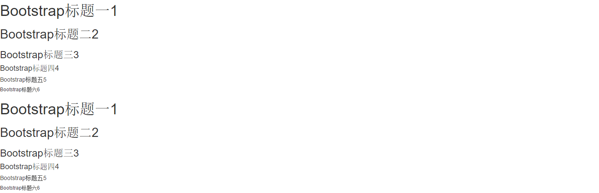
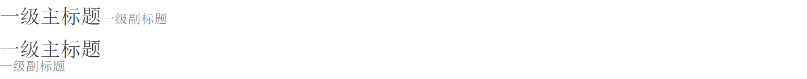
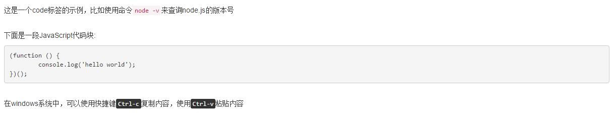

# 基本排版

## 标题
Bootstrap和普通的HTML页面一样，定义标题都是使用标签&lt;h1&gt;到&lt;h6&gt;,只不过Bootstrap覆盖了其默认的样式，使用其在所有浏览器下显示的效果一样

为了让非标题元素和标题使用相同的样式，还特意定义了.h1~.h6六个类名效果与&lt;h1&gt;到&lt;h6&gt;标签是一样的

**css样式**
```css
* {
	box-sizing: border-box;
}
.h1, .h2, .h3, .h4, .h5, .h6, h1, h2, h3, h4, h5, h6 {
	font-family: inherit;
	font-weight: 500;
	line-height: 1.1;
	color: inherit;
}
.h1, .h2, .h3, h1, h2, h3 {
	margin-top: 20px;
	margin-bottom: 10px;
}
.h1, h1 {
	font-size: 36px;
}
.h2, h2 {
	font-size: 30px;
}
.h3, h3 {
	font-size: 24px;
}
.h4, .h5, .h6, h4, h5, h6 {
	margin-top: 10px;
	margin-bottom: 10px;
}
.h4, h4 {
	font-size: 18px;
}
.h5, h5 {
	font-size: 14px;
}
.h6, h6 {
	font-size: 12px;
}
```

**示例**
```html
<h1>Bootstrap标题一1</h1>
<h2>Bootstrap标题二2</h2>
<h3>Bootstrap标题三3</h3>
<h4>Bootstrap标题四4</h4>
<h5>Bootstrap标题五5</h5>
<h6>Bootstrap标题六6</h6>

<div class='h1'>Bootstrap标题一1</div>
<div class='h2'>Bootstrap标题二2</div>
<div class='h3'>Bootstrap标题三3</div>
<div class='h4'>Bootstrap标题四4</div>
<div class='h5'>Bootstrap标题五5</div>
<div class='h6'>Bootstrap标题六6</div>
```
*效果:*


## 副标题
除标题之外，我们在Web的制作中，常常会碰到在一个标题后面紧跟着一行小的副标题。在Bootstrap中他也考虑了这种排版效果，使用了&lt;small&gt;标签来制作副标题

**css样式**
```css
.h1 .small, .h1 small, .h2 .small, .h2 small, .h3 .small, .h3 small, h1 .small, h1 small, h2 .small, h2 small, h3 .small, h3 small {
	font-size: 65%;
}
.h4 .small, .h4 small, .h5 .small, .h5 small, .h6 .small, .h6 small, h4 .small, h4 small, h5 .small, h5 small, h6 .small, h6 small {
	font-size: 75%;
}
.h1 .small, .h1 small, .h2 .small, .h2 small, .h3 .small, .h3 small, .h4 .small, .h4 small, .h5 .small, .h5 small, .h6 .small, .h6 small, h1 .small, h1 small, h2 .small, h2 small, h3 .small, h3 small, h4 .small, h4 small, h5 .small, h5 small, h6 .small, h6 small {
	font-weight: 400;
	line-height: 1;
	color: #777;
}
```

**示例**
```html
<h1>一级主标题<small>一级副标题</small></h1>
<div class='h1'>一级主标题<div class='small'>一级副标题</div></div>
```
*效果:*


## 段落文本
段落是排版中另一个重要元素之一。在Bootstrap中为文本设置了一个全局的文本样式

**css样式**
```css
body {
	font-family: "Helvetica Neue",Helvetica,Arial,sans-serif;
	font-size: 14px;
	line-height: 1.42857143;
	color: #333;
	background-color: #fff;
}
p {
    margin: 0 0 10px;
}
```

**使用方式**

文本使用方式很简单，用&lt;p&gt;标签包含即可

## 强调内容
在实际项目中，对于一些重要的文本，希望突出强调的部分都会做另外的样式处理，如果想让一个段落p突出显示，可以通过添加类名“.lead”实现，其作用就是增大文本字号，加粗文本，而且对行高和margin也做相应的处理

**css样式**
```css
.lead {
	margin-bottom: 20px;
	font-size: 16px;
	font-weight: 300;
	line-height: 1.4;
}
@media (min-width: 768px) { /*大中型浏览器字体稍大*/
	.lead {
		font-size: 21px;
	}
}
```

## 粗体
粗体就是给文本加粗，在普通的元素中我们一般通过font-weight设置为bold关键词给文本加粗，在Bootstrap中，可以使用&lt;b&gt;和&lt;strong&gt;标签让文本直接加粗

**css样式**
```css
b, strong {
	font-weight: bold;
}
```

**示例**
```html
<p>这里是一段文本，在p标签中，粗体内容：<b>这一部分在b标签中</b>，另外还有：<strong>这一部分在strong标签中</strong>，b标签和strong标签都可以用来表示粗体样式</p>
```

## 斜体
在排版中，除了用加粗来强调突出的文本之外，还可以使用斜体。斜体类似于加粗一样，除了可以给元素设置样式font-style值为italic实现之外，还可以通过使用标签&lt;em&gt;或&lt;i&gt;来实现

## 强调相关的类
除了使用标签&lt;strong&gt;、&lt;em&gt;等说明正文某些字词、句子的重要性，Bootstrap还定义了一套类名，这里称其为强调类名（类似前面说的“.lead”）,这些强调类都是通过颜色来表示强调

**具体说明**

|类名|说明|
|:--|:--|
|.text-muted|提示，使用浅灰色(#999)|
|.text-primary|主要，使用蓝色(#428bca)|
|.text-success|成功，使用浅绿色(#3c763d)|
|.text-info|通知信息，使用浅蓝色(#31708f)|
|.text-warning|警告，使用黄色(#8a6d3b)|
|.text-danger|危险，使用褐色(#a94442)|

**css样式**
```
.text-muted {
	color: #999;
}
.text-primary {
	color: #428bca;
}
a.text-primary:hover {
	color: #3071a9;
}
.text-success {
	color: #3c763d;
}
a.text-success:hover {
	color: #2b542c;
}
.text-info {
	color: #31708f;
}
a.text-info:hover {
	color: #245269;
}
.text-warning {
	color: #8a6d3b;
}
a.text-warning:hover {
	color: #66512c;
}
.text-danger {
	color: #a94442;
}
a.text-danger:hover {
	color: #843534;
}
```

**使用示例**
```html
<div class="text-muted">.text-muted 效果</div>
<div class="text-primary">.text-primary效果</div>
<div class="text-success">.text-success效果</div>
<div class="text-info">.text-info效果</div>
<div class="text-warning">.text-warning效果</div>
<div class="text-danger">.text-danger效果</div>
```

## 文本对齐风格
在排版中离不开文本的对齐方式。在CSS中常常使用text-align来实现文本的对齐风格的设置。其中主要有四种风格：
* 左对齐，取值left
* 居中对齐，取值center
* 右对齐，取值right
* 两端对齐，取值justify

为了简化操作，方便使用，Bootstrap通过定义四个类名来控制文本的对齐风格：
* .text-left：左对齐
* .text-center：居中对齐
* .text-right：右对齐
* .text-justify：两端对齐

**css样式**
```css
.text-left {
	text-align: left;
}
.text-right {
	text-align: right;
}
.text-center {
	text-align: center;
}
.text-justify {
	text-align: justify;
}
```

## 列表
无序列表和有序列表使用方式和我们平时使用的一样（无序列表使用ul，有序列表使用ol标签），在样式方面，Bootstrap只是在此基础上做了一些细微的优化

**css样式**
```css
ul, ol {
	margin-top: 0;
	margin-bottom: 10px;
}
ul ul, ol ul, ul ol, ol ol {
	margin-bottom: 0;
}
```

## 去点列表
默认情况下无序列表和有序列表是带有项目符号的，但在实际工作中很多时候，我们的列表是不需要这个编号的，通过给无序列表添加一个类名“.list-unstyled”,这样就可以去除默认的列表样式的风格

**css样式**
```css
.list-unstyled {
	padding-left: 0;
	list-style: none;
}
```

**示例代码**
```html
<ul class='list-unstyled'>
	<li>11111</li>
	<li>22222</li>
	<li>33333</li>
	<li>44444</li>
	<li>55555</li>
</ul>
<ol class='list-unstyled'>
	<li>11111</li>
	<li>22222</li>
	<li>33333</li>
	<li>44444</li>
	<li>55555</li>
</ol>
```

## 内联列表
通过添加类名“.list-inline”来实现内联列表，简单点说就是把**垂直列表换成水平列表**，**而且去掉项目符号（编号）**，保持水平显示

**css样式**
```css
.list-inline {
	padding-left: 0;
	margin-left: -5px;
	list-style: none;
}
.list-inline>li {
	display: inline-block;
	padding-right: 5px;
	padding-left: 5px;
}
```

**示例代码**
```html
<p>城市：</p>
<ul class="list-inline">
    <li>北京</li>
    <li>上海</li>
    <li>南京</li>
    <li>厦门</li>
</ul>
```

## 定义列表
对于定义列表，只是调整了行间距，外边距和字体加粗效果

**css样式**
```css
dl {
	margin-top: 0;
	margin-bottom: 20px;
}
dt, dd {
	line-height: 1.42857143;
}
dt {
	font-weight: bold;
}
dd {
	margin-left: 0;
}
```

**示例代码**
```html
<dl>
    <dt>北京</dt>
    <dd>北京是中国的首都，是政治文化集中地</dd>
    <dt>上海</dt>
    <dd>上海号称东方的巴黎</dd>
</dl>
```

## 水平定义列表
水平定义列表就像内联列表一样，可以给<dl>添加类名“.dl-horizontal”给定义列表实现水平显示效果

**css样式**
```css
@media (min-width: 768px) {
	.dl-horizontal dt {
		float: left;
		width: 160px;
		overflow: hidden;
		clear: left;
		text-align: right;
		text-overflow: ellipsis;
		white-space: nowrap;
	}
	.dl-horizontal dd {
		margin-left: 180px;
	}
}
```
此处添加了一个媒体查询。也就是说，只有屏幕大于768px的时候，添加类名“.dl-horizontal”才具有水平定义列表效果。其实现主要方式：

1. 将dt设置了一个左浮动，并且设置了一个宽度为160px
2. 将dd设置一个margin-left的值为180px，达到水平的效果
3. 当标题宽度超过160px时，将会显示三个省略号

## 代码
一般在个人博客上使用的较为频繁，用于显示代码的风格

* 使用&lt;code&gt;&lt;/code&gt;来显示单行内联代码
* 使用&lt;pre&gt;&lt;/pre&gt;来显示多行块代码
* 使用&lt;kbd&gt;&lt;/kbd&gt;来显示用户输入代码

在使用代码时，用户可以根据具体的需求来使用不同的类型：

1. &lt;code&gt;：一般是针对于单个单词或单个句子的代码
2. &lt;pre&gt;：一般是针对于多行代码（也就是成块的代码）
3. &lt;kbd&gt;:一般是表示用户要通过键盘输入的内容

**示例**

*code标签示例:*
```html
<p>这是一个code标签的示例，比如使用命令<code>node -v</code>来查询node.js的版本号</p>
```
*pre标签示例:*
```html
<p>下面是一段JavaScript代码块:</p>
<pre>
(function () {
	console.log('hello world');
})();
</pre>
```
*kbd标签示例:*
```html
<p>在windows系统中，可以使用快捷键<kbd>Ctrl-c</kbd>复制内容，使用<kbd>Ctrl-v</kbd>粘贴内容</p>
```

*效果:*


&lt;pre&gt;元素一般用于显示大块的代码，并保证原有格式不变。但有时候代码太多，而且不想让其占有太大的页面篇幅，就想控制代码块的大小。只需要在pre标签上添加类名“.pre-scrollable”，就可以控制代码块区域最大高度为340px，一旦超出这个高度，就会在Y轴出现滚动条

**css样式**
```css
.pre-scrollable {
	max-height: 340px;
	overflow-y: scroll;
}
```

## 基础表格
对于基础表格是通过类名“.table”来控制。如果在&lt;table&gt;元素中不添加任何类名，表格是无任何样式效果的。想得到基础表格，我们只需要在&lt;table&gt;元素上添加“.table”类名，就可以得到基础表格

**css样式**
```css
.table {
	width: 100%;
	max-width: 100%;
	margin-bottom: 20px;
}
table {
	background-color: transparent;
	border-spacing: 0;
	border-collapse: collapse;
}
.table > caption + thead > tr:first-child > th, .table > colgroup + thead > tr:first-child > th, .table > thead:first-child > tr:first-child > th, .table > caption + thead > tr:first-child > td, .table > colgroup + thead > tr:first-child > td, .table > thead:first-child > tr:first-child > td {
	border-top: 0;
}
.table > thead > tr > th {
	vertical-align: bottom;
	border-bottom: 2px solid #ddd;
}
th {
	text-align: left;
}
.table > thead > tr > th, .table > tbody > tr > th, .table > tfoot > tr > th, .table > thead > tr > td, .table > tbody > tr > td, .table > tfoot > tr > td {
	padding: 8px;
	line-height: 1.42857143;
	vertical-align: top;
	border-top: 1px solid #ddd;
}
```

**示例**
```html
<table class="table">
	<thead>
		<tr>
			<th>表格标题</th>
			<th>表格标题</th>
			<th>表格标题</th>
		</tr>
	</thead>
	<tbody>
		<tr>
			<td>表格单元格</td>
			<td>表格单元格</td>
			<td>表格单元格</td>
		</tr>
		<tr>
			<td>表格单元格</td>
			<td>表格单元格</td>
			<td>表格单元格</td>
		</tr>
	</tbody>
</table>
```

“.table”类主要有三个作用：
1. 给表格设置了margin-bottom:20px以及设置单元内距
2. 在thead底部设置了一个2px的浅灰实线
3. 每个单元格顶部设置了一个1px的浅灰实线

## 斑马线表格
有时候为了让表格更具阅读性，需要将表格制作成类似于斑马线的效果。简单点说就是让表格带有背景条纹效果。在&lt;table class="table"&gt;的基础上增加类名“.table-striped”即可

**css样式**
```css
.table-striped > tbody > tr:nth-child(odd) > td, .table-striped > tbody > tr:nth-child(odd) > th {
	background-color: #f9f9f9;
}
```

## 带边框的表格
在基础表格&lt;table class="table"&gt;基础上添加一个“.table-bordered”类名

**css样式**
```css
.table-bordered {
	border: 1px solid #ddd;/*整个表格设置边框*/
}
.table-bordered > thead > tr > th,
.table-bordered > tbody > tr > th,
.table-bordered > tfoot > tr > th,
.table-bordered > thead > tr > td,
.table-bordered > tbody > tr > td,
.table-bordered > tfoot > tr > td {
	border: 1px solid #ddd; /*每个单元格设置边框*/
}
.table-bordered > thead > tr > th,
.table-bordered > thead > tr > td {
	border-bottom-width: 2px;/*表头底部边框*/
}
```

**使用示例**
```html
<table  class="table table-bordered">
  …
</table>
```

## 鼠标悬浮高亮的表格
鼠标悬停高亮的表格需要&lt;table class="table"&gt;元素上添加类名“table-hover”

**css样式**
```css
.table-hover > tbody > tr:hover > td,
.table-hover > tbody > tr:hover > th {
	background-color: #f5f5f5;
}
```

## 紧凑型表格
紧凑型表格，简单理解，就是单元格没内距或者内距较其他表格的内距更小。换句话说，要实现紧凑型表格只需要重置表格单元格的内距padding的值，需要在&lt;table class="table"&gt;基础上添加类名“table-condensed”

**css样式**
```css
.table-condensed > thead > tr > th,
.table-condensed > tbody > tr > th,
.table-condensed > tfoot > tr > th,
.table-condensed > thead > tr > td,
.table-condensed > tbody > tr > td,
.table-condensed > tfoot > tr > td {
	padding: 5px;
}
```

## 响应式表格
提供一个容器，并且此容器设置类名“.table-responsive”,此容器就具有响应式效果，然后将&lt;table class="table"&gt;置于这个容器当中，这样表格也就具有响应式效果

**示例**
```html
<div class="table-responsive">
<table class="table table-bordered">
   …
</table>
</div>
```
