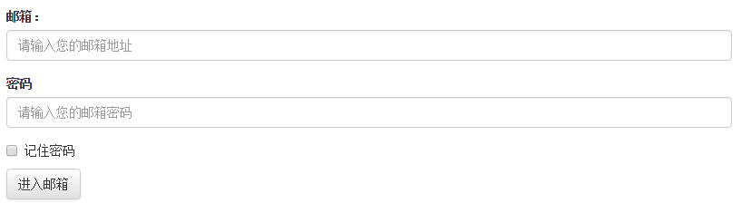
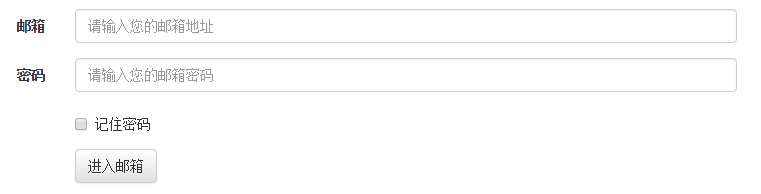
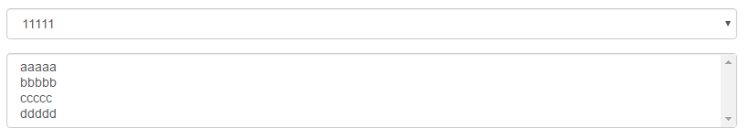
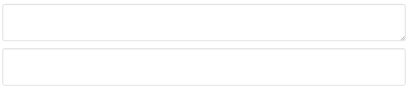
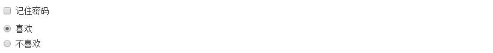
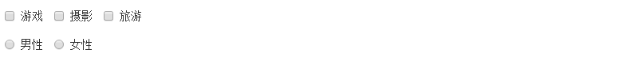
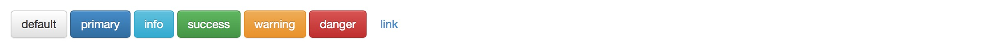

# 表单
表单主要功能是用来与用户做交流的一个网页控件，良好的表单设计能够让网页与用户更好的沟通。表单中常见的元素主要包括：**文本输入框**、**下拉选择框**、**单选按钮**、**复选按钮**、**文本域**和**按钮**等

## 基础表单
对于基础表单，Bootstrap并未对其做太多的定制性效果设计，仅仅对表单内的fieldset、legend、label标签进行了定制

**CSS样式**
```css
fieldset {
	min-width: 0;
	padding: 0;
	margin: 0;
	border: 0;
}
legend {
	display: block;
	width: 100%;
	padding: 0;
	margin-bottom: 20px;
	font-size: 21px;
	line-height: inherit;
	color: #333;
	border: 0;
	border-bottom: 1px solid #e5e5e5;
}

label {
	display: inline-block;
	margin-bottom: 5px;
	font-weight: bold;
}
```

表单除了这几个元素之外，还有input、select、textarea等元素，在Bootstrap框架中，通过定制了一个类名`form-control`，也就是说，如果这几个元素使用了类名“form-control”，将会实现一些设计上的定制效果

1. 宽度变成了100%
2. 设置了一个浅灰色（#ccc）的边框
3. 具有4px的圆角
4. 设置阴影效果，并且元素得到焦点之时，阴影和边框效果会有所变化
5. 设置了placeholder的颜色为#999

**示例:**
```html
<form role="form">
	<div class="form-group">
		<label for="exampleInputEmail1">邮箱：</label>
		<input type="email" class="form-control" id="exampleInputEmail1" placeholder="请输入您的邮箱地址">
	</div>
	<div class="form-group">
		<label for="exampleInputPassword1">密码</label>
		<input type="password" class="form-control" id="exampleInputPassword1" placeholder="请输入您的邮箱密码">
	</div>
	<div class="checkbox">
		<label>
			<input type="checkbox"> 记住密码
		</label>
	</div>
	<button type="submit" class="btn btn-default">进入邮箱</button>
</form>
```

*效果:*



## 水平表单
Bootstrap框架默认的表单是垂直显示风格，但很多时候我们需要的水平表单风格，要实现水平表单效果，必须满足以下两个条件

1. 在<form>元素是使用类名“form-horizontal”
2. 配合Bootstrap框架的网格系统

**CSS样式**
```css
.form-horizontal .control-label,
.form-horizontal .radio,
.form-horizontal .checkbox,
.form-horizontal .radio-inline,
.form-horizontal .checkbox-inline {
	padding-top: 7px;
	margin-top: 0;
	margin-bottom: 0;
}
.form-horizontal .radio,
.form-horizontal .checkbox {
	min-height: 27px;
}
.form-horizontal .form-group {
	margin-right: -15px;
	margin-left: -15px;
}
.form-horizontal .form-control-static {
	padding-top: 7px;
}
@media (min-width: 768px) {
	.form-horizontal .control-label {
		text-align: right;
	}
}
.form-horizontal .has-feedback .form-control-feedback {
	top: 0;
	right: 15px;
}
```

**示例:**
```html
<form class="form-horizontal" role="form">
	<div class="form-group">
		<label for="inputEmail3" class="col-sm-2 control-label">邮箱</label>
		<div class="col-sm-10">
			<input type="email" class="form-control" id="inputEmail3" placeholder="请输入您的邮箱地址">
		</div> 
	</div>
	<div class="form-group">
		<label for="inputPassword3" class="col-sm-2 control-label">密码</label>
		<div class="col-sm-10">
			<input type="password" class="form-control" id="inputPassword3" placeholder="请输入您的邮箱密码">
		</div>
	</div>
	<div class="form-group">
		<div class="col-sm-offset-2 col-sm-10">
			<div class="checkbox">
				<label>
					<input type="checkbox"> 记住密码
				</label>
			</div>
		</div>
	</div>
	<div class="form-group">
		<div class="col-sm-offset-2 col-sm-10">
			<button type="submit" class="btn btn-default">进入邮箱</button>
		</div>
	</div>
</form>
```

*效果:*



## 输入框input
单行输入框是创建的文本输入框，也就是input标签的type属性值为text，必须设置这个值，为了让控件在各种表单风格中样式不出错，需添加类名“form-control”

**CSS样式**
```css
.form-group {
	margin-bottom: 15px;
}
.form-control {
	display: block;
	width: 100%;
	height: 34px;
	padding: 6px 12px;
	font-size: 14px;
	line-height: 1.42857143;
	color: #555;
	background-color: #fff;
	background-image: none;
	border: 1px solid #ccc;
	border-radius: 4px;
	-webkit-box-shadow: inset 0 1px 1px rgba(0, 0, 0, .075);
	box-shadow: inset 0 1px 1px rgba(0, 0, 0, .075);
	-webkit-transition: border-color ease-in-out .15s, -webkit-box-shadow ease-in-out .15s;
	-o-transition: border-color ease-in-out .15s, box-shadow ease-in-out .15s;
	transition: border-color ease-in-out .15s, box-shadow ease-in-out .15s;
}
```

**示例:**
```html
<form>
	<div class='form-group'>
		<input type='text' class='form-control' placeholder="请输入用户名" />
	</div>
</form>
```

## 下拉选择框select
下拉选择框和原始的一直，多行选择的时候添加multiple属性

**示例:**
```html
<form>
	<div class='form-group'>
		<select class='form-control'>
			<option>11111</option>
			<option>22222</option>
			<option>33333</option>
			<option>44444</option>
			<option>55555</option>
		</select>
	</div>
	<div class='form-group'>
		<select multiple class='form-control'>
			<option>aaaaa</option>
			<option>bbbbb</option>
			<option>ccccc</option>
			<option>ddddd</option>
		</select>
	</div>
</form> 
```

*效果:*



## 文本域textarea
文本域和原始使用方法一样，设置rows可定义其高度，设置cols可以设置其宽度。但如果textarea元素中添加了类名“form-control”类名，则无需设置cols属性。因为“form-control”样式的表单控件宽度为100%或auto

**示例:**
```html
<form>
	<div class='form-group'>
		<textarea class='form-control' rows='3'></textarea>
	</div>
	<div class='form-group'>
		<textarea class='form-control' rows='3' style='resize:none;'></textarea>
	</div>
</form>
```

*效果:*



## 复选框checkbox和单选择按钮radio
checkbox和radio有点特殊，与label标签配合使用会出现对齐等问题，需要按以下规则:

1. 不管是checkbox还是radio都使用label包起来了
2. checkbox连同label标签放置在一个名为“.checkbox”的容器内
3. radio连同label标签放置在一个名为“.radio”的容器内

**CSS样式**
```css
.radio,
.checkbox {
	display: block;
	min-height: 20px;
	padding-left: 20px;
	margin-top: 10px;
	margin-bottom: 10px;
}
.radio label,
.checkbox label {
	display: inline;
	font-weight: normal;
	cursor: pointer;
}
.radio input[type="radio"],
.radio-inline input[type="radio"],
.checkbox input[type="checkbox"],
.checkbox-inline input[type="checkbox"] {
	float: left;
	margin-left: -20px;
}
.radio + .radio,
.checkbox + .checkbox {
	margin-top: -5px;
}
```

**示例:**
```html
<form>
	<div class='checkbox'>
		<label>
			<input type='checkbox' value=''>
			记住密码
		</label>
	</div>
	<div class='radio'>
		<label>
			<input type='radio' name='optionsRaios' value='love' checked >
			喜欢
		</label>
	</div>
	<div class='radio'>
		<label>
			<input type='radio' name='optionsRaios' value='hate' >
			不喜欢
		</label>
	</div>
</form> 
```

*效果:*



## 复选框和单选按钮水平排列
有时候，为了布局的需要，将复选框和单选按钮需要水平排列

1. 如果checkbox需要水平排列，只需要在label标签上添加类名“checkbox-inline”
2. 如果radio需要水平排列，只需要在label标签上添加类名“radio-inline”

**示例:**
```html
<form>
	<div class='form-group'>
		<label class='checkbox-inline'>
			<input type='checkbox' value='option1' />
			游戏
		</label>
		<label class='checkbox-inline'>
			<input type='checkbox' value='option2' />
			摄影
		</label>
		<label class='checkbox-inline'>
			<input type='checkbox' value='option3' />
			旅游
		</label>
	</div>
	<div class='form-group'>
		<label class='radio-inline'>
			<input type='radio' value='option1' />
			男性
		</label>
		<label class='radio-inline'>
			<input type='radio' value='option2' />
			女性
		</label>
	</div>
</form> 
```

*效果:*



## 初识按钮
按钮也是表单重要控件之一,制作按钮通常使用下面代码来实现:
```html
<input type='button' />
<input type='submit' />
<input type='reset' />
<button></button>
```

在Bootstrap框架中的按钮都是采用&lt;button&gr;来实现

**示例代码**
```html
<button class='btn btn-default'>default</button>
<button class='btn btn-primary'>primary</button>
<button class='btn btn-info'>info</button>
<button class='btn btn-success'>success</button>
<button class='btn btn-warning'>warning</button>
<button class='btn btn-danger'>danger</button>
<button class='btn btn-link'>link</button>
```

*效果*



## 表单控件大小
