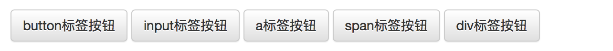
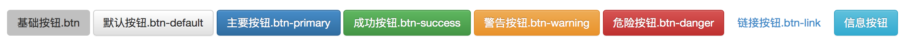
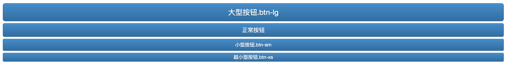

# 表单
表单主要功能是用来与用户做交流的一个网页控件，良好的表单设计能够让网页与用户更好的沟通。表单中常见的元素主要包括：**文本输入框**、**下拉选择框**、**单选按钮**、**复选按钮**、**文本域**和**按钮**等

## 基础表单
对于基础表单，Bootstrap并未对其做太多的定制性效果设计，仅仅对表单内的fieldset、legend、label标签进行了定制

**CSS样式**
```css
fieldset {
	min-width: 0;
	padding: 0;
	margin: 0;
	border: 0;
}
legend {
	display: block;
	width: 100%;
	padding: 0;
	margin-bottom: 20px;
	font-size: 21px;
	line-height: inherit;
	color: #333;
	border: 0;
	border-bottom: 1px solid #e5e5e5;
}

label {
	display: inline-block;
	margin-bottom: 5px;
	font-weight: bold;
}
```

表单除了这几个元素之外，还有input、select、textarea等元素，在Bootstrap框架中，通过定制了一个类名`form-control`，也就是说，如果这几个元素使用了类名“form-control”，将会实现一些设计上的定制效果

1. 宽度变成了100%
2. 设置了一个浅灰色（#ccc）的边框
3. 具有4px的圆角
4. 设置阴影效果，并且元素得到焦点之时，阴影和边框效果会有所变化
5. 设置了placeholder的颜色为#999

**示例:**
```html
<form role="form">
	<div class="form-group">
		<label for="exampleInputEmail1">邮箱：</label>
		<input type="email" class="form-control" id="exampleInputEmail1" placeholder="请输入您的邮箱地址">
	</div>
	<div class="form-group">
		<label for="exampleInputPassword1">密码</label>
		<input type="password" class="form-control" id="exampleInputPassword1" placeholder="请输入您的邮箱密码">
	</div>
	<div class="checkbox">
		<label>
			<input type="checkbox"> 记住密码
		</label>
	</div>
	<button type="submit" class="btn btn-default">进入邮箱</button>
</form>
```

*效果:*


## 水平表单
Bootstrap框架默认的表单是垂直显示风格，但很多时候我们需要的水平表单风格，要实现水平表单效果，必须满足以下两个条件

1. 在<form>元素是使用类名“form-horizontal”
2. 配合Bootstrap框架的网格系统

**CSS样式**
```css
.form-horizontal .control-label,
.form-horizontal .radio,
.form-horizontal .checkbox,
.form-horizontal .radio-inline,
.form-horizontal .checkbox-inline {
	padding-top: 7px;
	margin-top: 0;
	margin-bottom: 0;
}
.form-horizontal .radio,
.form-horizontal .checkbox {
	min-height: 27px;
}
.form-horizontal .form-group {
	margin-right: -15px;
	margin-left: -15px;
}
.form-horizontal .form-control-static {
	padding-top: 7px;
}
@media (min-width: 768px) {
	.form-horizontal .control-label {
		text-align: right;
	}
}
.form-horizontal .has-feedback .form-control-feedback {
	top: 0;
	right: 15px;
}
```

**示例:**
```html
<form class="form-horizontal" role="form">
	<div class="form-group">
		<label for="inputEmail3" class="col-sm-2 control-label">邮箱</label>
		<div class="col-sm-10">
			<input type="email" class="form-control" id="inputEmail3" placeholder="请输入您的邮箱地址">
		</div> 
	</div>
	<div class="form-group">
		<label for="inputPassword3" class="col-sm-2 control-label">密码</label>
		<div class="col-sm-10">
			<input type="password" class="form-control" id="inputPassword3" placeholder="请输入您的邮箱密码">
		</div>
	</div>
	<div class="form-group">
		<div class="col-sm-offset-2 col-sm-10">
			<div class="checkbox">
				<label>
					<input type="checkbox"> 记住密码
				</label>
			</div>
		</div>
	</div>
	<div class="form-group">
		<div class="col-sm-offset-2 col-sm-10">
			<button type="submit" class="btn btn-default">进入邮箱</button>
		</div>
	</div>
</form>
```

*效果:*


## 输入框input
单行输入框是创建的文本输入框，也就是input标签的type属性值为text，必须设置这个值，为了让控件在各种表单风格中样式不出错，需添加类名“form-control”

**CSS样式**
```css
.form-group {
	margin-bottom: 15px;
}
.form-control {
	display: block;
	width: 100%;
	height: 34px;
	padding: 6px 12px;
	font-size: 14px;
	line-height: 1.42857143;
	color: #555;
	background-color: #fff;
	background-image: none;
	border: 1px solid #ccc;
	border-radius: 4px;
	-webkit-box-shadow: inset 0 1px 1px rgba(0, 0, 0, .075);
	box-shadow: inset 0 1px 1px rgba(0, 0, 0, .075);
	-webkit-transition: border-color ease-in-out .15s, -webkit-box-shadow ease-in-out .15s;
	-o-transition: border-color ease-in-out .15s, box-shadow ease-in-out .15s;
	transition: border-color ease-in-out .15s, box-shadow ease-in-out .15s;
}
```

**示例:**
```html
<form>
	<div class='form-group'>
		<input type='text' class='form-control' placeholder="请输入用户名" />
	</div>
</form>
```

## 下拉选择框select
下拉选择框和原始的一直，多行选择的时候添加multiple属性

**示例:**
```html
<form>
	<div class='form-group'>
		<select class='form-control'>
			<option>11111</option>
			<option>22222</option>
			<option>33333</option>
			<option>44444</option>
			<option>55555</option>
		</select>
	</div>
	<div class='form-group'>
		<select multiple class='form-control'>
			<option>aaaaa</option>
			<option>bbbbb</option>
			<option>ccccc</option>
			<option>ddddd</option>
		</select>
	</div>
</form> 
```

*效果:*


## 文本域textarea
文本域和原始使用方法一样，设置rows可定义其高度，设置cols可以设置其宽度。但如果textarea元素中添加了类名“form-control”类名，则无需设置cols属性。因为“form-control”样式的表单控件宽度为100%或auto

**示例:**
```html
<form>
	<div class='form-group'>
		<textarea class='form-control' rows='3'></textarea>
	</div>
	<div class='form-group'>
		<textarea class='form-control' rows='3' style='resize:none;'></textarea>
	</div>
</form>
```

*效果:*


## 复选框checkbox和单选择按钮radio
checkbox和radio有点特殊，与label标签配合使用会出现对齐等问题，需要按以下规则:

1. 不管是checkbox还是radio都使用label包起来了
2. checkbox连同label标签放置在一个名为“.checkbox”的容器内
3. radio连同label标签放置在一个名为“.radio”的容器内

**CSS样式**
```css
.radio,
.checkbox {
	display: block;
	min-height: 20px;
	padding-left: 20px;
	margin-top: 10px;
	margin-bottom: 10px;
}
.radio label,
.checkbox label {
	display: inline;
	font-weight: normal;
	cursor: pointer;
}
.radio input[type="radio"],
.radio-inline input[type="radio"],
.checkbox input[type="checkbox"],
.checkbox-inline input[type="checkbox"] {
	float: left;
	margin-left: -20px;
}
.radio + .radio,
.checkbox + .checkbox {
	margin-top: -5px;
}
```

**示例:**
```html
<form>
	<div class='checkbox'>
		<label>
			<input type='checkbox' value=''>
			记住密码
		</label>
	</div>
	<div class='radio'>
		<label>
			<input type='radio' name='optionsRaios' value='love' checked >
			喜欢
		</label>
	</div>
	<div class='radio'>
		<label>
			<input type='radio' name='optionsRaios' value='hate' >
			不喜欢
		</label>
	</div>
</form> 
```

*效果:*


## 复选框和单选按钮水平排列
有时候，为了布局的需要，将复选框和单选按钮需要水平排列

1. 如果checkbox需要水平排列，只需要在label标签上添加类名“checkbox-inline”
2. 如果radio需要水平排列，只需要在label标签上添加类名“radio-inline”

**示例:**
```html
<form>
	<div class='form-group'>
		<label class='checkbox-inline'>
			<input type='checkbox' value='option1' />
			游戏
		</label>
		<label class='checkbox-inline'>
			<input type='checkbox' value='option2' />
			摄影
		</label>
		<label class='checkbox-inline'>
			<input type='checkbox' value='option3' />
			旅游
		</label>
	</div>
	<div class='form-group'>
		<label class='radio-inline'>
			<input type='radio' value='option1' />
			男性
		</label>
		<label class='radio-inline'>
			<input type='radio' value='option2' />
			女性
		</label>
	</div>
</form> 
```

*效果:*


## 初识按钮
按钮也是表单重要控件之一,制作按钮通常使用下面代码来实现:
```html
<input type='button' />
<input type='submit' />
<input type='reset' />
<button></button>
```

在Bootstrap框架中的按钮都是采用&lt;button&gr;来实现

**示例代码**
```html
<button class='btn btn-default'>default</button>
<button class='btn btn-primary'>primary</button>
<button class='btn btn-info'>info</button>
<button class='btn btn-success'>success</button>
<button class='btn btn-warning'>warning</button>
<button class='btn btn-danger'>danger</button>
<button class='btn btn-link'>link</button>
```

*效果*


## 表单控件大小

* input-sm: 让控件比正常大小更小
* input-lg: 让控件比正常大小更大

这两个类适用于表单中的input，textarea和select控件

**CSS样式**
```css
.input-sm {
	height: 30px;
	padding: 5px 10px;
	font-size: 12px;
	line-height: 1.5;
	border-radius: 3px;
}
select.input-sm {
	height: 30px;
	line-height: 30px;
}
textarea.input-sm, select[multiple].input-sm {
	height: auto;
}
.input-lg {
	height: 46px;
	padding: 10px 16px;
	font-size: 18px;
	line-height: 1.33;
	border-radius: 6px;
}
select.input-lg {
	height: 46px;
	line-height: 46px;
}
textarea.input-lg, select[multiple].input-lg {
	height: auto;
}
```

## 表单控件焦点状态
焦点状态是通过伪类“:focus”来实现

**CSS样式**
```css
.form-control:focus {
	border-color: #66afe9;
	outline: 0;
	-webkit-box-shadow: inset 0 1px 1pxrgba(0,0,0,.075), 0 0 8px rgba(102, 175, 233, .6);
	box-shadow: inset 0 1px 1pxrgba(0,0,0,.075), 0 0 8px rgba(102, 175, 233, .6);
}
input[type="file"]:focus,
input[type="radio"]:focus,
input[type="checkbox"]:focus {
	outline: thin dotted;
	outline: 5px auto -webkit-focus-ring-color;
	outline-offset: -2px;
}
```

## 表单控件禁用状态
对于禁用状态，添加属性‘disabled’

**CSS样式**
```css
.form-control[disabled],
.form-control[readonly],
fieldset[disabled] .form-control {
	cursor: not-allowed;
	background-color: #eee;
	opacity: 1;
}

/**
 * 对于禁用的控件，鼠标指针变成不可用的图标
 */
input[type="radio"][disabled],
input[type="checkbox"][disabled],
.radio[disabled],
.radio-inline[disabled],
.checkbox[disabled],
.checkbox-inline[disabled],
fieldset[disabled] input[type="radio"],
fieldset[disabled] input[type="checkbox"],
fieldset[disabled] .radio,
fieldset[disabled] .radio-inline,
fieldset[disabled] .checkbox,
fieldset[disabled] .checkbox-inline {
	cursor: not-allowed;
}
```

## 表单控件验证状态
在制作表单时，不免要做表单验证。同样也需要提供验证状态样式

* .has-warning:警告状态（黄色）
* .has-error：错误状态（红色）
* .has-success：成功状态（绿色）
* .has-feedback: 显示图标

**示例代码**
```html
<form role="form">
	<div class="form-group has-success">
		<label class="control-label" for="inputSuccess1">成功状态</label>
		<input type="text" class="form-control" id="inputSuccess1" placeholder="成功状态" >
	</div>
	<div class="form-group has-warning">
		<label class="control-label" for="inputWarning1">警告状态</label>
		<input type="text" class="form-control" id="inputWarning1" placeholder="警告状态">
	</div>
	<div class="form-group has-error">
		<label class="control-label" for="inputError1">错误状态</label>
		<input type="text" class="form-control" id="inputError1" placeholder="错误状态">
	</div>
</form>
```

## 表单提示信息
平常在制作表单验证时，要提供不同的提示信息，使用"help-block"样式，将提示信息以块状显示，并且显示在控件底部

**CSS样式**
```css
.help-block {
	display: block;
	margin-top: 5px;
	margin-bottom: 10px;
	color: #737373;
}
```

如果想要将提示信息显示在控件后面可以用如下css样式:
```css
.help-inline{
	display:inline-block;
	padding-left:5px;
	color: #737373;
}
```

**示例代码**
```html
<form>
	<div class='form-group has-warning has-feedback'>
		<input type='text' class='form-control' />
		<span class='help-block'>提示信息</span>
	</div>
	<div class='form-group has_error has-feedback'>
		<input type='text' class='form-control' />
		<span class='help-block'>提示信息</span>
	</div>
	<div class='form-group has-success has-feedback'>
		<input type='text' class='form-control' />
		<span class='help-block'>提示信息</span>
	</div>
</form>
```

## 基本按钮
button 标签添加‘btn’类

**CSS样式**
```css
.btn {
	display: inline-block;
	padding: 6px 12px;
	margin-bottom: 0;
	font-size: 14px;
	font-weight: normal;
	line-height: 1.42857143;
	text-align: center;
	white-space: nowrap;
	vertical-align: middle;
	cursor: pointer;
	  -webkit-user-select: none;
	     -moz-user-select: none;
	      -ms-user-select: none;
	user-select: none;
	background-image: none;
	border: 1px solid transparent;
	border-radius: 4px;
}
```

**示例代码**
```html
<button class="btn" type="button">基本按钮</button>
```

## 默认按钮
在基本按钮的基础上，添加“btn-default”类设置为默认按钮

**CSS样式**
```css
.btn-default {
	color: #333;
	background-color: #fff;
	border-color: #ccc;
}
```

**示例代码**
```html
<button class="btn btn-default" type="button">基本按钮</button>
```

## 多标签支持
一般制作按钮除了使用&lt;button&gt;标签元素之外，还可以使用&lt;input type="submit"&gt;和&lt;a&gt;标签等，要在制作按钮的标签元素上添加类名“btn”

**示例代码**
```html
<button class="btn btn-default" type="button">button标签按钮</button>
<input type="submit" class="btn btn-default" value="input标签按钮"/>
<a href="##" class="btn btn-default">a标签按钮</a>
<span class="btn btn-default">span标签按钮</span>
<div class="btn btn-default">div标签按钮</div>
```

*效果:*



## 定制风格
ootstrap框架中除了默认的按钮风格之外，还有其他六种按钮风格，每种风格的其实都一样，不同之处就是按钮的背景颜色、边框颜色和文本颜色

|类名|描述|颜色|
|:--:|:--|:--|
|.btn|基本按钮|背景色: 默认浅灰色；边框: 透明色; 文本: #000;|
|.btn-default|默认按钮|背景色: #fff；边框: #ccc; 文本: #333;|
|.btn-primary|主要按钮|背景色: #3276b1；边框: #285e8e; 文本: #fff;|
|.btn-success|成功按钮|背景色: #5cb85c；边框: #4cae4c; 文本: #fff;|
|.btn-info|信息按钮|背景色: #5bc0de；边框: #46b8da; 文本: #fff;|
|.btn-warning|警告按钮|背景色: #f0ad4e；边框: #eea236; 文本: #fff;|
|.btn-danger|危险按钮|背景色: #d9534f；边框: #d43f3a; 文本: #fff;|
|.btn-link|链接按钮|背景色: 无；边框: 透明; 文本: #428bca;|

**示例代码**
```html
<button class="btn btn-default" type="button">默认按钮.btn-default</button> 
<button class="btn btn-primary" type="button">主要按钮.btn-primary</button> 
<button class="btn btn-success" type="button">成功按钮.btn-success</button> 
<button class="btn btn-warning" type="button">警告按钮.btn-warning</button> 
<button class="btn btn-danger" type="button">危险按钮.btn-danger</button> 
<button class="btn btn-link" type="button">链接按钮.btn-link</button> 
<button class="btn btn-info" type="button">信息按钮</button>
```

*效果:*



## 按钮大小
对于按钮的大小，也是可以定制的。类似于input一样，通过在基础按钮“.btn”的基础上追加类名来控制按钮的大小

* .btn-lg  大型按钮
* .btn-sm  小型按钮
* .btn-xs  超小型按钮

**CSS样式**
```css
.btn-lg {
	padding: 10px 16px;
	font-size: 18px;
	line-height: 1.33;
	border-radius: 6px;
}
.btn-sm {
	padding: 5px 10px;
	font-size: 12px;
	line-height: 1.5;
	border-radius: 3px;
}
.btn-xs {
	padding: 1px 5px;
	font-size: 12px;
	line-height: 1.5;
	border-radius: 3px;
}
```

## 块状按钮

有时候在制作按钮的时候需要按钮宽度充满整个父容器（width:100%），特别是在移动端的制作中，类名“btn-block”，可以使按钮变成块状按钮

**CSS样式**
```css
.btn-block {
	display: block;
	width: 100%;
	padding-right: 0;
	padding-left: 0;
}
.btn-block + .btn-block {
	margin-top: 5px;
}
input[type="submit"].btn-block,
input[type="reset"].btn-block,
input[type="button"].btn-block {
	width: 100%;
}
```

**示例代码**

使用方法和前面的类似，只需要在原按钮类名上添加“.btn-block”类名，当然“.btn”类名是不可或缺的
```html
<button class="btn btn-primary btn-lg btn-block" type="button">大型按钮.btn-lg</button> 
<button class="btn btn-primary btn-block" type="button">正常按钮</button>
<button class="btn btn-primary btn-sm btn-block" type="button">小型按钮.btn-sm</button>
<button class="btn btn-primary btn-xs btn-block" type="button">超小型按钮.btn-xs</button>
```

*效果*



## 按钮活动状态
按钮的状态效果主要分为两种：活动状态和禁用状态

**CSS样式**
```css
.btn:focus,
.btn:active:focus,
.btn.active:focus {
	outline: thin dotted;
	outline: 5px auto -webkit-focus-ring-color;
	outline-offset: -2px;
}
.btn:hover,
.btn:focus {
color: #333;
	text-decoration: none;
}
.btn:active,
.btn.active {
	background-image: none;
	outline: 0;
	-webkit-box-shadow: inset 0 3px 5px rgba(0, 0, 0, .125);
	box-shadow: inset 0 3px 5px rgba(0, 0, 0, .125);
}
```

不同风格下的按钮都具有这几种状态效果，只是颜色做了一定的调整
```css
.btn-default:hover,
.btn-default:focus,
.btn-default:active,
.btn-default.active,
.open .dropdown-toggle.btn-default {
	color: #333;
	background-color: #ebebeb;
	border-color: #adadad;
}
.btn-default:active,
.btn-default.active,
.open .dropdown-toggle.btn-default {
	background-image: none;
}
```

当按钮处理正在点击状态（也就是鼠标按下的未松开的状态），对于&lt;button&gt;元素是通过“:active”伪类实现，而对于&lt;a&gt;这样的标签元素则是通过添加类名“.active”来实现。

## 按钮禁用状态
禁用状态与其他状态按钮相比，就是背景颜色的透明度做了一定的处理，opcity的值从100%调整为65%

要禁用按钮有两种实现方式：
1. 在标签中添加disabled属性
2. 在元素标签中添加类名“disabled”

两者的主要区别：

“.disabled”样式不会禁止按钮的默认行为，比如说提交和重置行为等。如果想要让这样的禁用按钮也能禁止按钮的默认行为，则需要通过JavaScript这样的语言来处理。对于<a>标签也存在类似问题，如果通过类名“.disable”来禁用按钮，其链接行为是无法禁止。而在元素标签中添加“disabled”属性的方法是可以禁止元素的默认行为的

**CSS样式**
```css
.btn.disabled,
.btn[disabled],
fieldset[disabled] .btn {
	pointer-events: none;
	cursor: not-allowed;
	filter: alpha(opacity=65);
	  -webkit-box-shadow: none;
	box-shadow: none;
	opacity: .65;
}
```
