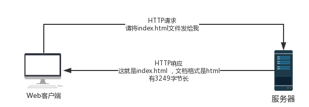

# http概述
Web浏览器、服务器和相关的Web应用程序都是通过http协议进行通讯，http是现代全球因特网中使用的公共语言

## Web客户端和服务器
Web内容是存储在Web服务器上的。Web服务器所使用的是http协议，因此经常被称为http服务器。http服务器中存储了数据，如果http客户端发出http请求，服务端会在http响应红回送所响应的数据



## 资源
Web服务器是Web资源的宿主，Web资源是Web内容的源头，最简单的Web资源就是Web服务器文件系统的静态文件，可以是任意内容：文本文件、html文件、word文件等等， 但是资源不一定是静态文件，还可以根据需要通过程序生成

**媒体类型**

http给每种需要Web传输的对象都打上mime的数据格式标签，最初是用在多用途右键扩展，为了解决在不同电子右键系统之间搬移报文时的问题

Web服务器为所有http对象数据附加一个MIME类型，当Web浏览器从服务器取回一个对象时，会查看MIME类型，作对应处理

* html格式的文本文档由 text/html 类型标记
* 普通的ASCII文本文档由 text/plain 类型标记
* JPEG 版本的图片为 image/jpeg 类型
* GIF 格式的图片为 image/gif 类型
* Apple的QuickTime电影为 video/quicktime 类型
* 微软的PowerPoint演示文件为 application/vnd.ms-powerpoint 类型

**URI**

服务器资源名即统一资源标识符，uri有两种形式：url和urn

**URL**

统一资源定位符描述了一台特定服务器上的特定资源

* URL的第一部分为方案，即采用的通讯协议类型，通常为HTTP协议
* 第二部分指明服务器的地址
* 其余部分为web服务器上的某个资源

**URN**

统一资源名，做为特定内容的唯一名称使用的，与资源所在地无关

## 事务
一个HTTP事务由一条请求命令(客户端发往服务器端)和一个响应结果(从服务器端返回客户端的)组成，通过http报文的格式化数据块进行通信

**方法**

每条HTTP请求报文都包含一个方法(HTTP method)，这个方法会告诉服务器要执行什么动作

|HTTP方法|描述|
|:--:|:--|
|GET|从服务器想客户端发送命名资源|
|PUT|将来自客户端的数据存储到一个命名的服务器资源中去|
|DELETE|从服务器中删除命名资源|
|POST|将客户端数据发送到一个服务器网关应用程序|
|HEAD|仅发送命名资源响应中的HTTP首部|

**状态码**

每条HTTP响应报文返回时都会携带一个状态码。状态码是一个三位数的代码，告诉客户端处理结果

*常见的HTTP状态码*

|HTTP状态码|描述|
|:--:|:--|
|200|OK 文档正确返回|
|302|Redirect(重定向) 到其他地方获取资源|
|404|Not Found 无法找到指定资源|

*HTTP状态码和原因短语的例子:*
```
200 OK
200 Document attached
200 Success
200 All's cool, dude
```

## 报文
HTTP报文是由一行一行的简单字符串组成的，都是纯文本，不是二进制代码，所以可以很方便的读写

从Web客户端发往Web服务器的HTTP报文称为**请求报文**，从服务器发往客户端的报文称为**响应报文**

*HTTP报文三部分:*

1. 起始行  报文的第一行就是起始行，请求报文中用来说明做些说明，响应报文中说明出现了什么情况
2. 首部字段  起始行后面有零个或多个首部字段，每个首部字段包含一个名字和一个值，中间用冒号(:)分割，首部以空行结束
3. 主题  空行之后就是可选的报文主题了，包含了所有类型的数据。请求主题中包括了要发送给Web服务器的数据；响应主体中包含了要返回给客户端的数据。主题中可以包含任意数据(二进制数据、纯文本等)

## 连接
Transmission Control Protocol TCP 连接从一个地方搬移到另一个地方去

**TCP/IP**

HTTP是应用层协议，无须关心网络通信的具体细节，联网细节都交给通用、可靠的网络传输协议TCP/IP

*TCP提供了:*

* 无差错的数据传输
* 按序传输 (数据总是按照发送的顺序到达)
* 未分段的数据流 (可以在任意时刻以任意尺寸将数据发送出去)

**连接、IP地址及端口号**

在HTTP客户端向服务器发送报文之前，需要用地址和端口号在客户端和服务器之间建立一条TCP/IP连接，通过URL获取机器的IP地址和端口号

1. 浏览器从URL中解析出服务器的主机名
2. 浏览器将服务器的主机名转换成服务器的IP地址
3. 浏览器将端口号从URL中解析出来
4. 浏览器建立一条与Web服务器的TCP连接
5. 浏览器向服务器发送一条HTTP请求报文
6. 服务器向浏览器会送一条HTTP响应报文
7. 关闭链接，浏览器显示文档

## 协议版本

**HTTP/0.9**

HTTP的1991原型版本为HTTP/0.9，只用于老客户端的交互，只支持GET方法，不支持多媒体内容的MIME类型、各种HTTP首部、或者版本号，只是获取简单的HTML对象，很快被HTTP/1.0取代

**HTTP/1.0**

1.0是广泛使用的HTTP版本，添加了版本号、各种HTTP首部、一些额外的方法以及对多媒体对象的处理

**HTTP/1.1**

校正HTTP设计中的结构性缺陷，明确予以，引入性能优化措施，是当前使用的HTTP版本
