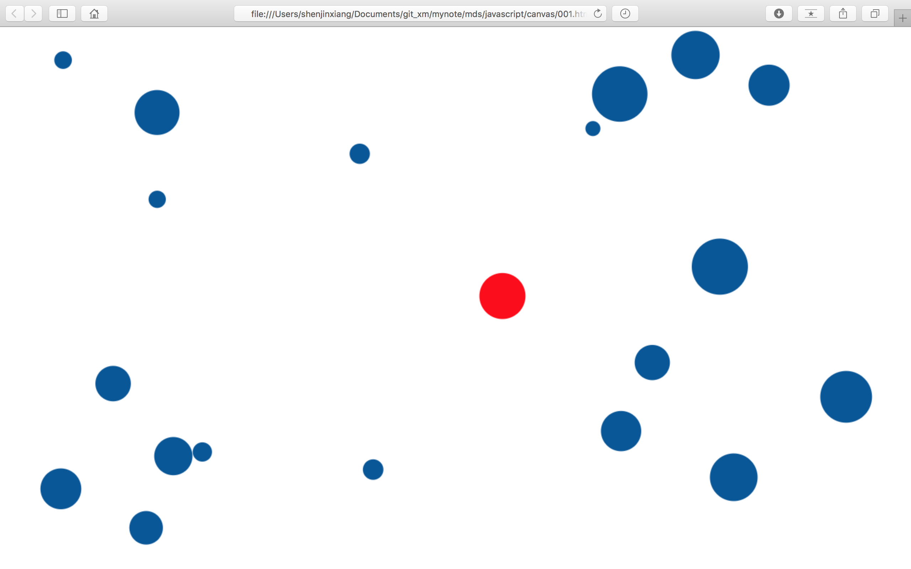

# Canvas交互
有些时候，canvas画布的内容需要与用户交互，js中有各种绑定事件，同样适用于canvas。canvas中也提供了一个用于与用户交互的方法：

> CanvasRenderingContext2D.isPointInPath(x, y)

isPointInPath()方法接受两个参数x、y，检查在画布中(x, y)坐标是否在当前路径中，返回布尔值

来一个例子：
```javascript
(function (){
	let canvas = document.getElementById('mycanvas');
	canvas.width = window.innerWidth;
	canvas.height = window. innerHeight;
	let context = canvas.getContext('2d');

	// 配置信息
	let config = {
		num: 20,
		minr: 10,
		maxr: 40,
		bcolor: '#059',
		ccolor: 'red'
	};

	let balls = [];
	let box = canvas.getBoundingClientRect();

	init();

	// 初始化
	function init() {
		for (let i = 0; i < config.num; i++) {
			balls[i] = {
				x: Math.random() * canvas.width,
				y: Math.random() * canvas.height,
				r: Math.random() * (config.maxr - config.minr) + config.minr
			};
		}
		draw();
	}

	// 绑定事件
	canvas.addEventListener('mousemove', draw, false);
	window.onresize = function () {
		init();
		canvas.width = window.innerWidth;
		canvas.height = window.innerHeight;
	};

	function draw(e) {
		context.clearRect(0, 0, canvas.width, canvas.height);
		let x = -1000, y = -1000;
		if (e) {
			x = e.clientX - box.left;
			y = e.clientY - box.top;
		}
		for (let i = 0; i < balls.length; i++) {
			context.beginPath();
			context.arc(balls[i].x, balls[i].y, balls[i].r, 0, 2 * Math.PI, false);
			if (context.isPointInPath(x, y)) {
				context.fillStyle = config.ccolor;
			} else {
				context.fillStyle = config.bcolor;
			}
			context.fill();
			context.closePath();
		}
	}
})();
```

1. 设置画布框高为浏览器窗口的宽高2
2. 在画布上随机的绘制20个蓝色的圆形图案
3. 当鼠标在画布上移动时，计算出鼠标在画布上的坐标点，不停的重复清除整个画布，并重复绘制，绘制的过程中通过isPointInPath()方法检查鼠标是否经过圆，如果鼠标滑过圆形图案，当前圆形图案就变成红色

效果：



具体的效果点[这里](http://www.shenjinxiang.com/pages/mydemo)
