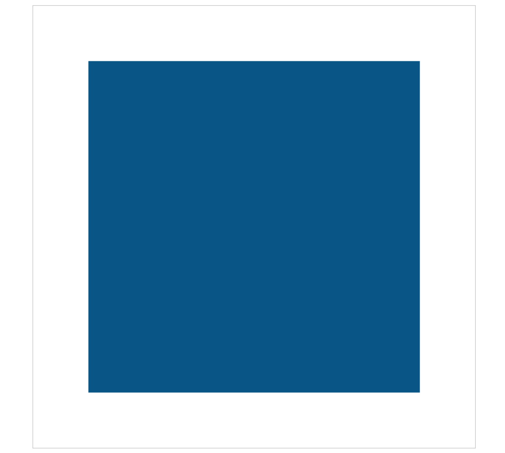

# Canvas剪辑区域
Canvas中实现剪辑区域只涉及到一个方法：CanvasRenderingContext2D.clip()，clip方法从原始画布中剪辑任意形状和尺寸的闭合区域，之后的绘图环境就在这个剪辑区域中，clip类似于fill()和stroke()方法，不同的是，fill()和stroke()方法是将设置的路径绘制出来，而clip()方法是将之前的路径形成的闭合区域作为剪辑区域

## 简单的例子
```javascript
(function() {
	let canvas = document.getElementById('mycanvas');
	canvas.width = 800;
	canvas.height = 800;
	let context = canvas.getContext('2d');

	context.fillStyle = '058';
	context.fillRect(100, 100, 600, 600);
})();
```

这个代码很简单，绘制宽高为600的矩形蓝色区域，效果：



如果加上一个剪辑区域，看看这个代码：

```javascript
(function() {
	let canvas = document.getElementById('mycanvas');
	canvas.width = 800;
	canvas.height = 800;
	let context = canvas.getContext('2d');

	context.rect(200, 200, 400, 400);
	context.clip();

	context.fillStyle = '058';
	context.fillRect(100, 100, 600, 600);
})();
```

效果：


在上一个代码的基础上设置了一个宽高为400的矩形区域为剪辑区域，然后接着绘制600宽高的矩形，这个时候，只有在剪辑区域内部的部分才会渲染出来，实际上clip的剪辑区域可以是任意形状的闭合路径，如果路径没有闭合，会自动调用一次closePath()来闭合路径，之后的绘制中，剪辑区域外部的内容将不再绘制，判断剪辑区域内部或外部同样是依据非零环绕原则。

## 剪辑区域为圆形区域
```javascript
(function() {
	let canvas = document.getElementById('mycanvas');
	canvas.width = 800;
	canvas.height = 800;
	let context = canvas.getContext('2d');

	context.fillStyle = '#000';
	context.fillRect(0, 0, canvas.width, canvas.height);
	
	context.beginPath();
	context.arc(canvas.width / 2, canvas.height / 2, 200, 0, 2 * Math.PI, false);
	context.fillStyle = '#fff';
	context.fill();
	context.clip();

	context.font = 'bold 200px Arial';
	context.textAlign = 'center';
	context.textBaseline = 'middle';
	context.fillStyle = '048';
	context.fillText('CANVAS', canvas.width / 2, canvas.height / 2);
})();
```

效果：


在这个例子中，将整个canvas画布设置成黑色的，然后在中心位置设置一个圆形的剪辑区域，剪辑区域的背景色为白色的，最后渲染一段文字“CANVAS”到画布上，可以看到圆形剪辑区域内部有文字的一部分

## 一个探照灯效果
通过上面这个例子，我们可以实现一个探照灯的效果：整个画布的内容被黑色阻挡，剪辑区域为圆形区域，当鼠标在画布上移动时，剪辑区域的中心随着鼠标移动，从而查看这个画布的内容，先说说整体思路：
