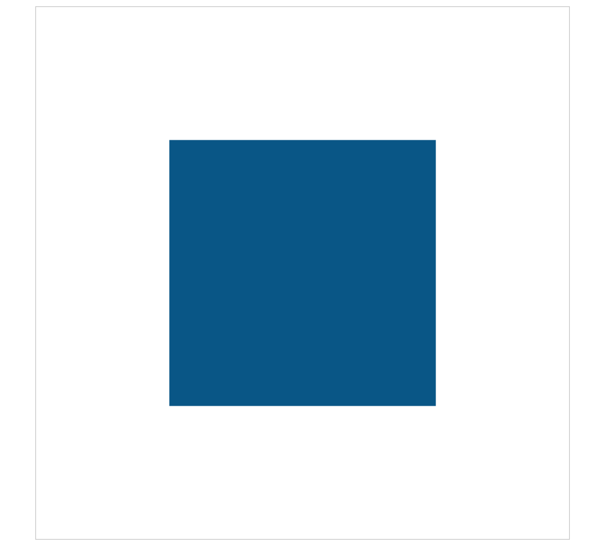

# Canvas剪辑区域
Canvas中实现剪辑区域只涉及到一个方法：CanvasRenderingContext2D.clip()，clip方法从原始画布中剪辑任意形状和尺寸的闭合区域，之后的绘图环境就在这个剪辑区域中，clip类似于fill()和stroke()方法，不同的是，fill()和stroke()方法是将设置的路径绘制出来，而clip()方法是将之前的路径形成的闭合区域作为剪辑区域

## 简单的例子
```javascript
(function() {
	let canvas = document.getElementById('mycanvas');
	canvas.width = 800;
	canvas.height = 800;
	let context = canvas.getContext('2d');

	context.fillStyle = '058';
	context.fillRect(100, 100, 600, 600);
})();
```

这个代码很简单，绘制宽高为600的矩形蓝色区域，效果：


如果加上一个剪辑区域，看看这个代码：

```javascript
(function() {
	let canvas = document.getElementById('mycanvas');
	canvas.width = 800;
	canvas.height = 800;
	let context = canvas.getContext('2d');

	context.rect(200, 200, 400, 400);
	context.clip();

	context.fillStyle = '058';
	context.fillRect(100, 100, 600, 600);
})();
```

效果：



在上一个代码的基础上设置了一个宽高为400的矩形区域为剪辑区域，然后接着绘制600宽高的矩形，这个时候，只有在剪辑区域内部的部分才会渲染出来，实际上clip的剪辑区域可以是任意形状的闭合路径，如果路径没有闭合，会自动调用一次closePath()来闭合路径，之后的绘制中，剪辑区域外部的内容将不再绘制，判断剪辑区域内部或外部同样是依据非零环绕原则。

## 剪辑区域为圆形区域
```javascript
(function() {
	let canvas = document.getElementById('mycanvas');
	canvas.width = 800;
	canvas.height = 800;
	let context = canvas.getContext('2d');

	context.fillStyle = '#000';
	context.fillRect(0, 0, canvas.width, canvas.height);
	
	context.beginPath();
	context.arc(canvas.width / 2, canvas.height / 2, 200, 0, 2 * Math.PI, false);
	context.fillStyle = '#fff';
	context.fill();
	context.clip();

	context.font = 'bold 200px Arial';
	context.textAlign = 'center';
	context.textBaseline = 'middle';
	context.fillStyle = '048';
	context.fillText('CANVAS', canvas.width / 2, canvas.height / 2);
})();
```

效果：


在这个例子中，将整个canvas画布设置成黑色的，然后在中心位置设置一个圆形的剪辑区域，剪辑区域的背景色为白色的，最后渲染一段文字“CANVAS”到画布上，可以看到圆形剪辑区域内部有文字的一部分

## 一个探照灯效果
通过上面这个例子，我们可以实现一个探照灯的效果：整个画布的内容被黑色阻挡，剪辑区域为圆形区域，当鼠标在画布上移动时，剪辑区域的中心随着鼠标移动，从而查看这个画布的内容，在次之前需要先引入另外一个方法：CanvasRenderingContext2D.clearRect()

### clearRect()方法
clearRect()用于清除画布中指定位置的内容，相当于是个橡皮擦，接受四个参数，分别表示清除矩形区域的左上角的x、y坐标值和矩形区域的宽高值，例如：

```javascript
(function() {
	let canvas = document.getElementById('mycanvas');
	canvas.width = 800;
	canvas.height = 800;
	let context = canvas.getContext('2d');

	context.fillStyle = '#058';
	context.fillRect(0, 0, canvas.width, canvas.height);

	context.clearRect(100, 100, 300, 400);
})();
```

效果：


这个例子也很简单，先用fillRect()将整个画布渲染成蓝色，然后使用clearRect()方法清除了一个矩形区域

### clip()方法的状态
一旦使用clip()方法剪切了某个区域，则所有之后的绘图都会被限制在被剪切的区域内（不能访问画布上的其他区域）。可以在使用 clip() 方法前通过使用 save() 方法对当前画布区域进行保存，并在以后的任意时间对其进行恢复（通过 restore() 方法）

### 制作探照灯
1. 将整个画布渲染为黑色
2. 根据鼠标的位置设置剪辑区域（初始设置为画布中心位置）
3. 绘制需要探照的图案，这里选取之前做过的中国国旗图案
4. 每当鼠标移动时，先将整个画布清除，重新根据鼠标当前位置绘制整个画布

代码：
```javascript
(function() {
	let canvas = document.getElementById('mycanvas');
	canvas.width = 660;
	canvas.height = canvas.width * 2 / 3;
	let context = canvas.getContext('2d');
	
	/ 设置鼠标位置和鼠标半径
	let config = {
		x: canvas.width / 2,
		y: canvas.height / 2,
		r: 100
	}
	var box = canvas.getBoundingClientRect();
	canvas.addEventListener('mousemove', function(e) {
		// 计算鼠标当前在画布上的坐标值
		config.x = e.clientX - box.left;
		config.y = e.clientY - box.top;
		draw();
	}, false);

	draw();

	function draw() {
		context.clearRect(0, 0, canvas.width, canvas.height);

		context.fillStyle = '#000';
		context.fillRect(0, 0, canvas.width, canvas.height);

		context.save();
		context.beginPath();
		context.arc(config.x, config.y, config.r, 0, 2 * Math.PI, false);
		context.fillStyle = '#fff';
		context.fill();
		context.clip();

		drawGQ();
		context.restore();
	}

	// 绘制国旗
	function drawGQ() {

		let gWidth = canvas.width / 30;
		let [maxX, maxY] = [5, 5];		// 大五角星的坐标
		let minX = [10, 12, 12, 10];	// 小五角星的x坐标值
		let minY = [2, 4, 7, 9];		// 小五角星的y坐标值

		// 红色背景
		context.fillStyle = 'red';
		context.fillRect(0, 0, canvas.width, canvas.height);

		// 大五角星
		drawStar(maxX * gWidth, maxY * gWidth, 3 * gWidth, -Math.PI / 2);

		// 小五角星
		for (let i = 0; i < 4; i++) {
			drawStar(minX[i] * gWidth, minY[i] * gWidth, gWidth, 
					Math.PI + Math.atan((minY[i] - maxY ) / (minX[i] - maxX)));
		}
	}

	// 五角星
	function drawStar(x, y, r, rotate) {
		context.save();
		context.fillStyle = 'yellow';
		context.translate(x, y);
		context.scale(r, r);
		context.rotate(rotate);
		context.beginPath();
		let dig = 2 * 2 * Math.PI / 5;
		for(let i = 0; i < 5; i++) {
			context.lineTo(Math.cos(i * dig), Math.sin(i * dig));
		}
		context.closePath();
		context.fill();
		context.restore();
	}
})();
```

初始的效果：


当鼠标移动到某一点的时候的效果：


本页面没法看到实际效果，可以在此处查看：[链接地址](http://www.shenjinxiang.com/pages/mydemo/canvas/clip/index.html)


重点说说clearRect()方法，这个方法很重要的哦，clearRect()方法用于清空画布中一个矩形区域，便于重新绘制心的图案。有了这个方法，就可以制作很多有意思的东西了，比如让画布的内容动起来，即动画效果，原理很简单，利用js中的setInterval()或setTimeout()方法，执行定时任务，每次清空画布中一些图案，绘制新图案，看起来就像动画一样，实际上是一张张静止的图片随时间变化的结果
