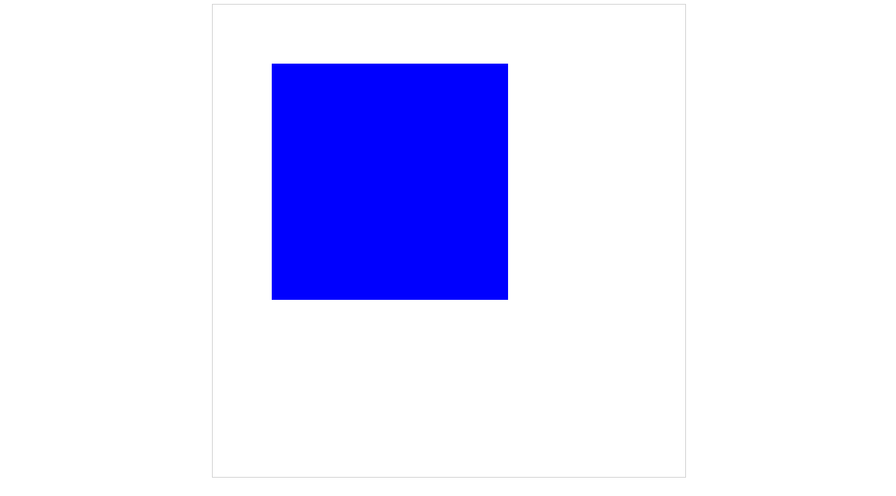
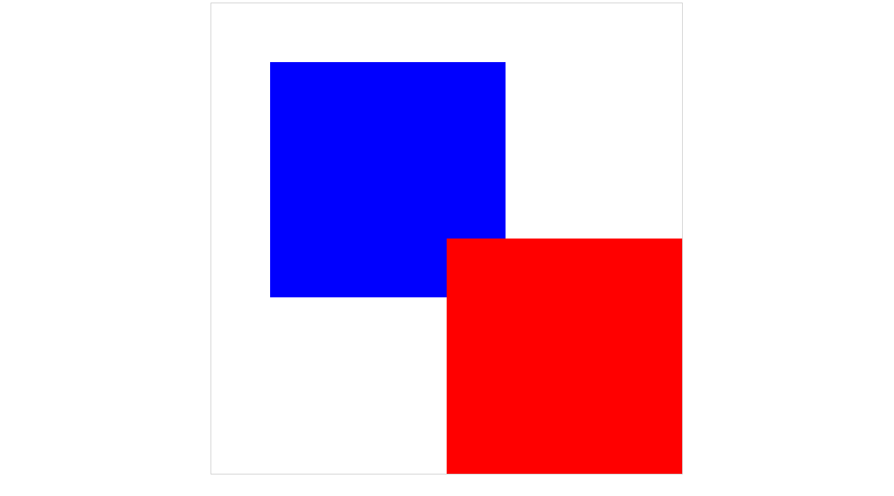
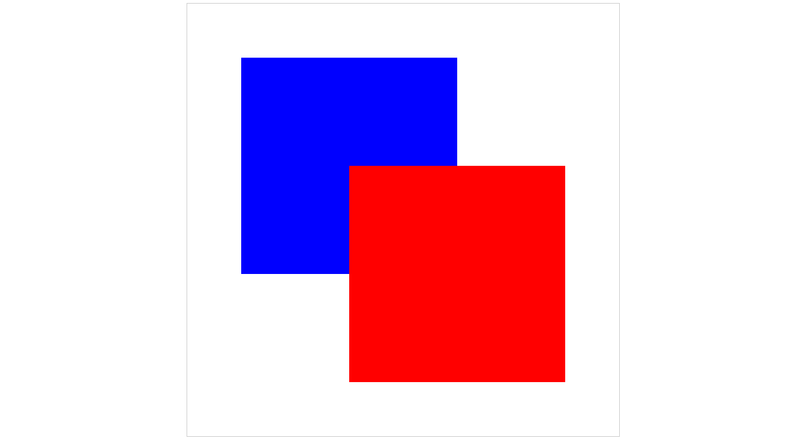
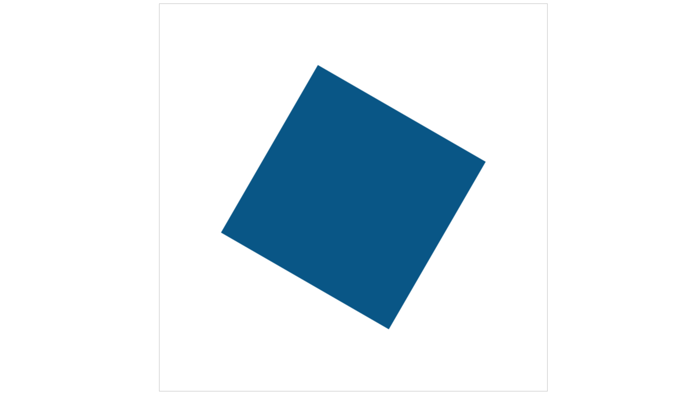
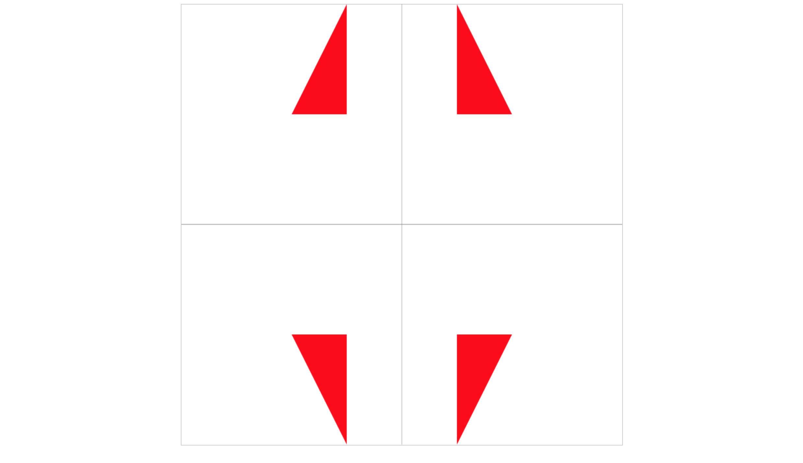

# Canvas图形变换
canvas中的图形变换，主要涉及到图形的偏移、旋转、缩放功能。本文所有的代码采用的html模板均为：
```html
<!doctype html>
<html>
<head>
	<meta charset='utf-8'>
	<style>
		canvas{display:block; border: 1px solid #ccc;margin: 0px auto;}
	</style>
	<title>canvas</title>
</head>
<body>
	<canvas id='mycanvas'></canvas>
<script src='外部js路径'></script>
</body>
</html>
```

## translate()方法
CanvasRenderingContext2D的translate()方法为当前画布添加水平和垂直偏移量。默认情况下，canvas中的坐标系统是以左上角为坐标原点`(0, 0)`，水平向右x坐标值增加、垂直向下y坐标值增加。translate()方法接受两个Number类型参数，分别设置x轴和y轴方向的偏移量

```javascript
(function() {
	let canvas = document.getElementById('mycanvas');
	canvas.width = 800;
	canvas.height = 800;
	let context = canvas.getContext('2d');

	// 开始绘制
	context.fillStyle = 'blue';
	context.translate(100, 100);
	context.fillRect(0, 0, 400, 400);
})();
```

效果：



使用`fillRect()`方法填充一个400*400的矩形空间，在此之前使用translate()方法设置x、y方向的偏移量都为100。可以看到，虽然填充的起始点坐标设置为`(0, 0)`，但是在translate()方法影响下，相当于将坐标原点移动到了`(100, 100)`位置

## 保存还原绘图状态
如果多次调用translate()方法会怎么样呢？看下面的例子：
```javascript
(function() {
	let canvas = document.getElementById('mycanvas');
	canvas.width = 800;
	canvas.height = 800;
	let context = canvas.getContext('2d');

	// 开始绘制
	context.fillStyle = 'blue';
	context.translate(100, 100);
	context.fillRect(0, 0, 400, 400);

	context.fillStyle = 'red';
	context.translate(300, 300);
	context.fillRect(0, 0, 400, 400);
})();
```

效果：



这个例子中画了两个矩形，第一个矩形的位置没什么问题，是在`(100, 100)`的位置开始画了一个蓝色的矩形，但是第二个矩形的位置有问题，不是在`translate()`设置的`(300, 300)`位置开始画的，而是在`(400, 400)`位置开始绘制的矩形，可以知道两次`translate()`方法效果累加了，这个时候我们需要在每次调用完`translate()`之后，将状态返回到原来的状态，采用下面的方法：

```javascript
(function() {
	let canvas = document.getElementById('mycanvas');
	canvas.width = 800;
	canvas.height = 800;
	let context = canvas.getContext('2d');

	// 开始绘制
	context.fillStyle = 'blue';
	context.translate(100, 100);
	context.fillRect(0, 0, 400, 400);
	context.translate(-100, -100);

	context.fillStyle = 'red';
	context.translate(300, 300);
	context.fillRect(0, 0, 400, 400);
	context.translate(-300, -300);
})();
```

效果：



第二个矩形的其实位置在`(300, 300)`位置。但是有个问题就是每次调用结束以后都需要再次调用`translate()`设置相反的参数，恢复原来状态，是一件很繁琐的事情，而且代码量大了以后，很难维护，这时需要用到`save()`和`restore()`方法

CanvasRenderingContext2D对象的`save()`将复制当前绘图状态，并将这个副本压入已保存的绘图状态栈中，这样就可以临时改变绘图状态。 CanvasRenderingContext2D对象的`restore()`从以保存的绘图状态的栈中弹出最后一个保存状态，并根据这个状态充值CanvasRenderingContext2D的各项属性、裁剪路径以及转换矩阵。所以上面的代码可以修改为：
```javascript
(function() {
	let canvas = document.getElementById('mycanvas');
	canvas.width = 800;
	canvas.height = 800;
	let context = canvas.getContext('2d');

	// 开始绘制
	context.save();
	context.fillStyle = 'blue';
	context.translate(100, 100);
	context.fillRect(0, 0, 400, 400);
	context.restore();

	context.save();
	context.fillStyle = 'red';
	context.translate(300, 300);
	context.fillRect(0, 0, 400, 400);
	context.restore();
})();
```

查看html页面，效果与上面是一样的，在实际开发的时候`save()`和`restore()`方法是成对出现的。这两个方法之间的绘图状态不会影响之前和之后的绘图

## rotate()方法
改变当前转换矩阵，接下来在画布上绘制的任何对象都将旋转指定的角度，&lt;canvas&gt;元素并没有旋转，angle角度的单位是弧度制。角度转换为弧度的方法：乘以Math.PI，再除以180。例子：

```javascript
(function() {
	let canvas = document.getElementById('mycanvas');
	canvas.width = 800;
	canvas.height = 800;
	let context = canvas.getContext('2d');

	// 开始绘制
	context.save();
	context.fillStyle = '#058';
	context.translate(400, 400);
	context.rotate(Math.PI / 6);
	context.fillRect(-200, -200, 400, 400);
	context.restore();
})();
```

效果：



在这里同时使用`translate()`和`rotate()`方法，偏移`(400, 400)`同时旋转30度角，可以看到`rotate()`方法是按顺时针旋转的

## scale()方法
添加一个缩放转换到画布的当前转换矩阵中，缩放在水平方向与垂直方向上上相互独立的，如果参数为负数，则为反向，这意味着可以随意的放大和缩小图形，也可以绘制图形的相对于x、y轴的对称图形和相对于坐标原点的点对称图形，这里说到的坐标轴是指的当前状态的坐标，而不是系统默认坐标
```javascript
(function() {
	let canvas = document.getElementById('mycanvas');
	canvas.width = 800;
	canvas.height = 800;
	let context = canvas.getContext('2d');

	// 开始绘制
	// 辅助线
	context.strokeStyle = '#aaa';
	context.moveTo(0, canvas.height / 2);
	context.lineTo(canvas.width, canvas.height / 2);
	context.stroke();
	context.moveTo(canvas.width / 2, 0);
	context.lineTo(canvas.width / 2, canvas.height);
	context.stroke();

	// 绘制图案
	for (let i = 0; i < 4; i++) {
		context.save();
		context.fillStyle = 'red';
		context.translate(400, 400);
		if (i == 0) {
			context.scale(10, 20);
		} else if (i == 1) {
			context.scale(-10, 20);
		} else if (i == 2) {
			context.scale(10, -20);
		} else if (i == 3) {
			context.scale(-10, -20);
		}
		context.beginPath();
		context.lineTo(10, 10);
		context.lineTo(20, 10);
		context.lineTo(10, 20);
		context.closePath();
		context.fill();
		context.restore();
	}
})();
```

效果：



在这个例子中，先在canvas的中间绘制两天中轴线作为辅助线，然后绘制四个图案，这次个图案的路径、样式都是一样的，唯一的不同在于`scale`的参数正负号，可以看到路径中的直角三角形，经过不同的缩放以后的效果
