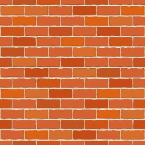
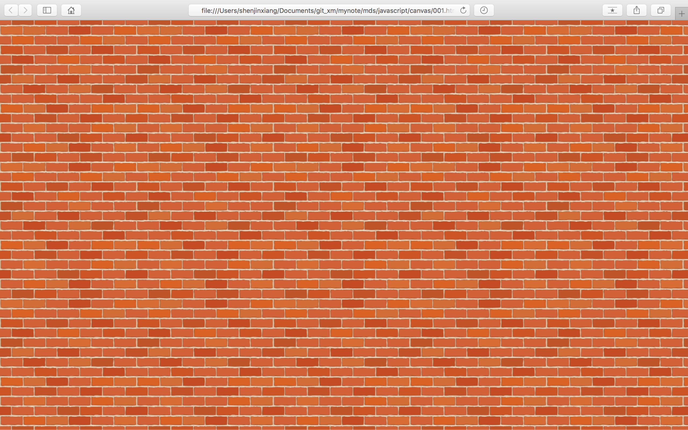
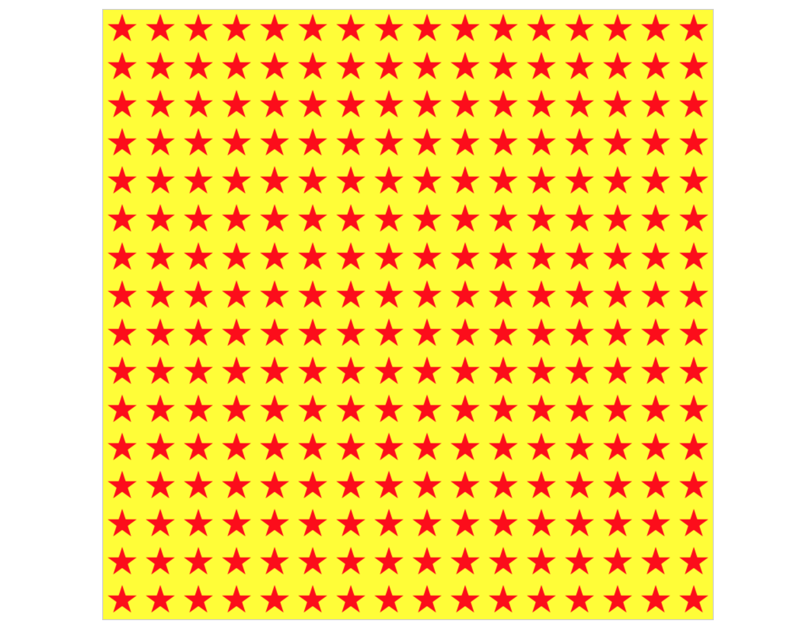

# Canvas填充样式
这一节主要说两个属性，`fillStyle`和`strokeStyle`，在此之前，设置这两个属性的值，都是一个表示颜色的字符串，但是这两属性的值不仅仅可以是个颜色，如果只可以设置颜色的话，属性名称就应该叫`fillColor`和`strokeColor`

实际上这两个属性的值可以是任意的css中接受的表示颜色的字符串以外，还可以是表示渐变颜色的CanvasGradient对象以及基于图片的CanvasPattern对象

## 线性渐变
关于线性渐变需要引入两个方法：

> CanvasRenderingContext2D.createLinearGradient(x0, y0, x1, y1)    
> CanvasGradient.addColorStop(stop, color)    

CanvasRenderingContext2D的`createLinearGradient()`生成并返回一个新的CanvasGradient对象，表示颜色重起点`(x0, y0)`到终点`(x1, y1)`之间的线性渐变，这个方法并没有指定渐变的颜色

要指定颜色，需要使用返回对象的`addColorStop()`方法，`addColorStop()`方法用于定义一个渐变中的固定颜色，参数`color`的值为任意css可以接收的表示颜色的字符串。参数`stop`是0.0 ~ 1.0之间的一个浮点数，对于渐变的起点到终点的位置，值为0表示起点，值为1表示终点

当设置好颜色以后将这个CanvasGradient对象赋值给`fillStyle`或`strokeStyle`属性，当调用对应的`fill()`方法和 `stroke()`方法时，即实现渐变效果，代码：
```javascript
(function () {
	let canvas = document.getElementById('mycanvas');
	canvas.width = 800;
	canvas.height = 800;
	let context = canvas.getContext('2d');

	let linearGrad = context.createLinearGradient(0, 0, canvas.width, canvas.height);
	linearGrad.addColorStop(0, '#fff');
	linearGrad.addColorStop(1, '#000');
	context.fillStyle = linearGrad;
	context.fillRect(0, 0, canvas.width, canvas.height);
})();
```

效果：


这个例子中通过`createLinearGradient()`创建一个线性渐变对象，从`(0, 0)`点白色渐变到`(800, 800)`黑色，最后填充一个矩形区域（整个canvas区域）

设置线性渐变颜色的`addColorStop()`方法可以添加很多个，代码：

```javascript
(function () {
	let canvas = document.getElementById('mycanvas');
	canvas.width = 800;
	canvas.height = 800;
	let context = canvas.getContext('2d');

	let linearGrad = context.createLinearGradient(0, 0, canvas.width, canvas.height);
	linearGrad.addColorStop(0, 'white');
	linearGrad.addColorStop(0.25, 'yellow');
	linearGrad.addColorStop(0.5, 'green');
	linearGrad.addColorStop(0.75, 'blue');
	linearGrad.addColorStop(1, 'black');
	context.fillStyle = linearGrad;
	context.fillRect(0, 0, canvas.width, canvas.height);
})();
```

效果：


再看一个例子：

```javascript
(function () {
	let canvas = document.getElementById('mycanvas');
	canvas.width = 800;
	canvas.height = 400;
	let context = canvas.getContext('2d');

	let linearGrad = context.createLinearGradient(0, 0, canvas.width, 0);
	linearGrad.addColorStop(0, 'red');
	linearGrad.addColorStop(0.5, 'red');
	linearGrad.addColorStop(0.5 + Number.MIN_VALUE, 'blue');
	linearGrad.addColorStop(1, 'blue');
	context.fillStyle = linearGrad;
	context.fillRect(100, 150, 600, 100);
})();
```

效果：


创建线性渐变`createLinearGradient()`方法参数的两个坐标点，与填充时的坐标点是没有任何关系的，实际开发的时候可以灵活应用

## 径向渐变
有了线性渐变的基础，理解和使用径向渐变就很简单了，线性渐变是通过设置两个坐标点，在这两个坐标点之间设置不同颜色，依次渐变。径向渐变则用于绘制放射状的渐变图像，方法：

> CanvasRenderingContext2D.createRadialGradient(x0,y0,r0,x1,y1,r1)

**参数说明**

* x0 - 渐变开始圆的的圆心x坐标值
* y0 - 渐变开始圆的圆心的y坐标值
* r0 - 渐变开始圆的半径值
* x1 - 渐变结束圆的的圆心x坐标值
* y1 - 渐变结束圆的圆心的y坐标值
* r1 - 渐变结束圆的半径值

通过`createRadialGradient()`方法创建CanvasGradient对象，然后调用`addColorStop()`方法来设置不同的颜色节点，代码：

```javascript
(function () {
	let canvas = document.getElementById('mycanvas');
	canvas.width = 800;
	canvas.height = 800;
	let context = canvas.getContext('2d');

	let canvasGradient = context.createRadialGradient(400, 400, 50, 400, 400, 300);
	canvasGradient.addColorStop(0, 'red');
	canvasGradient.addColorStop(1, 'white');
	context.fillStyle = canvasGradient;
	context.fillRect(200, 200, 400, 400);
})();
```

效果：


当理解了线性渐变的绘制方法以后，理解径向渐变就很容易了

## 使用画布、图片或者video
线性渐变和径向渐变依然是通过设置一些颜色值，来设置填充的样式。实际上canvas中的填充样式不仅可以通过颜色设置，也可以是另外一个canvas、图片甚至是一个video

基本流程是这样的：通过调用`createPattern()`方法，返回CanvasPattern对象，将样式(fillStyle或strokeStyle)的值设置成该对象，然后执行填充

> CanvasRenderingContext2D.createPattern(Element image, string repetition)

其中参数image可以是一个image、canvas或video对象，参数repetition定义图片如何平铺

**repetition的值:**

* 'repeat' - 默认值，在x轴方向和y轴方向都平铺图像
* 'repeat-x' - 只在x轴方向平铺图像
* 'repeat-y' - 只在y轴方向平铺图像
* 'no-repeat' - 不平铺图像，图像只绘制一次

### 使用图片填充
首先当然需要一张图片，这里我使用了下面的图片：



这张图片的宽高为300像素，且如果平铺的话，左右上下都可以连续起来，下面是canvas中使用该图片的代码：

```javascript
(function() {
	let canvas = document.getElementById('mycanvas');
	canvas.width = window.innerWidth;
	canvas.height = window.innerHeight;
	let context = canvas.getContext('2d');

	let img = new Image();
	img.src = './images/00039.png';
	img.onload = function () {
		context.fillStyle = context.createPattern(img, 'repeat');
		context.fillRect(0, 0, canvas.width, canvas.height);
	};
})();
```

效果：



这里我设置canvas的宽高值为浏览器可视窗口的宽高，设置img的src属性为外部图片的路径，使用`createPattern()`创建CanvasPattern对象，将返回值赋值给`fillStyll`属性，最后填充整个canvas画布，需要注意的是，要试着body的css属性margin和padding值为0px

### 使用canvas填充
使用canvas填充很简单了，再创建一个canvas绘制一些图案，然后调用即可，代码：

```javascript
(function() {
	let canvas = document.getElementById('mycanvas');
	canvas.width = 800;
	canvas.height = 800;
	let context = canvas.getContext('2d');
	context.fillStyle = context.createPattern(getStarCanvas(), 'repeat');
	context.fillRect(0, 0, canvas.width, canvas.height);
	
	function getStarCanvas() {
		let starCanvas = document.createElement('canvas');
		starCanvas.width = 50;
		starCanvas.height = 50;
		let ctx = starCanvas.getContext('2d');

		ctx.fillStyle = 'yellow';
		ctx.fillRect(0, 0, starCanvas.width, starCanvas.height);
		let r = 20;
		ctx.beginPath();
		ctx.fillStyle = 'red';
		ctx.translate(starCanvas.width / 2, starCanvas.height / 2);
		ctx.rotate(-Math.PI / 2);
		for(let i = 0; i < 5; i++) {
			ctx.lineTo(Math.cos(4 * Math.PI / 5 * i) * r, Math.sin(4 * Math.PI / 5 * i) * r);
		}
		ctx.closePath();
		ctx.restore();
		ctx.fill();
		return starCanvas;
	}
})();
```

效果：



这个例子中，使用`getStarCanvas()`方法创建一个canva对象，宽度和高度都为100像素，在这个小canvas中绘制了一个黄底红色的五角星，最后将这个小canvas返回，大canvas中将其作为`createPattern()`方法的参数调用，最后填充出了上图的效果
