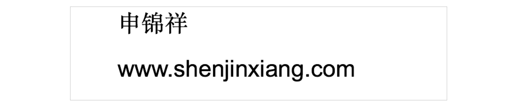
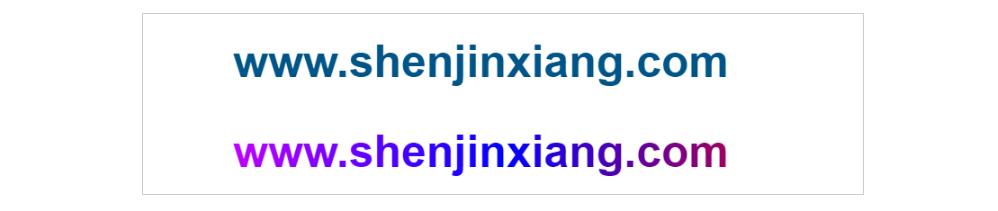
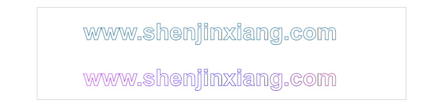
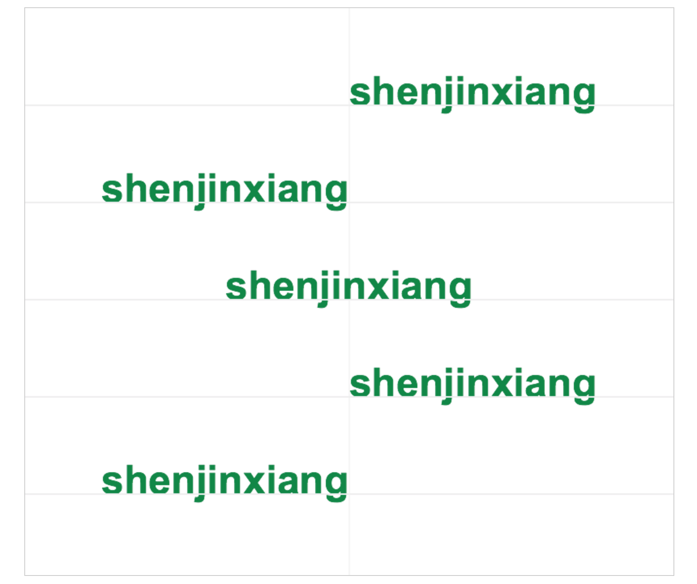
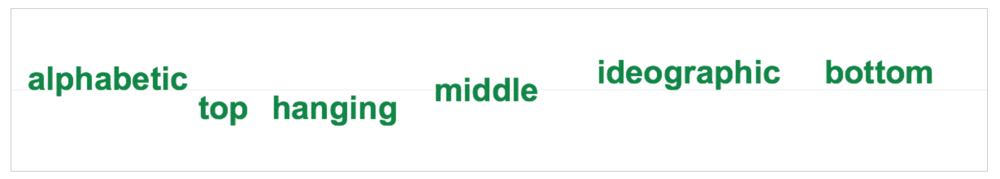

# Canvas文字渲染
图片中不止有一些线条组成的一些图形，同样可能会有一些文字，Canvas同样提供了绘制文字的方法

## fillText()方法
CanvasRenderingContext2D对象的fillText方法用于在画布上绘制一段文本内容，绘制的颜色、渐变、背景通过fillStyle属性来设置，文本的字体大小、样式通过CanvasRenderingContext2D对象的font属性设置

> CanvasRenderingContext2D.fillText(text, x, y, maxWidth)

fillText()方法的参数也很好理解，第一个参数为需要渲染的文本内容，x和y指定渲染的位置，可选参数maxWidth规定渲染的最大宽度，如果文本内容比较长，超过maxWidth值，设置这个参数会将文本压缩到指定的最大宽度

```javascript
(function() {
	let canvas = document.getElementById('mycanvas');
	canvas.width = 800;
	canvas.height = 200;
	let context = canvas.getContext('2d');

	context.font = '50px 宋体';
	context.fillText('申锦祥', 100, 50);
		
	context.font = '50px Arial';
	context.fillText('www.shenjinxiang.com', 100, 150);
})();
```

效果:



这样简单的文字渲染效果就出来了，上面提到过可以使用fillStyle来设置填充的样式，代码：

```javascript
(function () {
	let str = 'www.shenjinxiang.com';

	let canvas = document.getElementById('mycanvas');
	canvas.width = 800;
	canvas.height = 200;
	let context = canvas.getContext('2d');

	// 纯色
	context.fillStyle = '#058';
	context.font = 'bold 50px Arial';
	context.fillText(str, 100, 70);

	// 渐变色
	let gradient = context.createLinearGradient(0, 0, canvas.width, 0);
	gradient.addColorStop(0, 'magenta');
	gradient.addColorStop(0.5, 'blue');
	gradient.addColorStop(1, 'red');
	context.fillStyle = gradient;
	context.fillText(str, 100, 170);
})();
```

效果：



采用了纯色和渐变色绘制的一段文字，当然也可以使用外部图片或者其他canvas作为背景填充

## strokeText()方法
CanvasRenderingContext2D的strokeText()方法的与fillText()差不多，唯一的区别在于fillText()方法是填充一段文本，而strokeText()方法是绘制文本的描边，同样的可以设置strokeStyle属性来着是样式，直接来代码：

```javascript
(function () {
	let str = 'www.shenjinxiang.com';

	let canvas = document.getElementById('mycanvas');
	canvas.width = 800;
	canvas.height = 200;
	let context = canvas.getContext('2d');

	// 纯色
	context.strokeStyle = '#058';
	context.font = 'bold 50px Arial';
	context.strokeText(str, 100, 70);

	// 渐变色
	let gradient = context.createLinearGradient(0, 0, canvas.width, 0);
	gradient.addColorStop(0, 'magenta');
	gradient.addColorStop(0.5, 'blue');
	gradient.addColorStop(1, 'red');
	context.strokeStyle = gradient;
	context.strokeText(str, 100, 170);
})();
```

效果：



基本和上一个例子中的代码一样的，只是将fillText改成strokeText、将fillStyle改成strokeStyle，可以看到strokeText的效果

## 设置文本位置
关于文字的渲染还有一些细节，比如文字的位置，在fillText()方法和strokeText()方法的第二个、第三个参数指定了文字渲染的位置。另外CanvasRenderingContext2D提供了另外两个属性：textAlign属性和textBaseline属性

### textAlign 属性
textAlign属性指定了文字在水平方向的对齐方式，与fillText()或strokeText()方法的第二个参数x相关，textAlign属性值：

|值|描述|
|:--|:--|
|start|默认。文本在指定的位置开始|
|end|文本在指定的位置结束|
|center|文本的中心被放置在指定的位置|
|left|文本左对齐|
|right|文本右对齐|

```javascript
(function() {
	let str = 'shenjinxiang';

	let canvas = document.getElementById('mycanvas');
	canvas.width = 800;
	canvas.height = 700;
	let context = canvas.getContext('2d');

	context.lineWidth = 1;
	context.strokeStyle = '#eee';
	context.moveTo(canvas.width / 2, 0);
	context.lineTo(canvas.width / 2, canvas.height);
	context.stroke();

	var aligns = ['start', 'end', 'center', 'left', 'right'];

	context.fillStyle = '#084';
	context.font = 'bold 50px Arial';
	for (var i = 0; i < aligns.length; i++) {
		context.textAlign = aligns[i];
		context.fillText(str, canvas.width / 2, (i + 1) * 120);

		context.beginPath();
		context.lineTo(0, (i + 1) * 120);
		context.lineTo(canvas.width, (i + 1) * 120);
		context.closePath();
		context.stroke();
	}

})();
```

效果：



使用aligns变量记录了textAlign的各种值，从上到下一次绘制文字，fillText()方法的x参数值一只为canvas的宽度的一半也就是在画布的垂直中心线上，另外绘制了一些辅助线，便于更直观的观察结果

### textBaseline 属性
textBaseline属性指定了文字在竖直方向的对齐方式，与fillText()或strokeText()方法的第三个参数y相关，textBaseline属性值：

|值|描述|
|:--|:--|
|alphabetic|默认。文本基线是普通的字母基线|
|top|文本基线是 em 方框的顶端|
|hanging|文本基线是悬挂基线|
|middle|文本基线是 em 方框的正中|
|ideographic|文本基线是表意基线|
|bottom|文本基线是 em 方框的底端|

```javascript
(function() {
	let canvas = document.getElementById('mycanvas');
	canvas.width = 1200;
	canvas.height = 200;
	let context = canvas.getContext('2d');

	context.lineWidth = 1;
	context.strokeStyle = '#eee';
	context.moveTo(0, canvas.height / 2);
	context.lineTo(canvas.width, canvas.height / 2);
	context.stroke();

	var bls = ['alphabetic', 'top', 'hanging', 'middle', 'ideographic', 'bottom'];

	context.fillStyle = '#084';
	context.font = 'bold 40px Arial';

	context.textBaseline = 'alphabetic';
	context.fillText('alphabetic', 20, canvas.height / 2);

	context.textBaseline = 'top';
	context.fillText('top', 230, canvas.height / 2);

	context.textBaseline = 'hanging';
	context.fillText('hanging', 320, canvas.height / 2);

	context.textBaseline = 'middle';
	context.fillText('middle', 520, canvas.height / 2);

	context.textBaseline = 'ideographic';
	context.fillText('ideographic', 720, canvas.height / 2);

	context.textBaseline = 'bottom';
	context.fillText('bottom', 1000, canvas.height / 2);

})();
```

效果：


