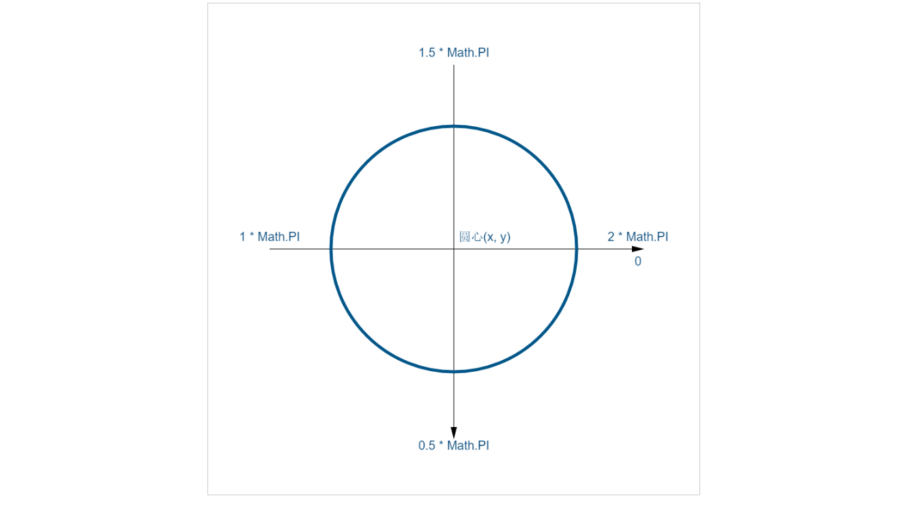

# Canvas绘制曲线
在此之前我们都是使用canvas绘制线段组成一些图案，今天介绍Canvas绘制曲线的一些接口

## arc()方法
arc()方法用来绘制一段圆弧，调用方法：
> context.arc(x, y, r, sAngle, eAngle, counterclockwise)

参数说明：

* x: 要绘制圆弧圆心的x坐标值，Number类型
* y: 要绘制圆弧圆心的y坐标值，Number类型
* r: 要绘制圆弧半径，Number类型
* sAngle: 绘制的圆弧的起始角度，单位为弧度
* eAngle: 绘制的圆弧的结束角度，单位为弧度
* counterclockwise: 规定应该逆时针还是顺时针绘图，false表示顺时针，true表示逆时针，默认为false

这里需要注意的是起始弧度终止弧度参数，默认情况下，x坐标正方向上的为0度，即圆弧的三点钟位置为0度，顺时针为正，示例如下图：

不论是要顺时针还是要逆时针绘图，角度是不会变的，看下面的代码：
