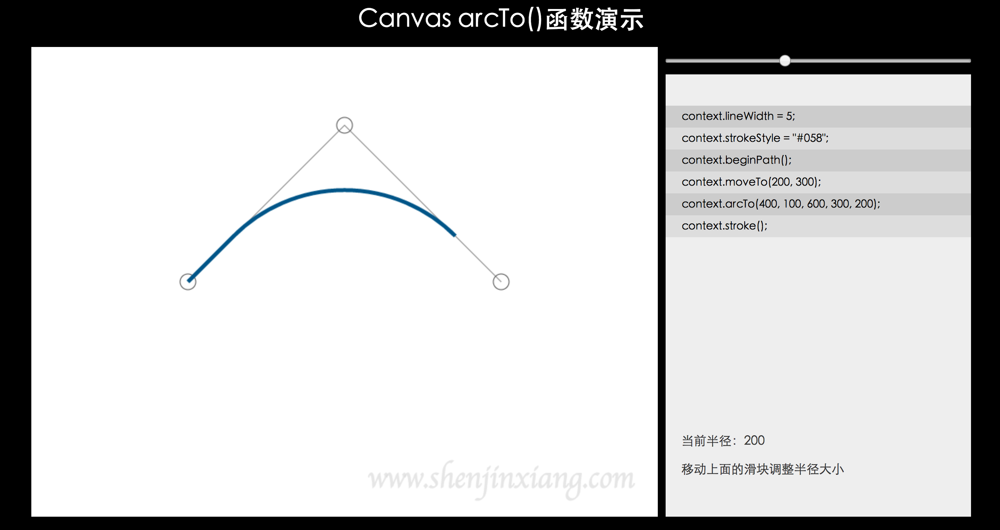
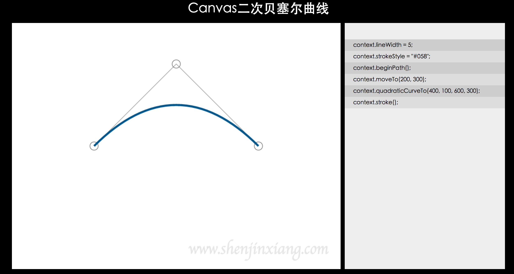
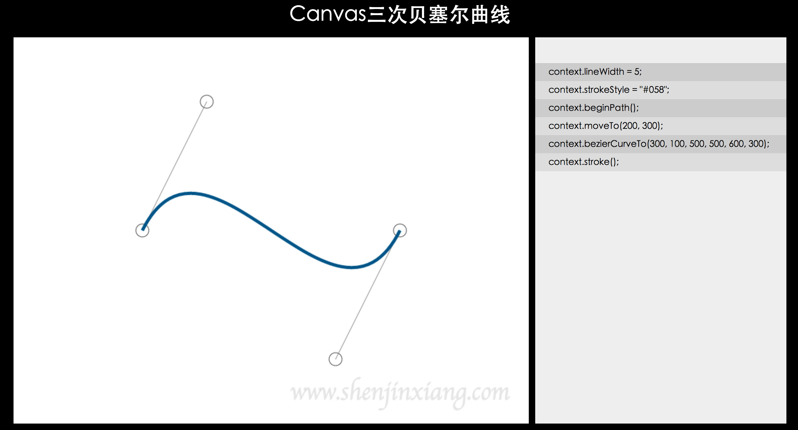

# Canvas绘制曲线
在此之前我们都是使用canvas绘制线段组成一些图案，今天介绍Canvas绘制曲线的一些接口

## arc()方法
arc()方法用来绘制一段圆弧，调用方法：
> context.arc(x, y, r, sAngle, eAngle, counterclockwise)

参数说明：

* x: 要绘制圆弧圆心的x坐标值，Number类型
* y: 要绘制圆弧圆心的y坐标值，Number类型
* r: 要绘制圆弧半径，Number类型
* sAngle: 绘制的圆弧的起始角度，单位为弧度
* eAngle: 绘制的圆弧的结束角度，单位为弧度
* counterclockwise: 规定应该逆时针还是顺时针绘图，false表示顺时针，true表示逆时针，默认为false

这里需要注意的是起始弧度终止弧度参数，默认情况下，x坐标正方向上的为0度，即圆弧的三点钟位置为0度，顺时针为正，示例如下图：


不论是要顺时针还是要逆时针绘图，角度是不会变的，看下面的代码：
```javascript
(function() {
	let canvas = document.getElementById('mycanvas');
	canvas.width = 800;
	canvas.height = 400;
	let context = canvas.getContext('2d');

	context.lineWidth = 5;
	context.fillStyle = '#058';

	context.beginPath();
	context.arc(100, 100, 75, 0, 0.5 * Math.PI, false);
	context.stroke();

	context.beginPath();
	context.arc(300, 100, 75, 0, 1 * Math.PI, false);
	context.stroke();

	context.beginPath();
	context.arc(500, 100, 75, 0, 1.5 * Math.PI, false);
	context.stroke();

	context.beginPath();
	context.arc(700, 100, 75, 0, 2 * Math.PI, false);
	context.stroke();

	context.beginPath();
	context.arc(100, 300, 75, 0, 0.5 * Math.PI, false);
	context.fill();

	context.beginPath();
	context.arc(300, 300, 75, 0, 1 * Math.PI, false);
	context.fill();

	context.beginPath();
	context.arc(500, 300, 75, 0, 1.5 * Math.PI, false);
	context.fill();

	context.beginPath();
	context.arc(700, 300, 75, 0, 2 * Math.PI, false);
	context.fill();
})();
```

效果：


上图中所有圆弧的其实位置都是在0度位置，结束角度不同，可以看到如果一段不封闭的圆弧，调用`fill()`方法的时候，会将起点和终点连接成封闭的路径，然后填充

```javascript
(function() {
	let canvas = document.getElementById('mycanvas');
	canvas.width = 800;
	canvas.height = 400;
	let context = canvas.getContext('2d');

	context.lineWidth = 5;
	context.fillStyle = '#058';

	context.beginPath();
	context.arc(100, 100, 75, 0, 0.5 * Math.PI, true);
	context.stroke();

	context.beginPath();
	context.arc(300, 100, 75, 0, 1 * Math.PI, true);
	context.stroke();

	context.beginPath();
	context.arc(500, 100, 75, 0, 1.5 * Math.PI, true);
	context.stroke();

	context.beginPath();
	context.arc(700, 100, 75, 0, 2 * Math.PI, true);
	context.stroke();

	context.beginPath();
	context.arc(100, 300, 75, 0, 0.5 * Math.PI, true);
	context.fill();

	context.beginPath();
	context.arc(300, 300, 75, 0, 1 * Math.PI, true);
	context.fill();

	context.beginPath();
	context.arc(500, 300, 75, 0, 1.5 * Math.PI, true);
	context.fill();

	context.beginPath();
	context.arc(700, 300, 75, 0, 2 * Math.PI, true);
	context.fill();
})();
```

效果：


这个例子和上一个例子代码唯一的区别在于绘制圆弧的时候最后一个参数由`false`改成`true`，意味着将采用逆时针方式绘制图形，可以看到没有调用rotate的情况下，0度在3点钟位置，而`0.5 * Math.PI`的角度在6点钟位置

Canvas的CanvasRenderingContext2D对象提供了`strokeRect()`，和`fillRect()`方法用于绘制矩形边框和填充矩形区域，那么我们也可以封装一个`strokeRoundRect()`和`fillRoundRect()`方法用于绘制带圆角的矩形边框的填充带圆角的矩形区域的功能
```javascript
(function() {
	CanvasRenderingContext2D.prototype.strokeRoundRect = function (x, y, width, height, r) {
		this.save();
		this.translate(x, y);
		roundRect(this, width, height, r);
		this.stroke();
		this.restore();
	};

	CanvasRenderingContext2D.prototype.fillRoundRect = function (x, y, width, height, r) {
		this.save();
		this.translate(x, y);
		roundRect(this, width, height, r);
		this.fill();
		this.restore();
	};

	function roundRect(ctx, width, height, r) {
		ctx.beginPath();
		ctx.arc(width - r, height - r, r, 0, 0.5 * Math.PI, false);
		ctx.lineTo(r, height);
		ctx.arc(r, height - r, r, 0.5 * Math.PI, Math.PI, false);
		ctx.lineTo(0, r);
		ctx.arc(r, r, r, Math.PI, 1.5 * Math.PI, false);
		ctx.lineTo(width -r, 0);
		ctx.arc(width -r, r, r, 1.5 * Math.PI, 0, false);
		ctx.closePath();
	}
})();
```
下面是调用的代码：
```javascript
(function() {
	let canvas = document.getElementById('mycanvas');
	canvas.width = 800;
	canvas.height = 800;
	let context = canvas.getContext('2d');

	context.strokeRoundRect(100, 100, 200, 200, 50);

	context.lineWidth = 5;
	context.strokeStyle = '#058';
	context.strokeRoundRect(500, 100, 200, 200, 50);
		
	context.fillStyle='#058';
	context.fillRoundRect(100, 500, 200, 200, 50);
	
	context.fillStyle = 'yellow';
	context.fillRoundRect(500, 500, 200, 200, 50);
	context.strokeRoundRect(500, 500, 200, 200, 50);
})();
```

效果：


通过扩展CanvasRenderingContext2D对象原型的方法，实现了`strokeRoundRect()`和`fillRoundRect()`方法，实现了绘制带圆角的矩形图案

## arcTo()方法
canvas中绘制圆弧，还可以使用`arcTo()`方法在画布上创建介于两个切线之间的圆弧，调用方式：

> context.arcTo(x1, y1, x2, y2, radius)

这里需要引入一个控制点的概念，x1、y1就是控制点的x、y坐标值，将当前的点坐标（即`moveTo()`或`lineTo()`到达的位置，或者其它结束点的位置）和控制点，以及控制点和`(x2, y2)`连成的折线段作为辅助线，按半径为radius的圆弧和这两个线段相切。可以得到以下结论：

1. 圆弧必然不经过`(x1, y1)`点
2. 绘制的路径的起始点一点是上次的结束点，但圆弧的起始点不一定在这个位置
3. 圆弧的终点也不一定在`(x2, y2)`位置

为了更明确的表述这个方法，我做了一个简单的页面，用于展示CanvasRenderingContext2D的`arcTo()`方法，地址：[http://www.shenjinxiang.com/pages/mydemo/canvas/arcTo/index.html](http://www.shenjinxiang.com/pages/mydemo/canvas/arcTo/index.html) 在这个页面中可以通过移动三个圆圈分别控制起始点、控制点和结束点的坐标，通过调整右侧上方的滑块调整圆弧半径的大小，可以很直观的理解`arcTo()`方法，页面效果如下：



## quadraticCurveTo()方法
用于绘制二次贝塞尔曲线，调用方式：

> context.quadraticCurveTo(cpx, cpy, x, y)

传入四个参数，分别表示控制点`(cpx, cpy)`的x、y坐标值和结束点`(x, y)`的x、y坐标值。将当前点坐标通过控制点绘制二次贝塞尔曲线到结束点结束

同样的，为了明确表述这个方法，也有一个简单的页面，用于展示CanvasRenderingContext2D的`quadraticCurveTo()`方法，地址：[http://www.shenjinxiang.com/pages/mydemo/canvas/quadraticCurveTo/index.html](http://www.shenjinxiang.com/pages/mydemo/canvas/quadraticCurveTo/index.html)，在这个页面中可以移动起始点、控制点和结束点的坐标，显示二次贝塞尔曲线的效果，右侧显示绘制曲线的代码。页面效果：



## bezierCurveTo()方法
这个方法用于绘制三次贝塞尔曲线，调用方式：

> context.bezierCurveTo(cpx1, cpy1, cpx2, cpy2, x, y)

相对于二次贝塞尔曲线，三次贝塞尔曲线需要两个控制点，所以需要6个参数，分别表示控制点1`(cpx1, cpy1)`、控制点2`(cpx2, cpy2)`和结束点坐标`(x, y)`。通过起始点、两个控制点最后在结束点之间绘制三次贝塞尔曲线。

展示页面地址：[http://www.shenjinxiang.com/pages/mydemo/canvas/bezierCurveTo/index.html](http://www.shenjinxiang.com/pages/mydemo/canvas/bezierCurveTo/index.html)，可以移动起始点、控制点和结束点，显示控制曲线的形状。右侧为绘制曲线的代码。页面效果：


