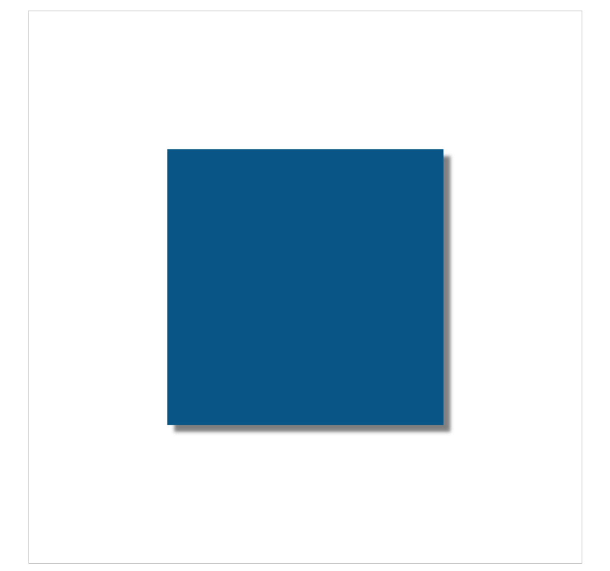

# Canvas阴影
canvas中同样可以绘制阴影，绘制阴影的时候，并不需要像绘制线条和填充一样调用专门的方法去绘制，而是设置阴影相关的一些属性，当调用fill或者stroke方法绘制图形的时候，阴影就绘制出来了，阴影相关的属性有：

## shadowColor属性
CanvasRenderingContext2D对象的shadowColor属性指定了阴影的颜色，属性值可以是任意的css中可接受的颜色值，甚至可以是有一定透明度的颜色，默认值为'#000000'

## shadowOffsetX属性和shadowOffsetY属性
CanvasRenderingContext2D对象的shadowOffsetX和shadowOffsetY属性指定了阴影在x和y轴方向的偏移量，默认为0，即没有偏移量，当shadowOffsetX的值设置为正数，阴影会向右（x轴正方向）便宜设置的像素。如果为负数，则像相反的方向便宜，对于shadowOffsetY属性也是类似的，值为正数表示向下偏移，负数表示向上偏移

## shadowBlur属性
CanvasRenderingContext2D对象的shadowBlur属性用于设置阴影的模糊等级，默认为0，即不模糊

## 一些例子
```javascript
(function() {
	let canvas = document.getElementById('mycanvas');
	canvas.width = 800;
	canvas.height = 800;
	let context = canvas.getContext('2d');

	context.shadowColor = 'gray';
	context.shadowOffsetX = 10;
	context.shadowOffsetY = 10;
	context.shadowBlur = 5;

	context.fillStyle = '#058';
	context.fillRect(200, 200, 400, 400);
})();
```

效果：



这里简单绘制了一个矩形图案，在绘制之前设置了阴影的颜色、x轴、y轴方向的偏移量，以及模糊程度

---

关于偏移量，可以设置为负值，即相反方向偏移；关于模糊程度，可以设置为0即很清晰的图案，看下面的例子

```javascript
(function() {
	let canvas = document.getElementById('mycanvas');
	canvas.width = 800;
	canvas.height = 800;
	let context = canvas.getContext('2d');

	context.shadowColor = 'green';
	context.shadowOffsetX = -400;
	context.shadowOffsetY = -400;
	context.shadowBlur = 0;

	context.fillStyle = '#058';
	context.fillRect(400, 400, 400, 400);
})();
```

效果：


这个例子中，我们绘制了一个蓝色的矩形图案，设置阴影为相反方向偏移的绿色的图案，模糊等级为0

---

```javascript
(function() {
	let canvas = document.getElementById('mycanvas');
	canvas.width = 800;
	canvas.height = 300;
	let context = canvas.getContext('2d');

	context.fillStyle = '#058';
	context.font = "bold 50px Arial";
	context.textAlign = 'center';
	context.textBaseline = 'middle';

	context.shadowColor = '#aaa';
	context.shadowOffsetX = 5;
	context.shadowOffsetY = 5;
	context.shadowBlur = 2;
	context.fillText('申锦祥', 400, 100);

	context.strokeStyle = '#058';
	context.lineWidth = 2;
	context.shadowColor = '00f7ff';
	context.shadowOffsetX = 0;
	context.shadowOffsetY = 0;
	context.shadowBlur = 5;
	context.strokeText('www.shenjinxiang.com', 400, 180);
})();
```

效果：


这个例子中先使用fillText()方法绘制了一段文字，同时添加阴影。然后会strokeText()方法绘制了另外一段文字，同样添加阴影，这里的阴影设置x、y轴方向的偏移量为0，展示出图上的效果
