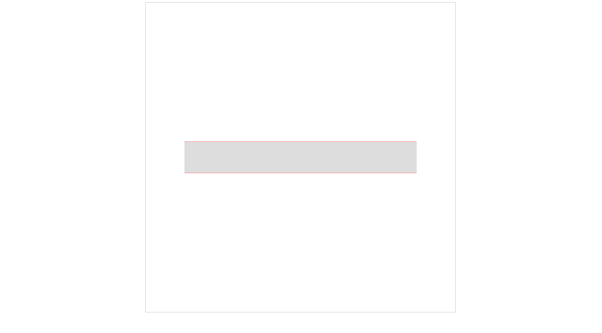
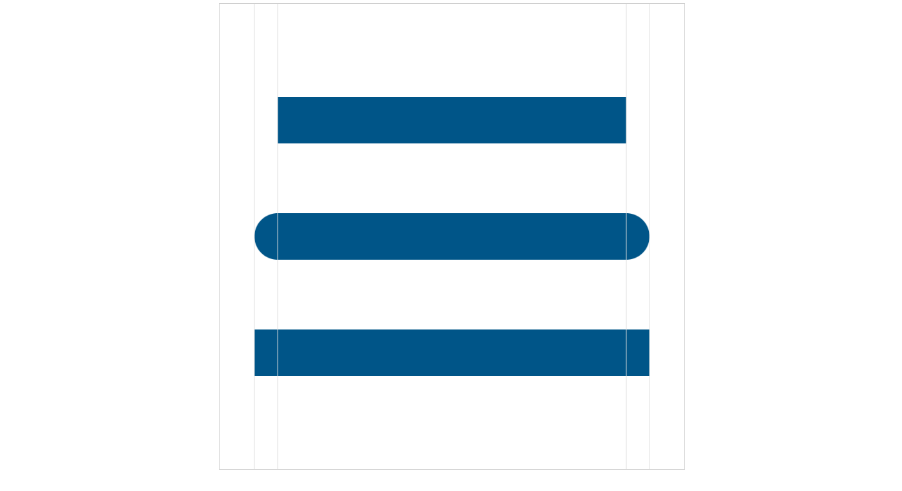
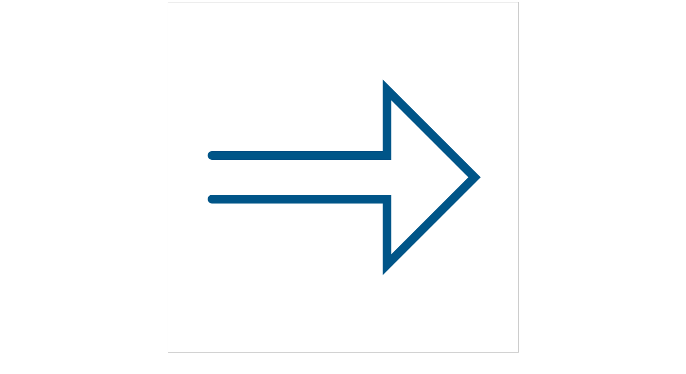
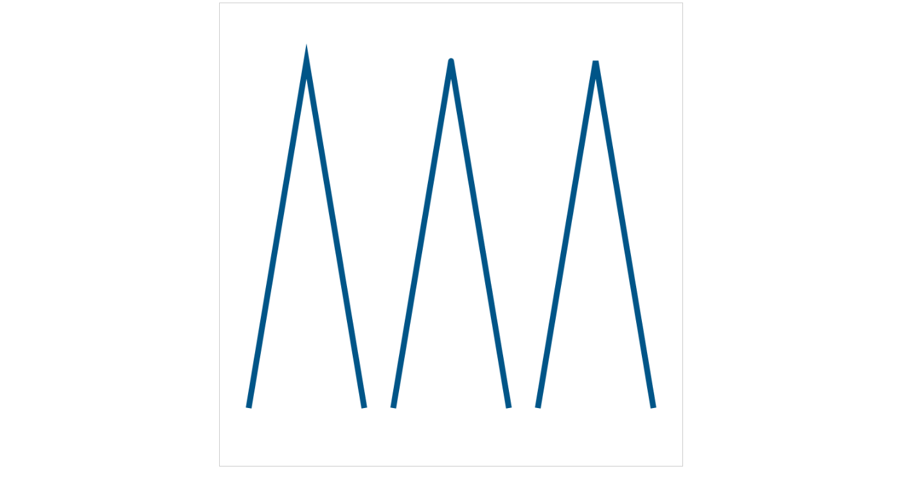

# 线条的属性
上节中，介绍了绘制线段、连续线段、折线段、封闭图形的边框以及填充等，在实际绘图中，线条可以说是基本要素，现在我主要看看线条的一些属性。同样的，需要html模板：
```html
<!doctype html>
<html>
<head>
	<meta charset='utf-8'>
	<style>
		canvas{display:block; border: 1px solid #ccc;margin: 0px auto;}
	</style>
	<title>canvas</title>
</head>
<body>
	<canvas id='mycanvas'></canvas>
<script src='外部js路径'></script>
</body>
</html>
```

## lineWidth属性
用于设置线条的宽度，`lineWidth`属性之前用过的，也很好理解，属性值为数字类型，默认值为1，即1像素宽。值大于1时线条的中心在路径上，路径两边各占一半的宽度，看下面代码：
```javascript
(function() {
	let canvas = document.getElementById('mycanvas');
	canvas.width = 800;
	canvas.height = 800;
	let context = canvas.getContext('2d');

	// 开始绘制
	context.beginPath();
	context.lineTo(100, 360);
	context.lineTo(700, 360);
	context.strokeStyle = 'red';
	context.stroke();

	context.beginPath();
	context.lineTo(100, 440);
	context.lineTo(700, 440);
	context.strokeStyle = 'red';
	context.stroke();

	context.beginPath();
	context.lineTo(100, 400);
	context.lineTo(700, 400);
	context.lineWidth = 80;
	context.strokeStyle = '#ddd';
	context.stroke();
})();
```
效果如下：



很好理解也很简单的例子，先绘制了两条相距80像素、宽度为1像素、红色的平行线段，最后在中间绘制了一条宽度为80的浅灰色线段，说明当宽度大于1时，线条的中心在路径上，路径两边各占一半宽度

## strokeStyle属性
用于设置线条颜色、图案或渐变，目前我们只用到颜色，图案和渐变色以后会有说明。如果设置颜色的话，`strokeStyle`属性的值为一个字符串，可以是css中表示颜色的字符串

另外，对于`fillStyle`属性，用于设置填充的颜色、图案或渐变，可以和`strokeStyle`一样的，只是用途不同

## lineCap属性
lineCap属性定义线条末端的样式，只有在画粗线条时这个属性才有用，属性值为字符串类型，下面是说明

|值|含义|
|:--|:--|
|'butt'|默认值，线条没有线帽，线条的终点上平直的，与线条方向垂直，线条不会超过终点|
|'round'|线条由一个半圆形的线帽，半圆的直径等于线条的宽度，半圆在线条的终点处向外扩展、距离为线条宽度的一半|
|'square'|这个值定义线条由一个矩形的线帽，和'butt'类似，但线条的终点处会扩展出其宽度一半的距离|

代码示例：
```javascript
(function(){
	let canvas = document.getElementById('mycanvas');
	canvas.width = 800;
	canvas.height = 800;
	let context = canvas.getContext('2d');

	// 开始绘制
	
	// 设置通用样式
	context.lineWidth = 80;
	context.strokeStyle = '#058';
	
	// lineCap属性值为 butt
	context.beginPath();
	context.lineTo(100, 200);
	context.lineTo(700, 200);
	context.lineCap = 'butt';
	context.stroke();

	// lineCap属性值为 round
	context.beginPath();
	context.lineTo(100, 400);
	context.lineTo(700, 400);
	context.lineCap = 'round';
	context.stroke();

	// lineCap属性值为 square
	context.beginPath();
	context.lineTo(100, 600);
	context.lineTo(700, 600);
	context.lineCap = 'square';
	context.stroke();

	// 绘制辅助线，便于观察
	
	context.lineWidth = 1;
	context.strokeStyle = '#aaa';
	context.lineCap = 'butt';

	context.beginPath();
	context.lineTo(60, 0);
	context.lineTo(60, context.canvas.width);
	context.stroke();

	context.beginPath();
	context.lineTo(100, 0);
	context.lineTo(100, context.canvas.width);
	context.stroke();

	context.beginPath();
	context.lineTo(700, 0);
	context.lineTo(700, context.canvas.width);
	context.stroke();

	context.beginPath();
	context.lineTo(740, 0);
	context.lineTo(740, context.canvas.width);
	context.stroke();
})();
```

效果：



上图中绘制了三条宽度为80像素的直线段，`lineCap`属性取不同的值，竖直的四条浅灰色线条为辅助线，可以看到各自的效果

lineCap属性只是定义了线条末端的样式，代码：

```javascript
(function() {
	let canvas = document.getElementById('mycanvas');
	canvas.width = 800;
	canvas.height = 800;
	let context = canvas.getContext('2d');

	// 开始绘制
	context.beginPath();
	context.moveTo(100, 350);
	context.lineTo(500, 350);
	context.lineTo(500, 200);
	context.lineTo(700, 400);
	context.lineTo(500, 600);
	context.lineTo(500, 450);
	context.lineTo(100, 450);

	context.strokeStyle = '#058';
	context.lineWidth = 20;
	context.lineCap = 'round';

	context.stroke();
})();
```

效果：



上图是一个连续的线段图形，设置了lineCap属性值为“round”，可以看到只有开始和结束的位置有圆角样式，线段的连接处是没有的

另外，上一级关于封闭路径的处理，我们使用了`closePath()`，因为使用`lineTo()`的时候会有个小缺口，就那个例子而言，如果`lingCap`属性值设置为“square”同样可以达到效果，但是建议使用`closePath()`方法

## lineJoin属性
lineCap属性定义了线条末端的样式，lineJoin属性则定义了线条相交点的样式，只对线条宽度大于1的情况才有效

lineJoin的属性值为字符串类型，可能的值为：

|值|说明|
|:--:|:--|
|'miter'|默认值，两天线段的外边缘一直扩展到它们相交|
|'round'|定义交合部分顶点的外边缘为一段实心圆弧，直径与线条的宽度相等|
|'bevel'|顶点的外边缘应该和一个填充的三角形相交|

代码：
```javascript
(function() {
	let canvas = document.getElementById('mycanvas');
	canvas.width = 800;
	canvas.height = 800;
	let context = canvas.getContext('2d');

	// 开始绘制
	context.lineWidth = 10;
	context.strokeStyle = '#058';

	context.beginPath();
	context.lineTo(50, 700);
	context.lineTo(150, 100);
	context.lineTo(250, 700);
	context.lineJoin = 'miter';
	context.stroke();

	context.beginPath();
	context.lineTo(300, 700);
	context.lineTo(400, 100);
	context.lineTo(500, 700);
	context.lineJoin = 'round';
	context.stroke();

	context.beginPath();
	context.lineTo(550, 700);
	context.lineTo(650, 100);
	context.lineTo(750, 700);
	context.lineJoin = 'bevel';
	context.stroke();
})();
```

效果：



上图中一次画了三个折线段，分别设置`lineJoin`属性值为“miter”、“round”和“bevel”，可以看到交点的效果是不同的。

需要注意的是属性值为miter的时候，如果角度很小，即尖角很锐利的时候，扩展部分会很长，这个时候涉及到另外一个属性：`miterLimit`，`miterLimit`属性设置斜交部分长度的上线。这个值定义斜交部分长度与线宽的一半之间的比例，默认为10，即斜交部分的长度不会超过线条宽度的5倍，如果超过了允许的最大值，这两条线条将以斜面而不是斜接的方式连接
