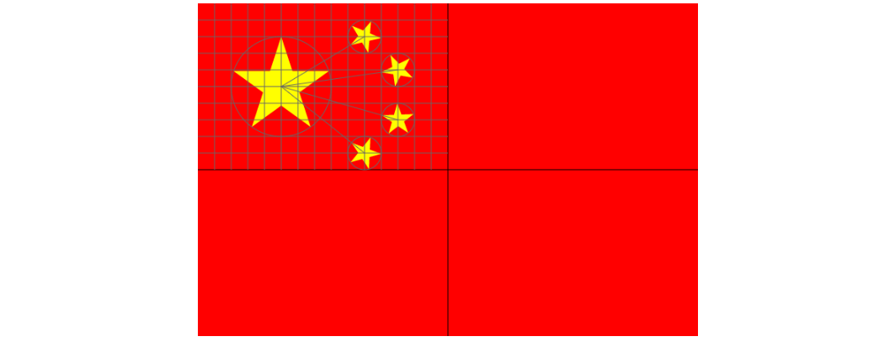
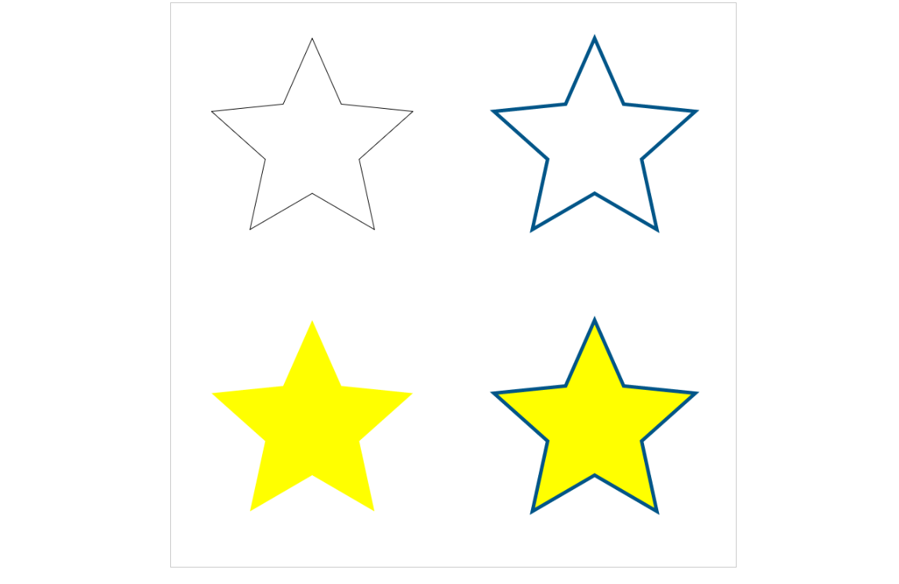
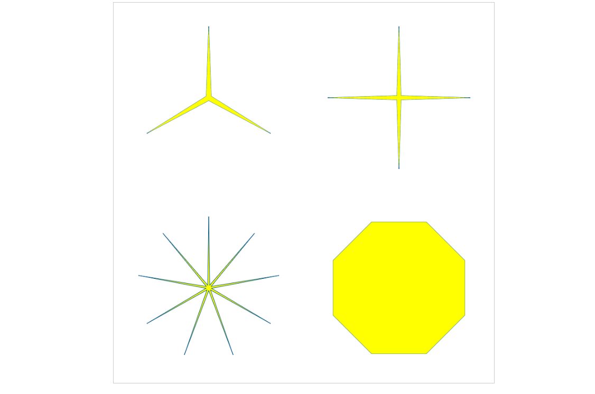

# 绘制中国国旗
对于前面几节了解以后，可以尝试做一些简单的图形了，比如咱们的国旗，国旗的图形很简单，我们都知道，旗面为红色，长宽比为3:2，左上方缀黄色五角星五颗，四颗小星环拱一颗大星左面，并各有一个角正对大星的中心点。五颗星的位置、大小关系如下图：



## 绘制正多边形
先扯点题外话，绘制正多边形，我们知道正多边形的连接点都在一个圆上，这个圆为外接圆，绘制思路是这样的：我们只绘制中心在`(0, 0)`点正多边形，然后通过图形变换的方式，绘制成需要的位置、大小和角度。我们希望可以封装成一个通用方法，绘制任意边数的正多边形，代码：
```javascript

/**
 * 绘制正多边形边框
 */
function strokeRegPolygon(ctx, num, sx, sy, radius, rotate) {
	ctx.save();
	ctx.translate(sx, sy);
	ctx.rotate(rotate);
	ctx.beginPath();
	for (let i = 0; i < num; i++) {
		ctx.lineTo(Math.cos(i * 2 * Math.PI / num) * radius, Math.sin(i * 2 * Math.PI / num) * radius);
	}
	ctx.closePath();
	ctx.stroke();
	ctx.restore();
}

/**
 * 填充正多边形
 */
function fillRegPolygon(ctx, num, sx, sy, radius, rotate) {
	ctx.save();
	ctx.translate(sx, sy);
	ctx.rotate(rotate);
	ctx.beginPath();
	for (let i = 0; i < num; i++) {
		ctx.lineTo(Math.cos(i * 2 * Math.PI / num) * radius, Math.sin(i * 2 * Math.PI / num) * radius);
	}
	ctx.closePath();
	ctx.fill();
	ctx.restore();
}
```

这两个方法并没有对参数进行检查，会有一个连接点在x轴方向上，可以通过rotate参数调整旋转角度，单位为弧度制，可以用来绘制正多边形边框和填充正多边形

## 绘制五角星
绘制五角星不算复杂，一样的思路，一共10个断点，其中内层的5个点在一个圆上，外层的5个点在一个圆上，同时，我们希望不只是5角星，而是多角星，同样的，封装成通用方法，代码：
```javascript
/**
 * 绘制边框
 */
function strokeStar(ctx, num, sx, sy, R, r, rotate) {
	ctx.save();
	ctx.translate(sx, sy);
	ctx.rotate(rotate);
	ctx.beginPath();
	for (let i = 0; i < num; i++) {
		ctx.lineTo(Math.cos(i * 2 * Math.PI / num) * R, 
				Math.sin(i * 2 * Math.PI / num) * R);
		ctx.lineTo(Math.cos(i * 2 * Math.PI / num + Math.PI / num) * r, 
				Math.sin(i * 2 * Math.PI / num + Math.PI / num) * r);
	}
	ctx.closePath();
	ctx.stroke();
	ctx.restore();
}

/**
 * 填充
 */
function fillStar(ctx, num, sx, sy, R, r, rotate) {
	ctx.save();
	ctx.translate(sx, sy);
	ctx.rotate(rotate);
	ctx.beginPath();
	for (let i = 0; i < num; i++) {
		ctx.lineTo(Math.cos(i * 2 * Math.PI / num) * R, 
				Math.sin(i * 2 * Math.PI / num) * R);
		ctx.lineTo(Math.cos(i * 2 * Math.PI / num + Math.PI / num) * r, 
				Math.sin(i * 2 * Math.PI / num + Math.PI / num) * r);
	}
	ctx.closePath();
	ctx.fill();
	ctx.restore();
}
```

同样的，这两方法不只可以画五角星，下面是调用的代码：

```javascript
(function(){
	let canvas = document.getElementById('mycanvas');
	canvas.width = 800;
	canvas.height = 800;
	let context = canvas.getContext("2d");

	strokeStar(context, 5, 200, 200, 150, 70, -Math.PI / 2);

	context.lineWidth = 5;
	context.strokeStyle = '#058';
	strokeStar(context, 5, 600, 200, 150, 70, -Math.PI / 2);

	context.fillStyle = 'yellow';
	fillStar(context, 5, 200, 600, 150, 70, -Math.PI / 2);

	fillStar(context, 5, 600, 600, 150, 70, -Math.PI / 2);
	strokeStar(context, 5, 600, 600, 150, 70, -Math.PI / 2);
})();
```

效果：



通过调整这两个方法的参数，可以得到一些变种图形，比如讲其中一个圆的半径设置成很小，可以呈现很尖锐的图形，也可以将两个远的半径设置成一样的，呈现成正多边形的图形
```javascript
(function(){
let canvas = document.getElementById('mycanvas');
	canvas.width = 800;
	canvas.height = 800;
	let context = canvas.getContext("2d");
	
	context.lineWidth = 1;
	context.strokeStyle = '#058';
	context.fillStyle = 'yellow';

	strokeStar(context, 3, 200, 200, 150, 6, -Math.PI / 2);
	fillStar(context, 3, 200, 200, 150, 6, -Math.PI / 2);
	
	strokeStar(context, 4, 600, 200, 150, 6, 0);
	fillStar(context, 4, 600, 200, 150, 6, 0);
	
	fillStar(context, 9, 200, 600, 150, 6, -Math.PI / 2);
	strokeStar(context, 9, 200, 600, 150, 6, -Math.PI / 2);
	
	strokeStar(context, 4, 600, 600, 150, 150, Math.PI / 8);
	fillStar(context, 4, 600, 600, 150, 150, Math.PI / 8);
})();
```

效果：



## 非零环绕规则
在实际开发的时候，构成一个图片的路径可能会很复杂，

