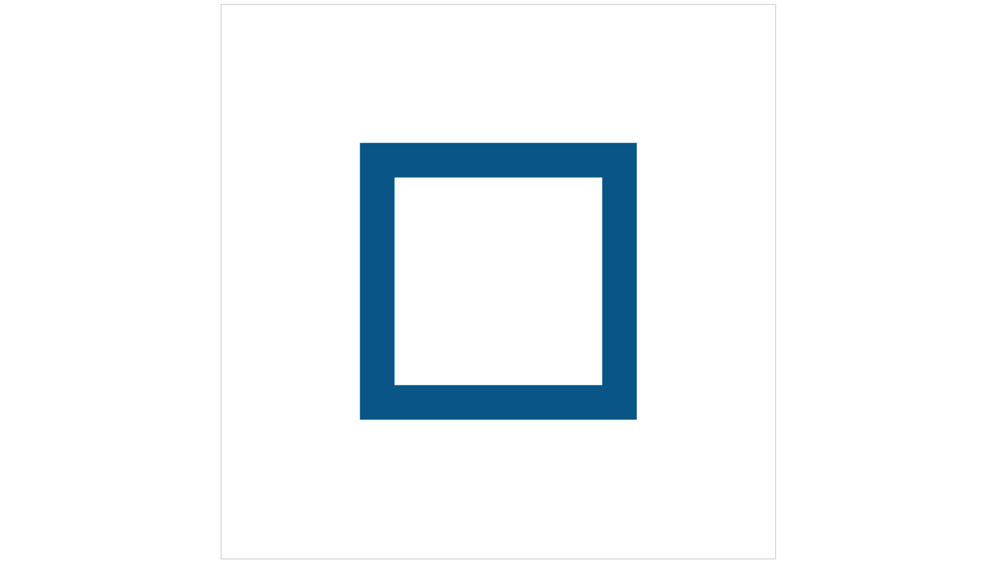
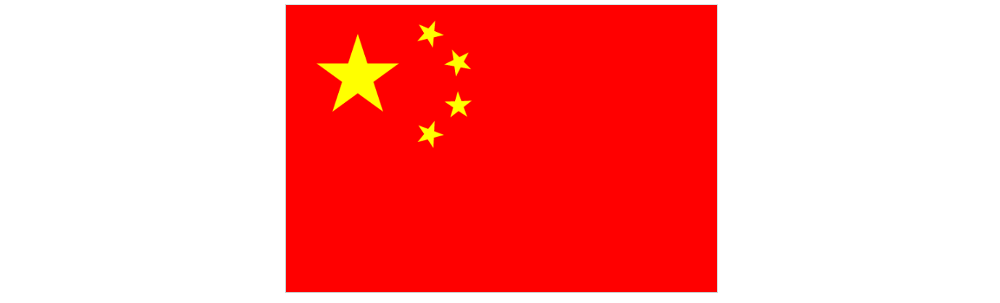

# 绘制中国国旗
对于前面几节了解以后，可以尝试做一些简单的图形了，比如咱们的国旗，国旗的图形很简单，我们都知道，旗面为红色，长宽比为3:2，左上方缀黄色五角星五颗，四颗小星环拱一颗大星左面，并各有一个角正对大星的中心点。五颗星的位置、大小关系如下图：


## 绘制正多边形
先扯点题外话，绘制正多边形，我们知道正多边形的连接点都在一个圆上，这个圆为外接圆，绘制思路是这样的：我们只绘制中心在`(0, 0)`点正多边形，然后通过图形变换的方式，绘制成需要的位置、大小和角度。我们希望可以封装成一个通用方法，绘制任意边数的正多边形，代码：
```javascript

/**
 * 绘制正多边形边框
 */
function strokeRegPolygon(ctx, num, sx, sy, radius, rotate) {
	ctx.save();
	ctx.translate(sx, sy);
	ctx.rotate(rotate);
	ctx.beginPath();
	for (let i = 0; i < num; i++) {
		ctx.lineTo(Math.cos(i * 2 * Math.PI / num) * radius, Math.sin(i * 2 * Math.PI / num) * radius);
	}
	ctx.closePath();
	ctx.stroke();
	ctx.restore();
}

/**
 * 填充正多边形
 */
function fillRegPolygon(ctx, num, sx, sy, radius, rotate) {
	ctx.save();
	ctx.translate(sx, sy);
	ctx.rotate(rotate);
	ctx.beginPath();
	for (let i = 0; i < num; i++) {
		ctx.lineTo(Math.cos(i * 2 * Math.PI / num) * radius, Math.sin(i * 2 * Math.PI / num) * radius);
	}
	ctx.closePath();
	ctx.fill();
	ctx.restore();
}
```

这两个方法并没有对参数进行检查，会有一个连接点在x轴方向上，可以通过rotate参数调整旋转角度，单位为弧度制，可以用来绘制正多边形边框和填充正多边形

## 绘制五角星
绘制五角星不算复杂，一样的思路，一共10个断点，其中内层的5个点在一个圆上，外层的5个点在一个圆上，同时，我们希望不只是5角星，而是多角星，同样的，封装成通用方法，代码：
```javascript
/**
 * 绘制边框
 */
function strokeStar(ctx, num, sx, sy, R, r, rotate) {
	ctx.save();
	ctx.translate(sx, sy);
	ctx.rotate(rotate);
	ctx.beginPath();
	for (let i = 0; i < num; i++) {
		ctx.lineTo(Math.cos(i * 2 * Math.PI / num) * R, 
				Math.sin(i * 2 * Math.PI / num) * R);
		ctx.lineTo(Math.cos(i * 2 * Math.PI / num + Math.PI / num) * r, 
				Math.sin(i * 2 * Math.PI / num + Math.PI / num) * r);
	}
	ctx.closePath();
	ctx.stroke();
	ctx.restore();
}

/**
 * 填充
 */
function fillStar(ctx, num, sx, sy, R, r, rotate) {
	ctx.save();
	ctx.translate(sx, sy);
	ctx.rotate(rotate);
	ctx.beginPath();
	for (let i = 0; i < num; i++) {
		ctx.lineTo(Math.cos(i * 2 * Math.PI / num) * R, 
				Math.sin(i * 2 * Math.PI / num) * R);
		ctx.lineTo(Math.cos(i * 2 * Math.PI / num + Math.PI / num) * r, 
				Math.sin(i * 2 * Math.PI / num + Math.PI / num) * r);
	}
	ctx.closePath();
	ctx.fill();
	ctx.restore();
}
```

下面是调用的代码：

```javascript
(function(){
	let canvas = document.getElementById('mycanvas');
	canvas.width = 800;
	canvas.height = 800;
	let context = canvas.getContext("2d");

	strokeStar(context, 5, 200, 200, 150, 70, -Math.PI / 2);

	context.lineWidth = 5;
	context.strokeStyle = '#058';
	strokeStar(context, 5, 600, 200, 150, 70, -Math.PI / 2);

	context.fillStyle = 'yellow';
	fillStar(context, 5, 200, 600, 150, 70, -Math.PI / 2);

	fillStar(context, 5, 600, 600, 150, 70, -Math.PI / 2);
	strokeStar(context, 5, 600, 600, 150, 70, -Math.PI / 2);
})();
```

效果：


同样不止是可以绘制五角星，通过调整这两个方法的参数，可以得到一些变种图形，比如讲其中一个圆的半径设置成很小，可以呈现很尖锐的图形，也可以将两个远的半径设置成一样的，呈现成正多边形的图形
```javascript
(function(){
let canvas = document.getElementById('mycanvas');
	canvas.width = 800;
	canvas.height = 800;
	let context = canvas.getContext("2d");
	
	context.lineWidth = 1;
	context.strokeStyle = '#058';
	context.fillStyle = 'yellow';

	strokeStar(context, 3, 200, 200, 150, 6, -Math.PI / 2);
	fillStar(context, 3, 200, 200, 150, 6, -Math.PI / 2);
	
	strokeStar(context, 4, 600, 200, 150, 6, 0);
	fillStar(context, 4, 600, 200, 150, 6, 0);
	
	fillStar(context, 9, 200, 600, 150, 6, -Math.PI / 2);
	strokeStar(context, 9, 200, 600, 150, 6, -Math.PI / 2);
	
	strokeStar(context, 4, 600, 600, 150, 150, Math.PI / 8);
	fillStar(context, 4, 600, 600, 150, 150, Math.PI / 8);
})();
```

效果：


## 非零环绕规则
在实际开发的时候，构成一个图片的路径可能会很复杂，绘制的路径可能会有交叉，在调用`fill()`填充的时候，需要判断哪些部分是路径的内部需要填充，哪些部分是不需要填充的，使用非零环绕规则：
对于路径中指定范围区域，从该区域内部画一条足够长的线段(射线)，使此线段的完全落在路径范围之外，然后，将计数器初始化为0，每当这个线段与路径上的直线或曲线相交时，就改变计数器的值，如果是与路径顺时针相交时，那么计数器就加1， 如果是与路径逆时针相交时，那么计数器就减1.
如果计数器始终不为0，那么此区域就在路径范围里面，在调用fill()方法时，浏览器就会对其进行填充。如果最终值是0，那么此区域就不在路径范围内，浏览器就不会对其进行填充
一个很简单的例子，画一个回字形的图形，可以有很多实现方式，最简单的方法是直接绘制一个矩形边框，变宽宽度设置的很宽就可以了，如果要用fill填充的方式的话，代码：
```javascript
(function() {
	let canvas = document.getElementById('mycanvas');
	canvas.width = 800;
	canvas.height = 800;
	let context = canvas.getContext('2d');

	context.fillStyle = "#058";
	context.beginPath();
	context.moveTo(200, 200);
	context.lineTo(600, 200);
	context.lineTo(600, 600);
	context.lineTo(200, 600);
	context.closePath();
	context.moveTo(250, 250);
	context.lineTo(250, 550);
	context.lineTo(550, 550);
	context.lineTo(550, 250);
	context.closePath();
	context.fill();
})();
```

效果：



绘制回字形图案，外边的方形路径顺时针，里边的方形路径逆时针，对于中心区域来说，按照非零环绕规则，不属于路径内部，所以并没有填充

接下来再看看五角星的绘制，一个标准的五角星，应该是在正五边形的基础上，对角线连接组成的图案，按照非零环绕规则，当使用fill()的时候内部都可以填充，所以绘制一个标准的五角星，只需要依次绘制正五边形的对角线即可
```javascript
// 五角星
function drawStar(x, y, r, rotate) {
	context.save();
	context.fillStyle = 'yellow';
	context.translate(x, y);
	context.scale(r, r);
	context.rotate(rotate);
	context.beginPath();
	let dig = 2 * 2 * Math.PI / 5;
	for(let i = 0; i < 5; i++) {
		context.lineTo(Math.cos(i * dig), Math.sin(i * dig));
	}
	context.closePath();
	context.fill();
	context.restore();
}
```

下面是调用`drawStar()`的代码：
```javascript
(function(){
	let canvas = document.getElementById('mycanvas');
	canvas.width = 800;
	canvas.height = 800;
	let context = canvas.getContext('2d');
	
	drawStar(400, 400, 200, -Math.PI / 2);

	// 五角星
	function drawStar(x, y, r, rotate) {
		context.save();
		context.fillStyle = 'yellow';
		context.translate(x, y);
		context.scale(r, r);
		context.rotate(rotate);
		context.beginPath();
		let dig = 2 * 2 * Math.PI / 5;
		for(let i = 0; i < 5; i++) {
			context.lineTo(Math.cos(i * dig), Math.sin(i * dig));
		}
		context.closePath();
		context.fill();
		context.restore();
	}
})();
```

效果：


这样即绘制了一个标准的五角星图案

## 绘制国旗
这样我们就可以绘制国旗了，步骤如下：

1. 初始化canvas宽高，宽高比为3:2
2. 将整个canvas填充为红色
3. 根据最上面的示例图，确定五个五角星的相对位置
4. 绘制大的五角星，然后根据大五角星和小五角星的圆心连接线的角度确定小五角星的角度，绘制小五角星

具体实现代码：
```javascript
(function(){
	let canvas = document.getElementById('mycanvas');
	canvas.width = 660;
	canvas.height = canvas.width * 2 / 3;
	let context = canvas.getContext('2d');
	
	let gWidth = canvas.width / 30;

	let [maxX, maxY] = [5, 5];		// 大五角星的坐标
	let minX = [10, 12, 12, 10];	// 小五角星的x坐标值
	let minY = [2, 4, 7, 9];		// 小五角星的y坐标值

	draw();
	function draw() {
		// 红色背景
		context.fillStyle = 'red';
		context.fillRect(0, 0, canvas.width, canvas.height);

		// 大五角星
		drawStar(maxX * gWidth, maxY * gWidth, 3 * gWidth, -Math.PI / 2);

		// 小五角星
		for (let i = 0; i < 4; i++) {
			drawStar(minX[i] * gWidth, minY[i] * gWidth, gWidth, Math.PI + Math.atan((minY[i] - maxY ) / (minX[i] - maxX)));
		}
	}

	// 五角星
	function drawStar(x, y, r, rotate) {
		context.save();
		context.fillStyle = 'yellow';
		context.translate(x, y);
		context.scale(r, r);
		context.rotate(rotate);
		context.beginPath();
		let dig = 2 * 2 * Math.PI / 5;
		for(let i = 0; i < 5; i++) {
			context.lineTo(Math.cos(i * dig), Math.sin(i * dig));
		}
		context.closePath();
		context.fill();
		context.restore();
	}
})();
```

效果：



代码中五角星的坐标值是按照最上面示例图中辅助线切割的小格子来确定的。大五角星的半径为3个格子宽度，小五角星的宽度为1个格子宽度。这样就实现了绘制中国国旗图案
