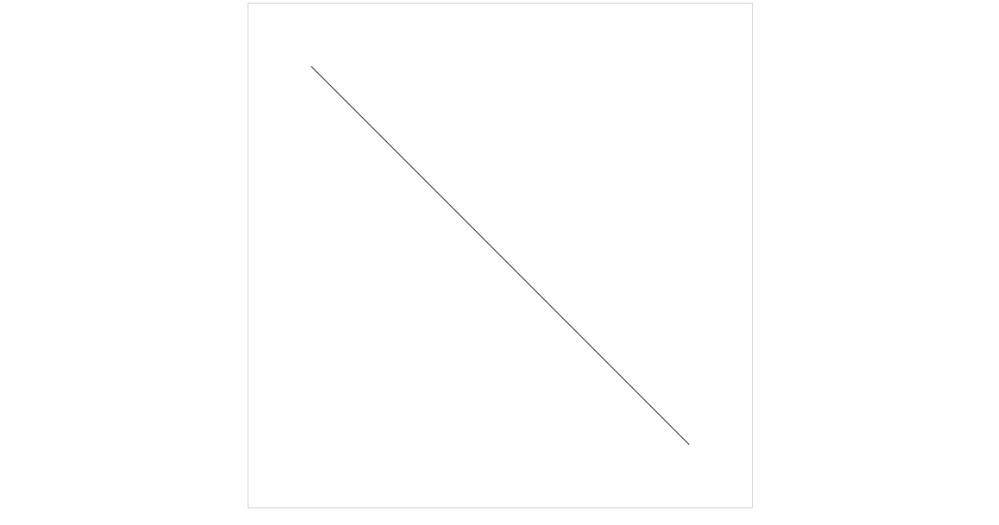

# 绘制直线
先从最简单的开始，绘制直线，其实是直线段。首先，编写html:

## 基本模板

### html部分
```html
<!doctype html>
<html>
<head>
	<meta charset='utf-8'>
	<style>
		canvas{display:block; border: 1px solid #ccc;margin: 0px auto;}
	</style>
	<title>canvas</title>
</head>
<body>
	<canvas id='mycanvas'></canvas>
<script src='外部js路径'></script>
</body>
</html>
```
body部分添加了canvas标签，设置canvas标签的id为“mycanvas”，引入外部的js文件；head部分设置canvas为块级元素、居中并设置边框为1个像素宽

### js部分
```javascript
(function(){
	let canvas = document.getElementById('mycanvas');
	canvas.width = 800;
	canvas.height = 800;
	let context = canvas.getContext('2d');

	// 开始绘制
})();
```
在这里，设置canvas的宽高都为800像素，并获取canvas的CanvasRenderingContext2D对象context，下面我们所有的代码都是操作context来实现

## 简单线段
先绘制一条简单的线段，代码：
```javascript
(function(){
	let canvas = document.getElementById('mycanvas');
	canvas.width = 800;
	canvas.height = 800;
	let context = canvas.getContext('2d');

	// 开始绘制
	context.moveTo(100, 100);
	context.lineTo(700, 700);
	context.stroke();
})();
```
这样就绘制了一条从`(100, 100)`到`(700, 700)`的一条线段，效果如下：


