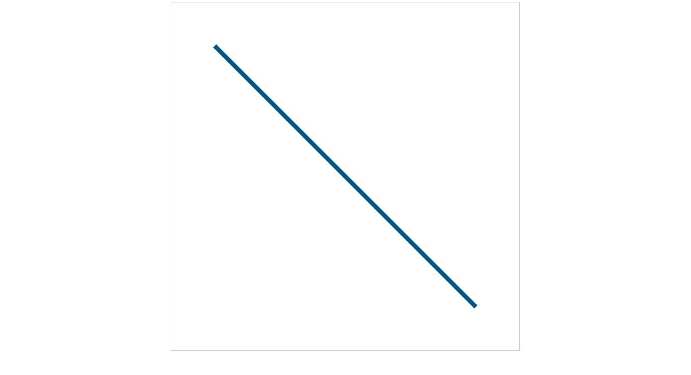
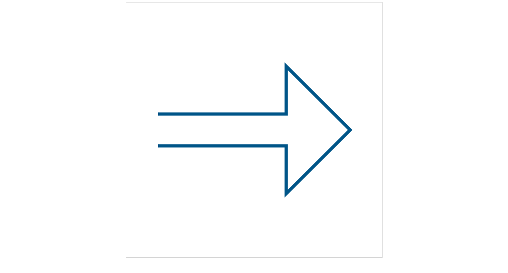
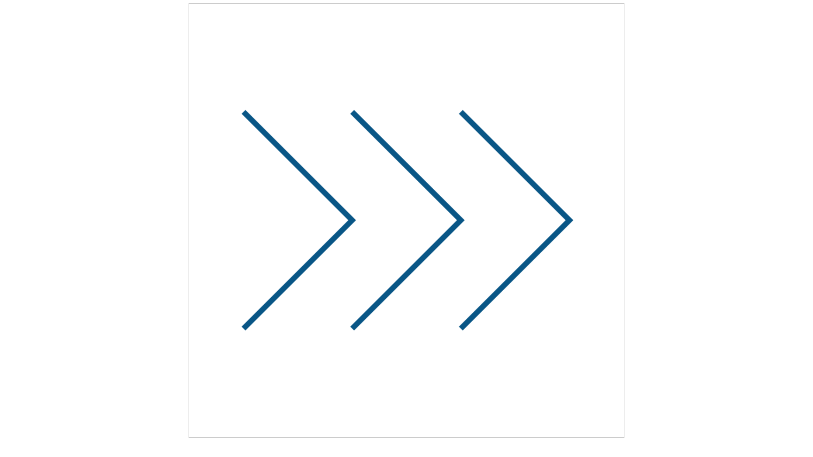
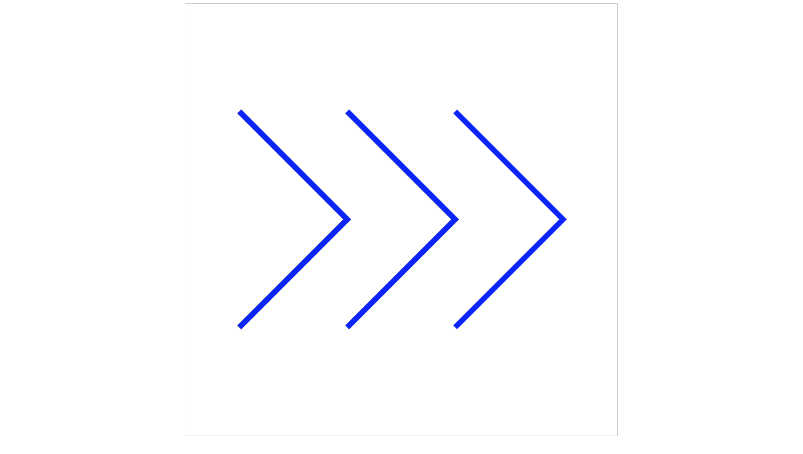
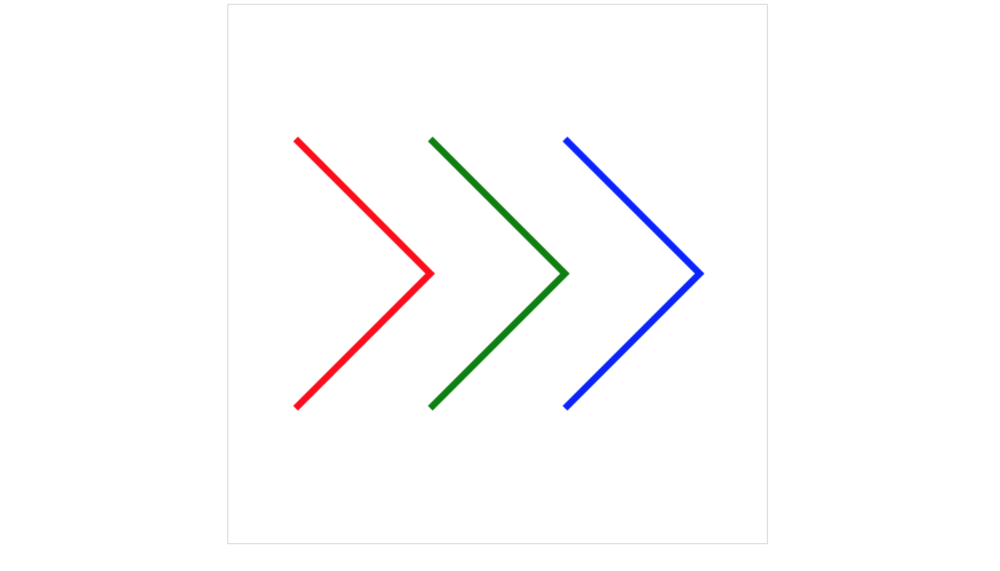

# 绘制直线
先从最简单的开始，绘制直线，其实是直线段。首先，编写html:

## 基本模板

### html部分
```html
<!doctype html>
<html>
<head>
	<meta charset='utf-8'>
	<style>
		canvas{display:block; border: 1px solid #ccc;margin: 0px auto;}
	</style>
	<title>canvas</title>
</head>
<body>
	<canvas id='mycanvas'></canvas>
<script src='外部js路径'></script>
</body>
</html>
```
body部分添加了canvas标签，设置canvas标签的id为“mycanvas”，引入外部的js文件；head部分设置canvas为块级元素、居中并设置边框为1个像素宽

### js部分
```javascript
(function(){
	let canvas = document.getElementById('mycanvas');
	canvas.width = 800;
	canvas.height = 800;
	let context = canvas.getContext('2d');

	// 开始绘制
})();
```
在这里，设置canvas的宽高都为800像素，并获取canvas的CanvasRenderingContext2D对象context，下面我们所有的代码都是操作context来实现

## 简单线段
先绘制一条简单的线段，代码：
```javascript
(function(){
	let canvas = document.getElementById('mycanvas');
	canvas.width = 800;
	canvas.height = 800;
	let context = canvas.getContext('2d');

	// 开始绘制
	context.moveTo(100, 100);
	context.lineTo(700, 700);
	context.stroke();
})();
```
这样就绘制了一条从`(100, 100)`到`(700, 700)`的一条线段，效果如下：


需要注意的是，真正实现绘制的代码是调用`stroke()`这个方法，想象一张画布，我们计划从`(100m 100)`开始画一条线段到`(700, 700)`终止，最后通过`stroke()`方法绘制到画布上。canvas是基于状态来绘图的，`moveTo()`和`lineTo()`设置了线条状态，`stroke()`实现绘制图形

我们可以设定线段的宽度和颜色：
```javascript
(function(){
	let canvas = document.getElementById('mycanvas');
	canvas.width = 800;
	canvas.height = 800;
	let context = canvas.getContext('2d');

	// 开始绘制
	context.moveTo(100, 100);
	context.lineTo(700, 700);
	context.lineWidth = 10;
	context.strokeStyle = "#058";
	context.stroke();
})();
```
绘制效果：


通过`lineWidth`属性设置线条宽度为10个像素，`strokeStyle`属性设置背景颜色为“#058”，同样可以看到canvas是基于状态画图，我们是通过context来设置线条宽度、颜色属性，而不是通过一个线条对象来设置的

## 绘制连续线段
既然可以绘制一条线段，同样的，可以绘制连续的线段，看下面的例子：
```javascript
(function(){
	let canvas = document.getElementById('mycanvas');
	canvas.width = 800;
	canvas.height = 800;
	let context = canvas.getContext('2d');

	// 开始绘制
	context.moveTo(100, 350);
	context.lineTo(500, 350);
	context.lineTo(500, 200);
	context.lineTo(700, 400);
	context.lineTo(500, 600);
	context.lineTo(500, 450);
	context.lineTo(100, 450);
	context.lineWidth = 10;
	context.strokeStyle = "#058";
	context.stroke();
})();
```
效果如下：



在这个例子中，我们设置起始点坐标为`(100, 350)`，依次调用`lineTo()`方法，设置线条的宽度和颜色属性，最后调用`stroke()`完成绘制

如果要画多段连续的线段怎么做呢？很简单，利用`moveTo()`方法，看下面的例子：
```javascript
(function() {
	let canvas = document.getElementById('mycanvas');
	canvas.width = 800;
	canvas.height = 800;
	let context = canvas.getContext('2d');

	// 开始绘制
	context.moveTo(100, 200);
	context.lineTo(300, 400);
	context.lineTo(100, 600);

	context.moveTo(300, 200);
	context.lineTo(500, 400);
	context.lineTo(300, 600);

	context.moveTo(500, 200);
	context.lineTo(700, 400);
	context.lineTo(500, 600);

	context.lineWidth = 10;
	context.strokeStyle = "#058";
	context.stroke();
})();
```
效果如下：

    

这个例子中，分别调用了三次`moveTo()`方法，绘制了三条不相连的折线段，最后设置线条宽度和颜色，最后调用`stroke()`方法完成绘制

## context.beginPath()方法
上面的例子中，我们绘制了三条同样颜色的折线段，如果要设置不同的颜色呢？我们首先想到的方法是这样的：
```javascript
(function() {
	let canvas = document.getElementById('mycanvas');
	canvas.width = 800;
	canvas.height = 800;
	let context = canvas.getContext('2d');

	// 开始绘制
	context.moveTo(100, 200);
	context.lineTo(300, 400);
	context.lineTo(100, 600);
	context.lineWidth = 10;
	context.strokeStyle = "red";
	context.stroke();

	context.moveTo(300, 200);
	context.lineTo(500, 400);
	context.lineTo(300, 600);
	context.lineWidth = 10;
	context.strokeStyle = "green";
	context.stroke();

	context.moveTo(500, 200);
	context.lineTo(700, 400);
	context.lineTo(500, 600);
	context.lineWidth = 10;
	context.strokeStyle = "blue";
	context.stroke();
})();
```

每次设置好线条路径以后设置线条的颜色，同时调用`stroke()`方法完成绘制，那么实际效果是什么样子呢？ 我们看看实际效果：



三条折线段都是蓝色的，并没有达到预期的效果，为什么会这样呢？这是因为canvas是基于状态绘图的，当第一次调用`stroke()`绘制的时候，线条颜色确实是红色的，绘制第二条折线段的时候设置线条颜色为绿色，将覆盖掉原来的状态，第二次调用`stroke()`方法，同样也绘制了第一条的折线段，将第一次绘制的红色的折线段覆盖掉了，第三次同样的效果，将前两次的状态都覆盖掉了，所以最终显示的是三条蓝色的折线段。那么我们该这样实现不同的颜色呢？需要用到`beginPath()`方法

```javascript
(function() {
	let canvas = document.getElementById('mycanvas');
	canvas.width = 800;
	canvas.height = 800;
	let context = canvas.getContext('2d');

	// 开始绘制
	context.lineWidth = 10;

	context.beginPath();
	context.moveTo(100, 200);
	context.lineTo(300, 400);
	context.lineTo(100, 600);
	context.strokeStyle = "red";
	context.stroke();

	context.beginPath();
	context.moveTo(300, 200);
	context.lineTo(500, 400);
	context.lineTo(300, 600);
	context.strokeStyle = "green";
	context.stroke();

	context.beginPath();
	context.moveTo(500, 200);
	context.lineTo(700, 400);
	context.lineTo(500, 600);
	context.strokeStyle = "blue";
	context.stroke();
})();
```

在开始的时候，设置线条宽度为10个像素，下面每次开始绘制一条折线段的时候，调用一次`beginPath()`方法，效果如下：



实现效果了，需要注意的是对于`lineWidth`属性，只是在开始设置为10像素，绘制的3条折线段都是10像素宽，我们可以知道，对于`beginPath()`如果一个状态没有被重新设置，它将一只用之前设置的属性值，所以在实际应用时，一定要清楚当前路径所使用的状态。另外，上面例子中的`moveTo()`方法可以用`lineTo()`方法替换，效果是一样的，因为`beginPath()`方法，同时声明开始一段新的路径绘制。
