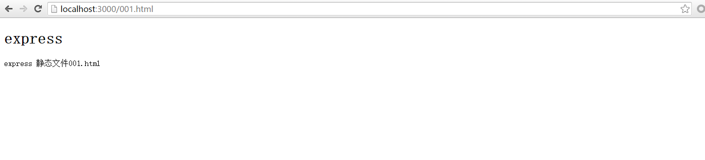

# Express中间件
在express中，中间件很重要，完全是由路由和中间件构成的一个web开发框架，本质上来说，一个express应用就是在调用各种中间件

中间件(moddleware)是一个函数，这个函数包含，请求对象(request)、响应对象(response)和web应用中处理请求和响应循环流程中的next变量

中间件的工恩能够包括:

* 执行任何代码
* 修改请求和响应对象
* 调用下一个中间件
* 终结请求-响应循环

现在明白了，上一节“Express路由”中个中路由处理程序，都可以理解为中间件，针对每个路由的请求，可以有多个中间件程序，最后一个程序向浏览器发送响应信息，是不是很像java web开发中的拦截器呢？

中间件的分类:

* [应用级中间件](#应用级中间件)
* [路由级中间件](#路由级中间件)
* [错误处理中间件](#错误处理中间件)
* [内置中间件](#内置中间件)
* [第三方中间件](#第三方中间件)

## 应用级中间件
应用级中间件绑定到 app 对象 使用 app.use() 和 app.METHOD()， 其中， METHOD 是需要处理的 HTTP 请求的方法，例如 GET, PUT, POST 等等，全部小写

```javascript
// app.js
const express = require('express');
const url = require('url');
const util = require('util');

let app = express();

/**
 * 没有挂载路径的中间件，应用的每个请求都会执行该中间件
 * 这个中间件的功能是用来在后头打印每次请求的时间和路径
 */
app.use(function (req, res, next) {
	let pathname = url.parse(req.url).pathname;
	util.log('pathname: ', pathname);
	next();
});

/**
 * 挂载至 /user/* 的中间件
 * 用于打印请求方式
 */
app.use('/user/*', function (req, res, next) {
	util.log('request method: ', req.method);
	next();
});

/**
 * 挂载至 /user:name 的中间件, 只有get请求方式才会执行
 * 其实没什么用，只是打印路径中name的值
 */
app.get('/user/:name', function (req, res, next) {
	util.log('name: ', req.params.name);
	next();
});

app.get('/', function (req, res) {
	res.send('hello');
});

app.get('/user', function (req, res) {
	res.send('user page');
});

app.get('/user/adduser', function (req, res) {
	res.send('add user page');
});

app.get('/user/upduser', function (req, res) {
	res.send('update user page');
});

app.use(function (req, res) {
	res.type('text/plain');
	res.status(404);
	res.send('404 - Not Found.');
});

app.listen(3000, function () {
	console.log('Server running at 3000 port.');
});
```

类似于上节中的路由，可以在一个路由上设置多个回调函数一样，同样可以挂载多个中间件
```javascript
app.use(function (req, res, next) {
	console.log('middleware 1');
	next();
}, function (req, res, next) {
	console.log('middleware 2');
	next();
}, function (req, res, next) {
	console.log('middleware 3');
	next();
});
```

在下面的例子中，为指向 /user/:id 的 GET 请求定义了两个路由。第二个路由虽然不会带来任何问题，但却永远不会被调用，因为第一个路由已经终止了请求-响应循环
```javascript
// 一个中间件栈，处理指向 /user/:id 的 GET 请求
app.get('/user/:id', function (req, res, next) {
  console.log('ID:', req.params.id);
  next();
}, function (req, res, next) {
  res.send('User Info');
});

// 处理 /user/:id， 打印出用户 id
app.get('/user/:id', function (req, res, next) {
  res.end(req.params.id);
});
```

如果需要在中间件栈中跳过剩余中间件，调用 next('route') 方法将控制权交给下一个路由。 注意： next('route') 只对使用 app.VERB() 或 router.VERB() 加载的中间件有效
```javascript
app.get('/user/:name', function (req, res, next) {
	let name = req.params.name;
	console.log(' /user/:name 第一个中间件');
	if (name == 'adduser') {
		next('route');
	} else {
		next();
	}
}, function (req, res, next) {
	console.log(' /user/:name 第二个中间件');
});

app.get('/user/adduser', function (req, res) {
	res.send('add user page');
});

app.get('/user/upduser', function (req, res) {
	res.send('update user page');
});
```
浏览器中访问 "http://localhost:3000/user/adduser" 的时候 不会打印 第二个中间件的信息，但是访问 "http://localhost:3000/user/upduser" 的时候会打印第二个中间件输出的内容

## 路由级中间件
路由级中间件和应用级中间件一样，只是它绑定的对象为 express.Router()，express.Router()的作用在上一节[Express路由-express.Router](./Express路由.md#expressrouter)有介绍，用于模块化路由管理

路由级使用 router.use() 或 router.VERB() 加载中间件

```javascript
// routes/user.js
const express = require('express');
const util = require('util');

let router = express.Router();

router.use(function (req, res, next) {
	util.log(req.method);
	next();
});

router.use('/:name', function (req, res, next) {
	console.log('use /user/:name  1');
	next();
}, function (req, res, next) {
	console.log('use /user/:name  2');
	next();
});

router.get('/:name', function (req, res, next) {
	let name = req.params.name;
	console.log('get /user:/name 1');
	if (name === 'adduser') {
		next('route');
	} else {
		next();
	}
}, function (req, res, next) {
	console.log('get /user:/name 2');
	next();
});

router.get('/', function (req, res) {
	res.send('user page');
});

router.get('/adduser', function (req, res) {
	res.send('add user page');
});

router.get('/upduser', function (req, res) {
	res.send('update user page');
});

module.exports = router;
```

## 错误处理中间件
错误处理中间件和其他中间件定义类似，只是要使用4个参数：err、req、res、next，即使不需要 next 对象，也必须在签名中声明它，否则中间件会被识别为一个常规中间件，不能处理错误

```javascript
app.use(function(err, req, res, next) {
  console.error(err.stack);
  res.status(500).send('Something broke!');
});
```

## 内置中间件

**express.static(root, [options])**
express 4.x 版本开始，express.static是Express唯一内置的中间件，负责express应用中托管静态资源，如静态html文档、图片、客户端js脚本、css等文件

**参数说明:**

* root - 指提供静态资源的跟目录
* options - 可选参数，是一个对象，一些配置信息

*options参数说明:*

|属性|描述|类型|默认值|
|:--|:--|:--:|:--:|
|dotfiles|是否对外输出文件名以点（.）开头的文件。可选值为 “allow”、“deny” 和 “ignore”|String|“ignore”|
|etag|是否启用 etag 生成|Boolean|true|
|extensions|设置文件扩展名备份选项|Array|[]|
|index|发送目录索引文件，设置为 false 禁用目录索引。|Mixed|“index.html”|
|lastModified|设置 Last-Modified 头为文件在操作系统上的最后修改日期。可能值为 true 或 false。|Boolean|true|
|maxAge|以毫秒或者其字符串格式设置 Cache-Control 头的 max-age 属性|Number|0|
|redirect|当路径为目录时，重定向至 “/”。Boolean|true|
|setHeaders|设置 HTTP 头以提供文件的函数。|Function||

**例子**
```javascript
// app.js
const express = require('express');

let app = express();

app.use(express.static('public'));

app.listen(3000, function () {
	console.log('Server running at 3000 port.');
});
```

*创建目录public*
```
$ mkdir public
```

*public目录下创建文件001.html*
```
$ touch public/001.html
```

*编辑001.html内容*
```html
<!doctype html>
<html>
<head>
	<meta charset='utf-8'>
	<title>001.html</title>
</head>
<body>
<h1>express</h1>
<p>express 静态文件001.html</p>
</body>
</html>
```

*启动app.js*
```
$ node app.js
Server running at 3000 port.
```

浏览器访问 "http://localhost:3000/001.html" 效果如下：



每个应用可以配置多个静态目录：
```javascript
app.use(express.static('public'));
app.use(express.static('uploads'));
app.use(express.static('files'));
```

## 第三方中间件
可以通过使用第三方中间件为express应用添加更多功能，可以在应用级加载，也可以在路由级加载

**例子**

*安装一个解析cookie的中间件：cookie-parser*
```
$ npm install cookie-parser
```

*加载中间件*
```javascript
var express = require('express');
var app = express();
var cookieParser = require('cookie-parser');

// 加载用于解析 cookie 的中间件
app.use(cookieParser());
```

**获取post请求参数的例子**
最长用的http请求是get和post，对于get请求的参数，可以直接解析url获取到，但是对于post请求，请求数据在请求体中，我们可以通过自定义一个中间件来获取到请求参数， 看下面的代码:
```javascript
const express = require('express');
const url = require('url');
const querystring = require('querystring');

let app = express();

/**
 * 自定义一个中间件，用于获取请求数据
 * 只解析get和post请求的数据
 * 数据保存在req.parameters中
 */
app.use(function (req, res, next) {
	let method = req.method;
	req.parameters = {};
	if (method === 'GET' || method === 'get') {  // 对于get请求，直接解析即可
		let urlObj = url.parse(req.url, true);
		req.parameters = urlObj.query;
		next();
	} else if (method === 'POST' || method === 'post') {  // 对于post请求， 获取请求体内容
		let data = '';

		req.on('data', function (chunk) {
			data += chunk;
		});

		req.on('end', function () {
			req.parameters = querystring.parse(data);
			next();
		});
	}
});

/**
 * 一个简单的登陆表单，要求用户输入用户名和密码
 * 采用post提交方式
 */
app.get('/', function(req, res) {
	let str = '<form action="/login" method="post">' + 
						'<label for="username">用户名：</label>' +
						'<input type="text" id="username" name="username" /><br>' +
						'<label for="password">密码：</label>' +
						'<input type="password" id="password" name="password" /><br>' +
						'<input type="submit" value="登录" />';
	res.type('text/html');
	res.send(str);
});

app.post('/login', function (req, res) {
	let username = req.parameters.username;
	let password = req.parameters.password;
	res.type('text/html');
	res.send('<p>用户名: ' + username + '</p><p>密码: ' + password + '</p>');
});

app.get('/user', function (req, res) {
	let username = req.parameters.username;
	let password = req.parameters.password;
	res.type('text/html');
	res.send('<p>用户名: ' + username + '</p><p>密码: ' + password + '</p>');
});

app.listen(3000, function () {
	console.log('Server running at 3000 port.');
});
```

*运行app.js*
```
$ node app.js
Server running at 3000 port.
```

浏览器输入 "http://localhost:3000/user?username=admin&password=123456" 得到的结果是：
```
用户名: admin
密码: 123456
```

浏览器输入 "http://localhost:3000/" 进入页面以后输入用户名和密码，登录，同样也可以获取到参数

这里只是简单的一个例子，实际开发的时候不用这么麻烦，只需要引入第三方中间件 "body-parser" 既可

*安装body-parser*
```
$ npm i body-parser --save
```

*应用中引入body-parser*
```javascript
const express = require('express');

let app = express();

// 加载 body-parser 中间件
app.use(require('body-parser')());

/**
 * 一个简单的登陆表单，要求用户输入用户名和密码
 * 采用post提交方式
 */
app.get('/', function(req, res) {
	let str = '<form action="/login" method="post">' + 
						'<label for="username">用户名：</label>' +
						'<input type="text" id="username" name="username" /><br>' +
						'<label for="password">密码：</label>' +
						'<input type="password" id="password" name="password" /><br>' +
						'<input type="submit" value="登录" />';
	res.type('text/html');
	res.send(str);
});

app.post('/login', function (req, res) {
	let username = req.body.username;
	let password = req.body.password;
	res.type('text/html');
	res.send('<p>用户名: ' + username + '</p><p>密码: ' + password + '</p>');
});

app.get('/user', function (req, res) {
	let username = req.query.username;
	let password = req.query.password;
	res.type('text/html');
	res.send('<p>用户名: ' + username + '</p><p>密码: ' + password + '</p>');
});

app.listen(3000, function () {
	console.log('Server running at 3000 port.');
});
```

运行app.js，可以发现同样可以实现获取post请求的数据，post请求数据在 req.body 中， get请求数据在 req.query中

