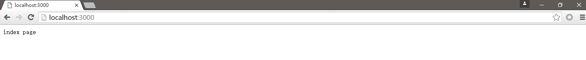
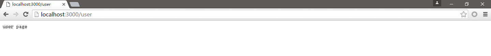
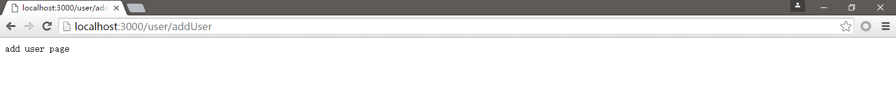
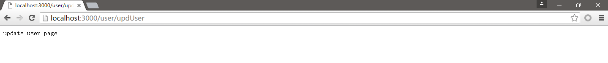
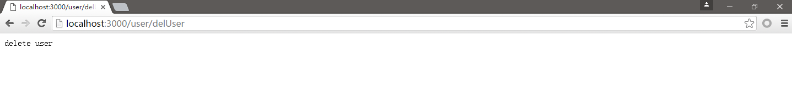

# Express 路由
express中的路由处理，相当于java Web框架中controller处理，针对不同的请求，调用不同的处理程序，给予用户不同的界面展示，express中路由是由一个url、http请求(get、post等)和若干句柄组成，结构如下:
```
app.METHOD(path, [callback...], callback)
```
app是express对象的实例，METHOD是一个http请求方法，path是服务器上的路径，callback是当路由匹配时要执行的函数

```javascript
const express = require('express');
let app = express();

// 匹配get请求的 '/' 路径
app.get('/', function (req, res) {
	res.send('hello world');
});
```

## 路由方法
路由方法源于http请求方法，和express实例相关联，下面是针对 '/' 定义的get和post请求:
```javascript
// get 请求方式的路由
app.get('/', function (req, res) {
	res.send('GET request');
});

// post 请求方式的路由
app.post('/', function (req, res) {
	res.send('POST request');
});
```

另外还有一个方法：```app.all()```，这是个特殊的路由方法，不同使用GET、POST、PUT、DELETE或者其他http请求方式，都会执行:
```javascript
app.all('/user', function (req, res, next) {
	console.log('user request');
	next(); // 下一个controller
});
```

可以看到我们可以针对一个路由执行多个controller，类似拦截器的执行，看下面的代码:
```javascript
const express = require('express');

let app = express();

app.all('/user', function (req, res, next) {
	console.log('user controller 1');
	next();
});

app.all('/user', function (req, res, next) {
	console.log('user controller 2');
	next();
});

app.all('/user', function (req, res, next) {
	console.log('user controller 3');
	res.send('user page');
});

app.listen(3000, function () {
	console.log('Server running ar 3000 port.');
});
```
*运行js文件:*
```
$ node app.js
Server running ar 3000 port.
```
浏览器中访问："http://localhost:3000/user" ，页面显示内容：user page 查看后台内容:
```
user controller 1
user controller 2
user controller 3
```

## 路由路径
路由路径和请求方法一起定义了请求的端点，它可以是字符串、字符串模式或者正则表达式，示例:

*使用字符串的路由路径示例:*
```javascript
// 匹配根路径的请求
app.get('/', function (req, res) {
  res.send('root');
});

// 匹配 /about 路径的请求
app.get('/about', function (req, res) {
  res.send('about');
});

// 匹配 /random.text 路径的请求
app.get('/random.text', function (req, res) {
  res.send('random.text');
});
```

*使用字符串模式的路由路径示例:*
```javascript
// 匹配 acd 和 abcd
app.get('/ab?cd', function(req, res) {
  res.send('ab?cd');
});

// 匹配 abcd、abbcd、abbbcd等
app.get('/ab+cd', function(req, res) {
  res.send('ab+cd');
});

// 匹配 abcd、abxcd、abRABDOMcd、ab123cd等
app.get('/ab*cd', function(req, res) {
  res.send('ab*cd');
});

// 匹配 /abe 和 /abcde
app.get('/ab(cd)?e', function(req, res) {
 res.send('ab(cd)?e');
});
```

*使用正则表达式的路由路径示例:*
```javascript
// 匹配任何路径中含有 a 的路径：
app.get(/a/, function(req, res) {
  res.send('/a/');
});

// 匹配 butterfly、dragonfly，不匹配 butterflyman、dragonfly man等
app.get(/.*fly$/, function(req, res) {
  res.send('/.*fly$/');
});
```

## 路由句柄
可以为请求处理提供多个回调函数，可以有多重形式，可以是一个函数、一个函数数组、或者两者混合
```javascript
const express = require('express');

let app = express();

// 一个回调函数
app.get('/user', function (req, res) {
	console.log('user');
	res.send('user page');
});

// 多个回调函数
app.get('/person', function (req, res, next) {
	console.log('person function 1');
	next();
}, function (req, res, next) {
	console.log('person function 2');
	next();
}, function (req, res, next) {
	console.log('person function 3');
	res.send('person page');
});

let stu_cb0 = function (req, res, next) {
	console.log('student cb0');
	next();
};

let stu_cb1 = function (req, res, next) {
	console.log('student cb1');
	next();
};

let stu_cb2 = function (req, res, next) {
	console.log('student cb2');
	next();
};

let stu_cb3 = function (req, res, next) {
	console.log('student cb3');
	res.send('student page');
};

// 函数数组
app.get('/student', [stu_cb0, stu_cb1, stu_cb2, stu_cb3]);

let th_cb0 = function (req, res, next) {
	console.log('teacher cb0');
	next();
};

let th_cb1 = function (req, res, next) {
	console.log('teacher cb1');
	next();
};

let th_cb2 = function (req, res, next) {
	console.log('teacher cb2');
	next();
};

app.get('/teacher', [th_cb0, th_cb1, th_cb2], function (req, res, next) {
	console.log('teacher cb -- 1');
	next();
}, function (req, res, next) {
	console.log('teacher cb -- 2');
	res.send('teacher page');
});

app.listen(3000, function () {
	console.log('Server running ar 3000 port.');
});
```

*运行js文件:*
```
$ node app.js
Server running ar 3000 port.
```

*浏览器中输入："http://localhost:3000/user" 查看后台运行结果:*
```
user
```

*浏览器中输入："http://localhost:3000/person" 查看后台运行结果:*
```
person function 1
person function 2
person function 3
```

*浏览器中输入："http://localhost:3000/student" 查看后台运行结果:*
```
student cb0
student cb1
student cb2
student cb3
```

*浏览器中输入："http://localhost:3000/teacher" 查看后台运行结果:*
```
teacher cb0
teacher cb1
teacher cb2
teacher cb -- 1
teacher cb -- 2
```

需要注意的是，回调函数中，不能再执行完res.send()以后再次调用next()，因为响应已经处理了，就不能执行后面的程序了

## 响应方法
响应对象(res)的方法会想客户端返回响应信息，终止请求响应的循环，如果在路由句柄中一个方法也不调用，来自客户端的请求会一直挂起

*res的一些方法*

|方法|描述|
|:--|:--|
|res.download()|提示下载文件|
|res.end()|终结响应处理流程|
|res.json()|发送一个 JSON 格式的响应|
|res.jsonp()|发送一个支持 JSONP 的 JSON 格式的响应|
|res.redirect()|重定向请求|
|res.render()|渲染视图模板|
|res.send()|发送各种类型的响应|
|res.sendFile|以八位字节流的形式发送文件|
|res.sendStatus()|设置响应状态代码，并将其以字符串形式作为响应体的一部分发送|

## app.route()
可使用 app.route() 方法创建路由路径的链式路由句柄。由于路径在一个地方指定，这样做有助于创建模块化的路由，而且减少了代码冗余和拼写错误

*示例:*
```javascript
app.route('/book')
  .get(function(req, res) {
    res.send('Get a random book');
  })
  .post(function(req, res) {
    res.send('Add a book');
  })
  .put(function(req, res) {
    res.send('Update the book');
  });
```

## express.Router
express的路由使用到这里，大体已经明白了，但是有个问题，一个项目中，需要挂载的路由不是一个两个，可能是成百上千个，如果都写在启动模块中，那是相当麻烦的，且非常不利于维护，我们可以使用express.Router类创建模块化、可挂载的路由句柄

*创建routes目录，在routes目录下创建user.js*
```
$ mkdir routes
$ touch routes/user.js
```

*编辑user.js:*
```javascript
// routes/user.js
const express = require('express');
let router = express.Router();

router.get('/', function (req, res) {
	res.send('user page');
});

router.get('/addUser', function (req, res) {
	res.send('add user page');
});

router.get('/updUser', function (req, res) {
	res.send('update user page');
});

router.get('/delUser', function (req, res) {
	res.send('delete user');
});

module.exports = router;
```

*修改app.js:*
```javascript
// app.js
const express = require('express');

let app = express();
let user = require ('./routes/user');

app.get('/', function (req, res) {
	res.send('index page');
});

app.use('/user', user);

app.listen(3000, function () {
	console.log('Server running ar 3000 port.');
});
```

*运行app.js:*
```
$ node app.js
Server running ar 3000 port.
```

*浏览器中访问: "http://localhost:3000/" *


*浏览器中访问: "http://localhost:3000/user" *


*浏览器中访问: "http://localhost:3000/user/addUser" *


*浏览器中访问: "http://localhost:3000/user/updUser" *


*浏览器中访问: "http://localhost:3000/user/delUser" *


这里都是采用的get方式，实际开发的时候，可能要用到post之类的请求方式，也可能用到重定向等响应方式
