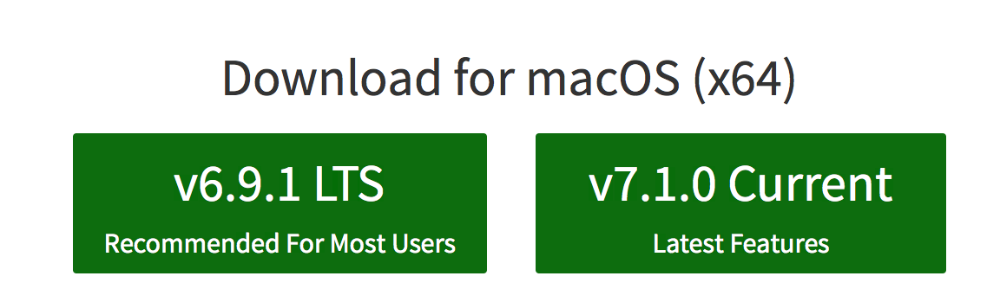
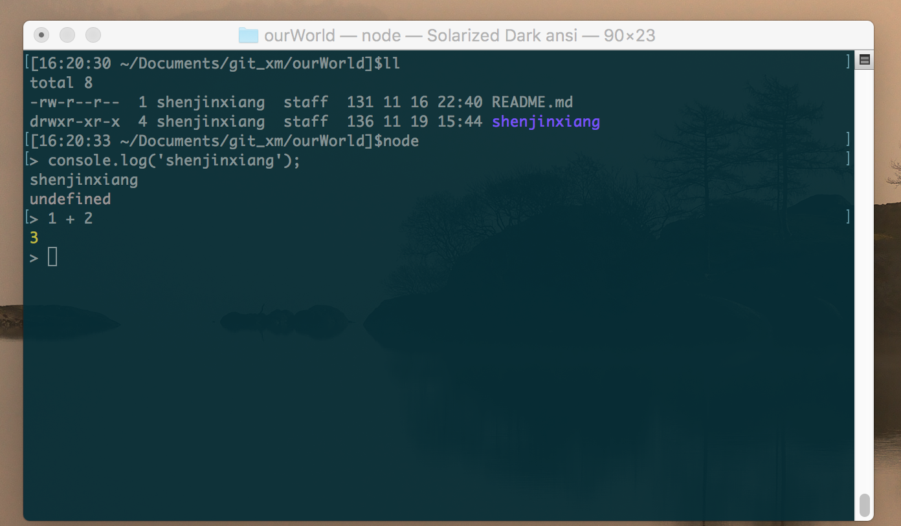
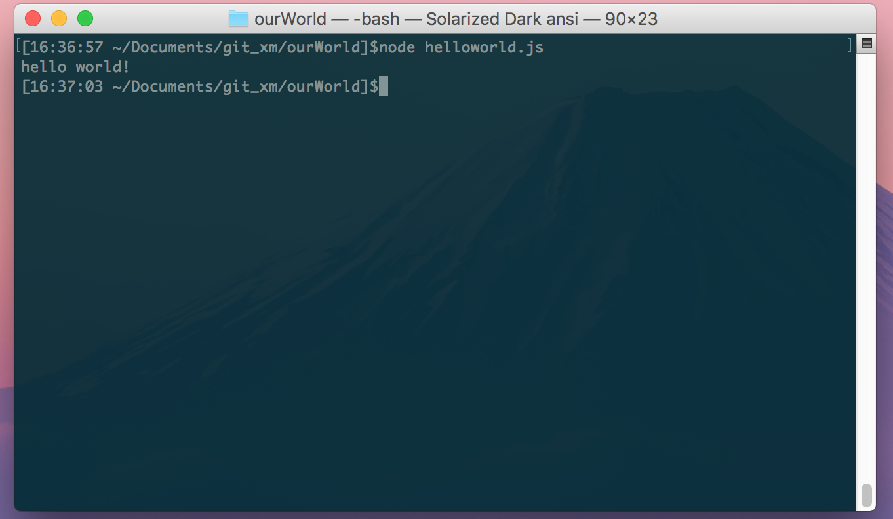

# Nodejs总结：安装与使用
Node.js的学习开始了一段时间了，做了一些小的练习，对这一阶段的内容做个总结，现在开始Node.js的安装和使用

## 安装Node.js
打开Node.js[官网](https://nodejs.org/en/)，可以看到如下图：

左边的为 LTS 版本，即长期支持版本，选择这个就可以了，右边为最新版，可以体验一些新特性，对ES6的支持更为全面

安装完成以后，鼠标右键点击空白书，选择git bash 窗口，可以分别查看node和npm是否安装成功

*查看node版本*
```
node -v
```
*查看npm版本*
```
npm -v
```

## n 和 nvm
这两个工具都是用来管理nodejs的版本用的。比如java开发，电脑上装的是1.6版本的jdk，现在项目开发要用到1.8版本的一些特性了，那么，需要先下载、安装jdk1.8，然后配制环境变量，最后还要配制开发工具eclipse，一整套下来半个多小时过去了。。。 nodejs中，不用想那么多，用n或者nvm就可以了，至于选择哪一个，请[点这里](http://taobaofed.org/blog/2015/11/17/nvm-or-n/)。

## 命令行中体验Node.js
一般来说，如果要做一些JavaScript的小测试，我们需要在浏览器中打开开发者模式，输入需要运行的JavaScript代码，查看运行结果。有了Node.js以后就不需要这样了，可以用在git bash窗口中，直接输入node，即可进入命令行模式，如下图：


如果需要退出命令模式，需要连续按两次CTRL_c

## node 运行js文件
依照惯例，来一个hello world小程序：

1. 输入‘vim helloworld.js’创建并编辑js文件
2. 输入文件内容：console.log('hello world!');
3. 保存文件，终端(或git bash)中，切换只当前目录，输入： node helloworld.js
4. 得到运行结果


