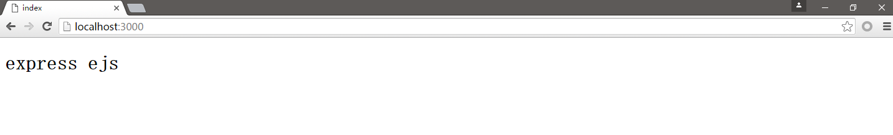
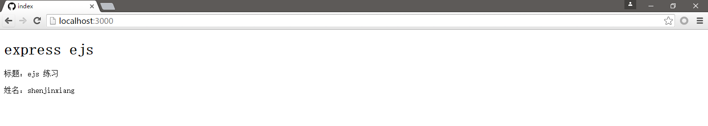
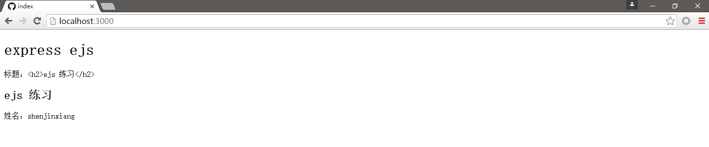
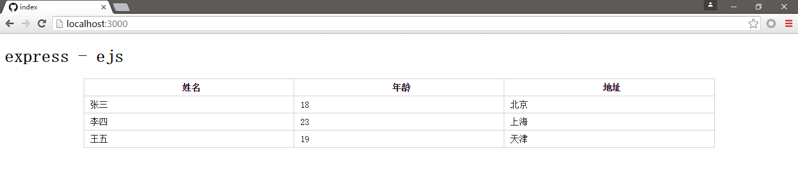

# ejs模板引擎
express使用到现在的阶段，有一个很重要的问题还没解决，那就是mvc模式中的view层，之前我们只是简单的给浏览器发送一个字符串，或者拼接html字符串，对于简单的页面来说还可以实现，但是实际开发的时候显然是不合适的，类似于java web开发的时候有jsp、FreeMarker等模板引擎，nodejs中同样也有模板引擎，比如 jade、ejs等模板引擎，今天简单介绍一下ejs，原因很简单，这个非常容易上手

## 安装ejs
ejs安装很简单，同样是使用npm工具
```
$ npm install ejs --save
```
使用'--save'命令同时更新package.json中的依赖列表

## express中加载ejs
```javascript
// app.js
const express = require('express');
const path = require('path');

let app = express();

app.set('views', path.join(__dirname, '/views'));
app.set('view engine', 'ejs');

app.listen(3000, function () {
	console.log('Server running at 3000 port.');
});
```

上面的代码中，没有设置任何路由，不过已经加载了ejs，```app.set('views', path.join(__dirname, '/views'));``` 这行代码的意思是，设置视图根目录为views目录，```app.set('view engine', 'ejs');``` 的意思是设置视图的后缀名为‘ejs’，这样就加载上了ejs模板

## 使用ejs模板

创建目录views
```
$ mkdir views
```

在views目录下创建index.ejs文件
```
$ touch views/index.ejs
```

编辑index.ejs
```html
<!DOCTYPE html>
<html>
<head>
	<meta charset='utf-8'>
	<title>index</title>
</head>
<body>
<h1>express ejs</h1>
</body>
</html>
```

修改app.js 添加路由
```javascript
const express = require('express');
const path = require('path');

let app = express();

app.set('views', path.join(__dirname, '/views'));
app.set('view engine', 'ejs');

app.get('/', function (req, res) {
	// 渲染index.ejs视图
	res.render('index');
});

app.listen(3000, function () {
	console.log('Server running at 3000 port.');
});
```

启动app.js应用
```
$ node app.js
Server running at 3000 port.
```

浏览器中访问 "http://localhost:3000/" 结果如下:



需要注意的是，res.render()方法，ejs文件的路径是以配置的视图路径为根目录的，本例中，配置的视图根目录为“views”，所以要渲染“views/index.ejs”，则写成“res.render('index')”，ejs文件的目录为“views/user/user.ejs”，那么渲染的方法为“res.render('user/user')”

## ejs中的一些标签
作为模板引擎，类似于jsp，可以执行java代码，可以从servlet传值至jsp显示，ejs中也有同样的功能，先看看一些标签列表

* &lt;% 'Scriptlet' 标签, 用于控制流，没有输出
* &lt;%= 向模板输出值（带有转义）
* &lt;%- 向模板输出没有转义的值
* &lt;%# 注释标签，不执行，也没有输出
* &lt;%% 输出字面的 '<%'
* %&gt; 普通的结束标签
* -%&gt; Trim-mode ('newline slurp') 标签, 移除随后的换行符

下面我们修改index.ejs:
```html
<!DOCTYPE html>
<html>
<head>
	<meta charset='utf-8'>
	<title>index</title>
</head>
<body>
<h1>express ejs</h1>
<%
console.log('hello ejs');
%>
</body>
</html>
```

运行app.js
```
$ node app.js
Server running at 3000 port.
```

浏览器中访问 "http://localhost:3000/" 发现页面结果与之前是一样的，打开浏览器控制台，也没有任何输出，而在后台中输出了```hello ejs```，也就是说 ‘&lt;%’、‘%&gt;’之间可以执行js代码，运行在服务器端，类似于jsp中使用 ```System.out.println()```一样的道理

下面我们给ejs传递值，并显示出来，修改app.js文件:
```javascript
// app.js
const express = require('express');
const path = require('path');

let app = express();

app.set('views', path.join(__dirname, '/views'));
app.set('view engine', 'ejs');

app.get('/', function (req, res) {
	// 渲染index.ejs视图
	res.render('index', {title: 'ejs 练习', name: 'shenjinxiang'});
});

app.listen(3000, function () {
	console.log('Server running at 3000 port.');
});
```

在index.ejs中获取并给浏览器上显示值
```html
<!DOCTYPE html>
<html>
<head>
	<meta charset='utf-8'>
	<title>index</title>
</head>
<body>
<h1>express ejs</h1>
<p>标题：<%= title %></p>
<p>姓名：<%= name %></p>
</body>
</html>
```

同样的启动app.js应用，浏览器中访问 "http://localhost:3000/" 结果如下：



如果传递的值为html结构的字符串，看看是什么情况
```javascript
const express = require('express');
const path = require('path');

let app = express();

app.set('views', path.join(__dirname, '/views'));
app.set('view engine', 'ejs');

app.get('/', function (req, res) {
	// 渲染index.ejs视图
	res.render('index', {title: '<h2>ejs 练习</h2>', name: 'shenjinxiang'});
});

app.listen(3000, function () {
	console.log('Server running at 3000 port.');
});
```

修改index.ejs
```html
<!DOCTYPE html>
<html>
<head>
	<meta charset='utf-8'>
	<title>index</title>
</head>
<body>
<h1>express ejs</h1>
<p>标题：<%= title %></p>
<%- title %>
<p>姓名：<%= name %></p>
</body>
</html>
```

启动app.js应用，浏览器访问 "http://localhost:3000/" 结果如下:



也可以传递数组数据的值，修改app.js
```javascript
// app.js
const express = require('express');
const path = require('path');

let app = express();

app.set('views', path.join(__dirname, '/views'));
app.set('view engine', 'ejs');

app.get('/', function (req, res) {
	let data = [
		{
			name: '张三',
			age: 18,
			address: '北京'
		},
		{
			name: '李四',
			age: 23,
			address: '上海'
		},
		{
			name: '王五',
			age: 19,
			address: '天津'
		}
	];
	// 渲染index.ejs视图
	res.render('index', {title: 'express - ejs', data: data});
});

app.listen(3000, function () {
	console.log('Server running at 3000 port.');
});
```

修改index.ejs页面
```html
<!DOCTYPE html>
<html>
<head>
	<meta charset='utf-8'>
	<title>index</title>
<style>
table{border-collapse: collapse;width:80%;margin:10px auto;}
table th, table td {border: 1px solid #ccc; line-height: 28px;text-indent:10px;}
</style>
</head>
<body>
<h1><%= title %></h1>
<table>
	<tr>
		<th>姓名</th>
		<th>年龄</th>
		<th>地址</th>
	</tr>
	<% for (var index = 0; index < data.length; index++) { %>
		<tr>
			<td><%= data[index].name %></td>
			<td><%= data[index].age %></td>
			<td><%= data[index].address %></td>
		</tr>
	<%}%>
</table>
</body>
</html>
```

启动app.js应用，浏览器访问 "http://localhost:3000/" 效果如下:



## ejs包含
ejs同样可以包含其他的ejs页面，语法为:
```
<%- include(path) %>
```

这里的path要么是绝对路径，如果不是，则相对于视图根目录，即‘veiws’目录。例如，在‘views/users.ejs’ 中包含 ‘views/user/show.ejs’，应该使用```<%- include('user/show') %>```

举个最简单的例子，比如我们可以创建head.ejs和foot.ejs文件
```
$ touch views/head.ejs
$ touch views/foot.ejs
```

编辑head.ejs:
```html
<!doctype thml>
<html>
<head>
	<meta charset='utf-8'>
	<title>Express应用</title>
	<!-- 
	此处添加公用css文件 link
	-->
<style>
table{border-collapse: collapse;width:80%;margin:10px auto;}
table th, table td {border: 1px solid #ccc; line-height: 28px;text-indent:10px;}
</style>
</head>
<body>
```

编辑foot.ejs:
```html
<!--
此处添加公用JavaScript文件 
-->
</body>
</html>
```

修改index.ejs
```html
<%- include('head') %>
<h1><%= title %></h1>
<table>
	<tr>
		<th>姓名</th>
		<th>年龄</th>
		<th>地址</th>
	</tr>
	<% for (var index = 0; index < data.length; index++) { %>
		<tr>
			<td><%= data[index].name %></td>
			<td><%= data[index].age %></td>
			<td><%= data[index].address %></td>
		</tr>
	<%}%>
</table>
<%- include('foot') %>
```

启动app.js应用，浏览器访问 "http://localhost:3000/" 运行结果和之前的例子一样

到目前为止，我们已经可以用ejs的一些简单使用了，其实ejs还有很多特性，这里不做介绍了，其实是我也不会，在摸索中。。 哈~~
