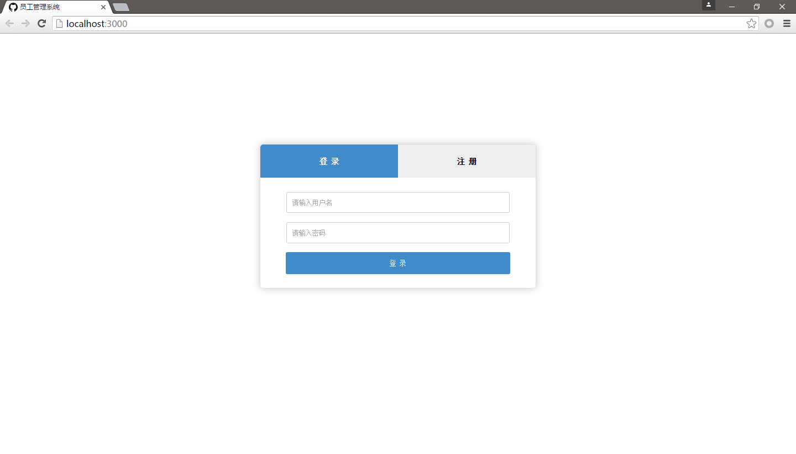
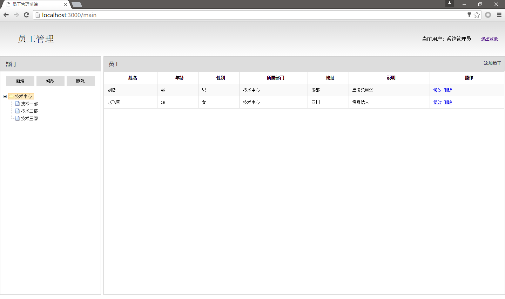

# express-mysql-ejs员工管理系统
之前介绍过express、ejs的使用，也介绍了nodejs操作mysql数据库，现在将这些整合起来，做一个简单的员工管理系统

## 功能说明

* 数据存储在mysql数据库中，后台用express框架
* 包含一个登陆、注册页面和主页面
* 主页面包括左侧的部门信息，以及右侧的员工列表，可以添加删除修改员工和部门信息

## 目录结构
创建工作目录employee
```
$ mkdir employee
```

1. app.js - 应用启动文件    
2. packag.json - 项目总信息文件    
3. lib目录 - 存放后台js文件    
  3.1. lib/middleware - 中间件目录，自定义的中间件    
  3.2. lib/routes - 路由目录，用于配置路由    
  3.3. lib/service - 业务层目录，后台主要业务都在这个目录下    
  3.4. lib/sql - 数据库表设计sql文件    
  3.5. lib/utils - 工具目录，包括md5加密和操作数据库的工具文件    
  3.6. lib/config.json - 配置文件    
4. node_modules - 保存依赖的第三方包    
5. public - 静态文件目录，包括前段第三方插件、页面css、js文件    
6. views - 存放前段ejs文件    

## 初始化环境
初始化包，创建package.json
```
$ npm init
```

导入express
```
$ npm install express --save
```

导入mysql包
```
$ npm install mysql --save
```

导入ejs模板引擎
```
$ npm install ejs --save
```

导入uuid，用于生成数据库主键id
```
$ npm install node-uuid --save
```

导入body-parser包，用于解析post请求数据
```
$ npm install body-parser --save
```

导入express-session包，用于管理session
```
$ npm install express-session --save
```

创建静态文件根目录public
```
$ mkdir public
```

public目录下创建plugin目录，存放前段第三方插件
```
$ mkdir public/plugin
```

plugin目录中导入第三方插件:
* jquery.js - jquery插件
* jquery.form.js - jquery from表单插件
* ztrr - 树形控件
* layer - 弹出框控件

## 项目配置文件
创建lib目录
```
$ mkdir lib
```

lib目录下创建config.json
```
$ touch lib/config.json
```

编辑config.json
```json
{
	"mysql": {
		"user": "root",
		"password": "6098",
		"host": "localhost",
		"port": 3306,
		"database": "nodejs",
		"connectionLimit": 10
	},
	"noLogin": ["/", "/login", "/register", "/checkUsername"]
}
```
mysql指明数据库配置信息
* user - 数据库用户名
* password - 数据库用户密码
* host - 数据库地址
* port - 数据库端口
* database - 数据库名
* connectionLimit - 连接池连接数

noLogin 指明拦截配置信息，除了noLogin指定的路由，其他所有请求都需要session验证

## 创建MD5工具模块
有登录、注册功能，针对密码做个简单的MD5处理，lib目录下创建utils目录
```
$ mkdir lib/utils
```

utils目录下创建MD5Util.js
```
$ touch lib/utils/MD5Util.js
```

编辑MD5Util.js
```javascript
// lib/utils/MD5Util.js
const crypto = require('crypto');

exports.md5 = function (content) {
	if (typeof content !== 'string') {
		return '';
	}
	let md5 = crypto.createHash('md5');
	md5.update(content);
	return md5.digest('hex');
};

exports.sha1 = function (content) {
	if (typeof content !== 'string') {
		return '';
	}
	let shasum = crypto.createHash('sha1');
	shasum.update(content);
	return shasum.digest('hex');
};
```

## 创建数据库操作模块
utils目录下创建mysqlUtil.js
```
$ touch /lib/utils/mysqlUtil.js
```

编辑mysqlUtil.js文件
```javascript
// lib/utils/mysqlUtil.js
const mysql = require('mysql');
const dbConfig = require('../Config').mysql;

let pool = mysql.createPool(dbConfig);

/**
 * 通用查询
 */
let query = exports.query = function (sql, callback) {
	console.log(sql);
	pool.getConnection(function (err, conn) {
		if (err) {
			callback(err);
		} else {
			conn.query(sql, function (err, rows, fields) {
				conn.release();
				console.log(rows);
				callback(err, rows, fields);
			});
		}
	});
};

/**
 * 判断obj是否为对象，也不是{}，即至少有一个属性
 */
let isNotEmptyObject = function (obj) {
	if (typeof obj !== 'object') {
		return false;
	}
	for (let k in obj) {
		return true;
	}
	return false;
}

/**
 * 根据id获取一条记录
 * tableName 数据库表名
 * idName 表主键的名称，默认为'id'
 * idValue 表主键的值
 * callback 回调函数
 */
exports.findById = function () {
	let tableName, idName, idValue, callback;
	if (arguments.length === 3) {
		tableName = arguments[0];
		idName = 'id';
		idValue = arguments[1];
		callback = arguments[2];
	} else if (arguments.length == 4) {
		tableName = arguments[0];
		idName = arguments[1];
		idValue = arguments[2];
		callback = arguments[3];
	} else {
		throw new Error('参数个数错误');
	}
	query({
		sql: 'select * from ' + tableName + ' where ' + idName + ' = ?',
		values: [idValue]
	}, function (err, data) {
		if (err) {
			callback(err);
		} else {
			if (data.length === 0) {
				callback(null, {});
			} else if (data.length === 1) {
				callback(null, data[0]);
			} else {
				callback(new Error('结果错误'));
			}
		}
	});
};

/**
 * 保存一条记录
 * tableName 表名
 * obj 要保存的对象
 * callback 回调函数
 */
exports.save = function(tableName, obj, callback) {
	if (!isNotEmptyObject(obj)) {
		callback(new Error('参数错误'));
		return;
	}
	let sql = 'insert into ' + tableName + ' (';
	let temp = 'values (';
	let values = [];

	for (let k in obj) {
		sql += ' `' + k + '`,';
		temp += ' ?,';
		values.push(obj[k]);
	}
	sql = sql.substring(0, sql.length - 1) + ') ';
	temp = temp.substring(0, temp.length - 1) + ') ';
	sql += temp;
	query({sql: sql, values: values}, function (err, data) {
		callback(err, data);
	});
};

/**
 * 修改一条记录
 * tableName 对应的数据库表名
 * idName 对应的数据库表主键名称
 * obj 修改的对象
 * callback 回调函数
 */
exports.update = function () {
	let tableName, idName, obj, callback;
	if (arguments.length === 3) {
		tableName = arguments[0];
		idName = 'id';
		obj = arguments[1];
		callback = arguments[2];
	} else if (arguments.length === 4) {
		idName = arguments[1];
		obj = arguments[2];
		callback = arguments[3];
	} else {
		throw new Error('参数个数错误');
	}
	if (!isNotEmptyObject(obj)) {
		callback(new Error('参数错误'));
		return;
	}
	if (!obj[idName]) {
		callback(new Error('参数错误'));
		return;
	}

	let sql = 'update ' + tableName + ' set';
	let values = [];
	for (let k in obj) {
		if (k !== idName) {
			sql += ' `' + k + '` = ?,'
			values.push(obj[k]);
		}
	}
	sql = sql.substring(0, sql.length - 1) + ' where ' + idName + ' = ? ';
	values.push(obj[idName]);

	query({sql: sql, values: values}, function (err, data) {
		callback(err, data);
	});
};

/**
 * 根据id删除一条记录
 */
exports.delById = function () {
	let tableName, idName, idValue, callback;
	if (arguments.length === 3) {
		tableName = arguments[0];
		idName = 'id';
		idValue = arguments[1];
		callback = arguments[2]
	} else if (arguments.length === 4) {
		tableName = arguments[0];
		idName = arguments[1];
		idValue = arguments[2];
		callback = arguments[3]
	} else {
		throw new Error('参数个数错误');
	}

	let sql = 'delete from ' + tableName + ' where ' + idName + ' = ?';
	let values = [idValue];
	query({sql: sql, values: values}, function (err, data) {
		callback(err, data);
	});
};
```

## 创建数据库表
lib目录下创建sql目录
```
$ mkdir lib/sql
```

sql目录下创建mysql.sql文件
```
$ touch lib/sql/mysql.sql
```

由于功能简单，所以数据库表只有3个，user表，用于登录、注册；department部门表，为树形结构数据以及employee员工表，编辑mysql.sql
```sql
/**
 * // lib/sql/mysql.sql
 * 初始化数据库表
 */

-- 用户表
CREATE TABLE `user` (
  `id` varchar(64) NOT NULL COMMENT '主键id',
  `name` varchar(255) DEFAULT NULL COMMENT '名称',
  `username` varchar(255) DEFAULT NULL COMMENT '登录用户名',
  `password` varchar(255) DEFAULT NULL COMMENT '登录密码',
  `registerDate` date DEFAULT NULL COMMENT '注册日期',
  PRIMARY KEY (`id`)
) ENGINE=InnoDB DEFAULT CHARSET=utf8;

-- 用户表插入系统管理员记录
insert into user (`id`, `name`, `username`, `password`, `registerDate`) values (UUID(), '系统管理员', 'admin', MD5('admin'), now());

-- 部门表
CREATE TABLE `department` (
  `id` varchar(64) NOT NULL COMMENT '主键id',
  `name` varchar(255) DEFAULT NULL COMMENT '名称',
  `pId` varchar(64) DEFAULT NULL COMMENT '上级部门id',
  `createTime` timestamp NULL DEFAULT CURRENT_TIMESTAMP ON UPDATE CURRENT_TIMESTAMP COMMENT '创建时间',
  PRIMARY KEY (`id`)
) ENGINE=InnoDB DEFAULT CHARSET=utf8;

-- 员工表
CREATE TABLE `employee` (
  `id` varchar(64) NOT NULL COMMENT '主键id',
  `name` varchar(255) DEFAULT NULL COMMENT '姓名',
  `departmentId` varchar(64) DEFAULT NULL COMMENT '部门id',
  `age` int(3) DEFAULT NULL COMMENT '年龄',
  `sex` int(1) DEFAULT NULL COMMENT '性别 1 男   2 女',
  `address` varchar(255) DEFAULT NULL COMMENT '地址',
  `desc` text COMMENT '说明',
  PRIMARY KEY (`id`)
) ENGINE=InnoDB DEFAULT CHARSET=utf8;
```

命令行登录mysql服务器，执行下面的命令，运行sql脚本
```
mysql> use nodejs;
mysql> source ~/Users/shenjinxiang/Documents/employee/lib/sql/mysql.sql;
```

## 搭建express应用
创建app.js文件
```
$ touch app.js
```

编辑app.js
```
// app.js
const express = require('express');
const path = require('path');
const url = require('url');

let app = express();

/**
 * 设置视图，引入ejs
 */
app.set('views', path.join(__dirname, 'views'));
app.set('view engine', 'ejs');

/**
 * 设置静态文件路面
 */
app.use(express.static(path.join(__dirname, 'public')));

/**
 * 引入express-session
 */
app.use(require('express-session')({
	secret: 'shenjinxiang',
	saveUninitialized: true
}));

/**
 * 引入body-parser
 */
app.use(require('body-parser')());

app.listen(3000, function () {
	console.log('Server running at 3000 port.');
});
```

一个简单的应用已经好了，当然，现在没有引入任何路由，项目启动起来也没有任何意义

## 添加自定义中间件
**创建路由日志中间件**

lib目录下创建middleware目录
```
$ mkdir lib/middleware
```

middleware目录下创建routerLog.js文件
```
$ touch lib/middleware/routerLog.js
```

编辑routerLog.js文件
```javascript
// lib/middleware/routeLog.js
const url = require('url');
const util = require('util');

/**
 * 用于打印每次请求的路径和参数
 */
module.exports = function(req, res, next) {
	let pathname = url.parse(req.url).pathname;
	util.log('请求路径:', pathname);
	if (req.method === 'GET' || req.method === 'get') {
		util.log('Get请求，参数:', req.query);
		next();
	} else if (req.method === 'POST' || req.method === 'post') {
		util.log('POST请求，参数:', req.body);
		next();
	}
};
```

**登录session验证中间件**

middleware目录下创建loginFilter.js
```
$ touch lib/middleware/loginFilter.js
```

编辑loginFilter.js文件
```javascript
// lib/middleware/loginFilter.js
const noLogin = require('../config').noLogin;
const url = require('url');

/**
 * 登录session验证 中间件
 */
module.exports = function (req, res, next) {
	let pathname = url.parse(req.url).pathname;
	if (noLogin.indexOf(pathname) < 0 && !req.session.currentUser) {
		res.redirect('/');
	} else {
		next();
	}
};
```

app.js中添加自定义中间件
```javascript
/**
 * 引入路由日志
 */
app.use(require('./lib/middleware/routeLog'));

/**
 * 登录拦截器
 */
app.use(require('./lib/middleware/loginFilter'));
```

## 配置路由模块
lib目录下创建routes目录
```
$ mkdir lib/routes
```

routes目录下创建index.js、department.js、employee.js文件
```
$ touch lib/routes/index.js
$ touch lib/routes/department.js
$ touch lib/routes/employee.js
```

编辑刚创建的三个文件，内容都为:
```javascript
const express = require('express');

let router = express.Router();

module.exports = router;
```

app.js中配置这三个路由文件，app.js最终内容为:
```javascript
// app.js
const express = require('express');
const path = require('path');
const url = require('url');

let app = express();

/**
 * 设置视图，引入ejs
 */
app.set('views', path.join(__dirname, 'views'));
app.set('view engine', 'ejs');

/**
 * 设置静态文件路面
 */
app.use(express.static(path.join(__dirname, 'public')));

/**
 * 引入express-session
 */
app.use(require('express-session')({
	secret: 'shenjinxiang',
	saveUninitialized: true
}));

/**
 * 引入body-parser
 */
app.use(require('body-parser')());

/**
 * 引入路由日志
 */
app.use(require('./lib/middleware/routeLog'));

/**
 * 登录拦截器
 */
app.use(require('./lib/middleware/loginFilter'));

app.use('/', require('./lib/routes/index'));
// 部门路由
app.use('/department', require('./lib/routes/department'));
// 员工路由
app.use('/employee', require('./lib/routes/employee'));


app.listen(3000, function () {
	console.log('Server running at 3000 port.');
});
```

## 添加页面css文件
public目录下创建css目录
```
$ mkdir public/css
```

css目录中创建common.css文件
```
$ touch public/css/common.css
```

common.css内容
```css
* {
	margin: 0;
	padding: 0;
	font-size: 12px;
}
div {
	box-sizing: border-box;
}
ul li {
	list-style: none;
}
.clear {
	clear: both;
}
.fl {
	float: letf;
}
.fr {
	float: right;
}
.index-content {
	width: 500px;
	margin: 200px auto;
	border-radius: 5px;
	box-shadow: 0px 0px 20px #ccc;
	border: 1px solid #ddd;
}
.index-menu {
	height: 60px;
	line-height: 60px;
}
.index-menu li {
	float: left;
	width: 50%;
	font-size: 14px;
	font-weight: bold;
	text-align: center;
	background: #eee;
	cursor: pointer;
}
.index-menu li.login-li {
	border-radius: 5px 0 0 0;
}
.index-menu li.register-li {
	border-radius: 0 5px 0 0;
}
.index-menu li:hover {
	background: #ddd;
}
.index-menu li.active {
	background: #428bca;
	color: #fff;
}
.list-content {
	display: none;
	margin: 20px 0;
}
.list-content li{
	line-height: 40px;
	text-align: center;
	padding: 5px;
	margin: 5px;
}
.list-content li input[type='text'],
.list-content li input[type='password'] {
	width: 80%;
	height: 32px;
	border-radius: 3px;
	border: 1px solid #ccc;
	padding: 2px 10px;
}
.list-content li input[type='button'] {
	width: 85%;
	height: 40px;
	border-radius: 3px;
	border: none;
	background: #428bca;
	color: #fff;
	cursor: pointer;
}
.list-content li input[type='button']:hover {
	background: #327bba;
}
.list-content.active{
	display: block;
}

.header {
	width: 100%;
	height: 100px;
	background: linear-gradient(#ddd, #fefefe);
	line-height: 100px;
}
.header .title {
	font-size: 26px;
	width: 200px;
	line-height: 100px;
	float: left;
	text-indent: 50px;
}
.header span {
	font-size: 14px;
	display: inline-block;
	float: right;
	margin-right: 20px;
}
.header a {
	font-size: 12px;
	display: inline-block;
	float: right;
}
.left-content {
	float: left;
	width: 20%;
	border: 1px solid #ccc;
}
.right-content {
	float: right;
	width: 79.5%;
	border: 1px solid #ccc;
}

.box-title {
	width: 100%;
	height: 42px;
	line-height: 42px;
	text-indent: 15px;
	background: #ddd;
	color: #444;
	font-weight: bold;
	font-size: 14px;
}
.box-title a {
	display: inline-block;
	float: right;
	line-height: 36px;
	padding: 0 10px;
	text-decoration: none;
	color: #444;
}
.box-title a:hover {
	color: #222;
}
.operate-box {
	width: 100%;
	height: 54px;
	line-height: 54px;
	border-bottom: 1px solid #eee;
	text-align: center;
}
.operate-box button {
	display: inline-block;
	cursor: pointer;
	border: 1px solid transparent;
	padding: 0 10px;
	width: 80px;
	height: 28px;
}

#departmentTree {
	overflow-y: auto;
}
.table-ware {
	width: 100%;
	overflow-y: auto;
}
.table {
	width: 100%;
	border-collapse: collapse;
}
.table th, 
.table td {
	border: 1px solid #ddd;
	height: 34px;
	line-height: 34px;
	text-indent: 10px;
}
.table> tbody > tr:nth-child(odd) > td,
.table> tbody > tr:nth-child(odd) > th {
	background-color: #f9f9f9;
}
.table> tbody > tr:hover > td,
.table> tbody > tr:hover > th {
	background-color: #f5f5f5;
}
.form-ul {
	line-height: 40px;
	text-align: center;
	padding: 5px;
	margin: 5px;
}
.form-ul ._text {
	width: 80%;
	height: 32px;
	border-radius: 3px;
	border: 1px solid #ccc;
	padding: 2px 10px;
}
.form-ul ._text:focus {
	border-color: #66afe9;
	outline: 0;
	-webkit-box-shadow: inset 0 1px 1pxrgba(0,0,0,.075), 0 0 8px rgba(102, 175, 233, .6);
	box-shadow: inset 0 1px 1pxrgba(0,0,0,.075), 0 0 8px rgba(102, 175, 233, .6);
}
input[type="file"]:focus,
input[type="radio"]:focus,
input[type="checkbox"]:focus {
	outline: thin dotted;
	outline: 5px auto -webkit-focus-ring-color;
	outline-offset: -2px;
}
.form-ul label {
	display: inline-block;
	text-align: left;
	text-indent: 5px;
	width: 80px;
}
.form-ul textarea._text {
	height: 80px;
	resize: none;
	margin-top: 6px;
}
.form-ul ._btn {
	width: 100px;
	height: 32px;
	color: #444;
	background-color: #eee;
	border-radius: 4px;
	border: 1px solid #ccc;
	cursor: pointer;
	margin: 10px 20px;
}
.form-ul ._btn:hover {
	background-color: #fefefe;
}
```

## 添加页面公用js文件
public 目录下创建js目录
```
$ mkdir public/js
```

js目录下创建common.js
```
$ touch public/js/common.js
```

common.js文件内容
```javascript
// public/js/common.js
/**
 * 获取form表单数据
 */
$.fn.getFormJson = function() {  
   var o = {};  
   var a = this.serializeArray();  
   $.each(a, function() {  
       if (o[this.name]) {  
           if (!o[this.name].push) {  
               o[this.name] = [o[this.name]];  
           }  
           o[this.name].push(this.value || '');  
       } else {  
           o[this.name] = this.value || '';  
       }  
   });  
   return o;  
}; 

/**
 * 重置表单
 */
function formReset(formId){
	var $form = $("#"+formId);
	$form.get(0).reset();
	$form.find("input[type='hidden']").val("");
}

/**
 * 执行ajax post请求
 */
function doPost(url, data, callback) {
	$.ajax({
		type: 'POST',
		url: url,
		data: data,
		dataType: 'json',
		success: callback
	});
}

/**
 * 提示信息 用于表单验证
 */
function tips(str, key) {
	layer.tips(str, '#' + key);
}

/**
 * 弹出提示信息
 */
function alertMsg (str, fn) {
	if (typeof fn === 'function') {
		layer.msg(str, {time: 2000}, fn);
	} else {
		layer.msg(str, {time: 2000});
	}
}

/**
 * 弹出layer窗口
 */
function openContent(title, width, contentId) {
	layer.open({
		type: 1, 
		area: [width + 'px', 'auto'],
		title: title,
		shade: 0.6, 
		anim: 1,
		content: $('#' + contentId)
	}); 
}

/**
 * 关闭layer弹出窗口
 */
function closeLayer() {
	layer.closeAll();
}
```

## 登录、注册模块
创建views目录
```
$ mkdir views
```

创建登录页面index.ejs
```
$ touch views/index.ejs
```

index.ejs 文件内容
```html
<!doctype html>
<html>
<head>
	<meta charset='utf-8'>
	<link type='text/css' rel='stylesheet' href='/plugin/ztree/zTreeStyle.css' />
	<link type='text/css' rel='stylesheet' href='/plugin/layer/skin/default/layer.css' />
	<link type='text/css' rel='stylesheet' href='/css/common.css' />
	<title>员工管理系统</title>
</head>
<body>
<div class='index-content'>
	<ul class='index-menu'>
		<li class='login-li active' data='0'>登 录</li>
		<li class='register-li' data='1'>注 册</li>
	</ul>
	<i class='clear'></i>
	<div id='login-content' class='list-content active'>
		<form id='loginForm'>
			<ul>
				<li>
					<input type='text' id='login_username' name='username' placeholder='请输入用户名' />
				</li>
				<li>
					<input type='password' id='login_password' name='password' placeholder='请输入密码' />
				</li>
				<li>
					<input type='button' value='登  录' onclick='login()'/>
				</li>
			</ul>
		</form>
	</div>
	<div id='register-content' class='list-content'>
		<form id='registerForm'>
			<ul>
				<li>
					<input type='text' id='register_name' name='name' placeholder='请输入姓名' />
				</li>
				<li>
					<input type='text' id='register_username' name='username' placeholder='请输入用户名' />
				</li>
				<li>
					<input type='password' id='register_password' name='password' placeholder='请输入密码' />
				</li>
				<li>
					<input type='button' value='注  册' onclick='register()'/>
				</li>
			</ul>
		</form>
	</div>
</div>
<script type='text/javascript' src='/plugin/jquery.js'></script>
<script type='text/javascript' src='/plugin/jquery.form.js'></script>
<script type='text/javascript' src='/plugin/layer/layer.js'></script>
<script type='text/javascript' src='/plugin/ztree/jquery.ztree.core-3.5.min.js'></script>
<script type='text/javascript' src='/plugin/ztree/jquery.ztree.excheck-3.5.min.js'></script>
<script type='text/javascript' src='/js/common.js'></script>
<script type='text/javascript' src='/js/index.js'></script>
</body>
</html>
```

**登录、注册页面的js文件**

public/js 目录下创建文件 index.js
```
$ touch public/js/index.js
```

public/js/index.js文件内容
```javascript
$(function () {
	bindEvent();
});

/**
 * 绑定事件
 */
function bindEvent() {
	$('.index-menu li').click(function () {
		$(this).addClass('active');
		$(this).siblings().removeClass('active');
		let data = $(this).attr('data');
		$('.list-content').eq(data).addClass('active').siblings().removeClass('active');
	});

	$('#login_username').keypress(function (event) {
		if (event.keyCode === 13) {
			$('#login_password').focus();
		}
	});

	$('#login_password').keypress(function (event) {
		if (event.keyCode === 13) {
			login();
		}
	});

	$('#register_name').keypress(function (event) {
		if (event.keyCode === 13) {
			$('#register_username').focus();
		}
	});
	
	$('#register_username').keypress(function (event) {
		if (event.keyCode === 13) {
			$('#register_password').focus();
		}
	});

	$('#register_password').keypress(function (event) {
		if (event.keyCode === 13) {
			register();
		}
	});

	$('#register_username').blur(function () {
		if ($.trim($(this).val()) != '') {
			checkUsername($(this).val());
		}
	});
}

/**
 * 登录
 */
function login() {
	let data = $('#loginForm').getFormJson();
	if (data.username === '' || $.trim(data.username) === '') {
		tips('请输入用户名', 'login_username');
		return;
	}
	if (data.password === '' || $.trim(data.password) === '') {
		tips('请输入密码', 'login_password');
		return;
	}
	doPost('/login', data, function(result) {
		if (result.result) {
			window.location.href = '/main';
		} else {
			alertMsg(result.msg);
		}
	});
}

/**
 * 注册
 */
function register() {
	let data = $('#registerForm').getFormJson();
	if (data.name === '' || $.trim(data.name) === '') {
		tips('请输入姓名', 'register_name');
		return;
	}
	if (data.username === '' || $.trim(data.username) === '') {
		tips('请输入用户名', 'register_username');
		return;
	}
	if (data.password === '' || $.trim(data.password) === '') {
		tips('请输入密码', 'register_password');
		return;
	}
	doPost('/register', data, function (result) {
		if (result.result) {
			window.location.href = '/main';
		} else {
			alertMsg(result.msg);
		}
	});
}

/**
 * 检测用户名是否重复
 */
function checkUsername(username) {
	doPost('/checkUsername', {username: username}, function (result) {
		if (!result.result) {
			tips(result.msg, 'register_username');
		}
	});
}
```

**编辑lib/routes/index.js文件**
```javascript
// lib/routes/index.js
const express = require('express');
const userService = require('../service/user');
const MD5 = require('../utils/MD5Util');

let router = express.Router();

/**
 * 登录、注册页面
 */
router.get('/', function (req, res) {
	res.render('index');
});

/**
 * 登录验证
 */
router.post('/login', function (req, res) {
	let username = req.body.username;
	let password = req.body.password;
	userService.queryUserByUsername(username, function (err, data) {
		if (err) {
			res.json({result: false, msg: '用户不存在'});
		} else {
			if (data.length === 1 && data[0].password === MD5.md5(password)) {
				req.session.currentUser = data[0];
				res.json({result: true});
			} else {
				res.json({result: false, msg: '用户或密码错误'});
			}
		}
	});
});

/**
 * 注册用户
 */
router.post('/register', function (req, res) {
	userService.register(req.body, function (err, data) {
		if (err) {
			res.json({result: false, msg: err.message});
		} else {
			req.session.currentUser = data;
			res.json({result: true});
		}
	});
});

/**
 * 验证用户名是否存在
 */
router.post('/checkUsername', function (req, res) {
	userService.queryUserByUsername(req.body.username, function (err, data) {
		if (err) {
			res.json({result: false, msg: err.message});
		} else {
			if (data.length > 0) {
				res.json({result: false, msg: '用户名已经存在'});
			} else {
				res.json({result: true});
			}
		}
	});
});

/**
 * 登出
 */
router.get('/logout', function (req, res) {
	delete req.session.currentUser;
	res.redirect('/');
});

/**
 * 主页面
 */
router.get('/main', function (req, res){
	let user = req.session.currentUser;
	res.render('main', {name: user.name});
});

module.exports = router;
```

**业务处理**

创建lib/service目录
```
$ mkdir lib/service
```

创建lib/service/user.js文件
```
$ touch lib/service/user.js
```

lib/service/user.js文件内容
```javascript
// lib/service/user.js

const mysqlUtil = require('../utils/mysqlUtil');
const uuid = require('node-uuid');
const MD5 = require('../utils/MD5Util');

/**
 * 根据用户名获取用户信息
 */
let queryUserByUsername = exports.queryUserByUsername = function (username, callback) {
	mysqlUtil.query({
		sql: 'select * from user where username = ?',
		values: [username]
	}, callback);
};

/**
 * 注册
 */
exports.register = function (obj, callback) {
	queryUserByUsername(obj.username, function (err, data) {
		if (err) {
			callback(err);
		} else if (data.length > 0) {
			callback(new Error('用户名已存在'));
		} else {
			obj.id = uuid.v4();
			obj.registerDate = new Date();
			obj.password = MD5.md5(obj.password);
			mysqlUtil.save('user', obj, function (err, data) {
				if (err) {
					callback(err);
				} else {
					mysqlUtil.findById('user', obj.id, function (err, data) {
						callback(err, data);
					});
				}
			});
		}
	});
};
```

这个模块中，使用了node-uuid包，用于生成数据库中主键id，至此登录、注册功能完成

## 主页面开发
在lib/routes/index.js这个路由中配置了/main 路由，用于跳转至主页面
```javascript
/**
 * 主页面
 */
router.get('/main', function (req, res){
	let user = req.session.currentUser;
	res.render('main', {name: user.name});
});
```

下面开始主页面的开发

创建views/main.ejs文件
```
$ touch views/main.ejs
```

编辑main.ejs文件
```html
<!doctype html>
<html>
<head>
	<meta charset='utf-8'>
	<link type='text/css' rel='stylesheet' href='/plugin/ztree/zTreeStyle.css' />
	<link type='text/css' rel='stylesheet' href='/plugin/layer/skin/default/layer.css' />
	<link type='text/css' rel='stylesheet' href='/css/common.css' />
	<title>员工管理系统</title>
</head>
<body>
<div class='header'>
	<div class='title'>员工管理</div>
	<span>当前用户：<%= name %>&nbsp;&nbsp;<a href='/logout'>退出登录</a></span>
</div>
<div class='left-content'>
	<div class='box-title'>部门</div>
	<div class='operate-box'>
		<button type='button' class='_btn' id='add_department_btn'>新增</button>
		<button type='button' class='_btn' id='upd_department_btn'>修改</button>
		<button type='button' class='_btn' id='del_department_btn'>删除</button>
	</div>
	<ul id='departmentTree' class='ztree'></ul>
</div>
<div class='right-content'>
	<div class='box-title'>员工
		<a href='javascript:addEmployee();'>添加员工</a>
	</div>
	<div class='table-ware'>
	<table id='employeeTable' class='table'>
		<thead>
			<tr>
				<th>姓名</th>
				<th>年龄</th>
				<th>性别</th>
				<th>所属部门</th>
				<th>地址</th>
				<th>说明</th>
				<th>操作</th>
			</tr>
		</thead>
		<tbody>
			<tr>
				<td colspan='7'>暂无数据.</td>
			</tr>
		</tbody>
	</table>
	</div>
</div>

<div id='departmentContent' style='display: none;'>
	<form id='departmentForm'>
		<ul class='form-ul'>
			<li>
				<input type='hidden' id='department_pId' name='pId' />
				<input type='text' id='department_pName'  class='_text' readonly />
			</li>
			<li>
				<input type='hidden' id='department_id' name='id' />
				<input type='text' id='department_name' name='name' class='_text' placeholder='请输入部门名称' />
			</li>
			<li>
				<button type='button' class='_btn' onclick='saveDepartment()'>确定</button>
				<button type='button' class='_btn' onclick='closeLayer()'>取消</button>
			</li>
		</ul>
	</form>
</div>

<div id='employeeContent' style='display: none;'>
	<form id='employeeForm'>
		<ul class='form-ul'>
			<li>
				<input type='hidden' id='employee_id' name='id' />
				<input type='text' id='employee_name' name='name' placeholder='请输入姓名' class='_text' />
			</li>
			<li>
				<input type='number' id='employee_age' name='age' placeholder='请输入年龄' class='_text' />
			</li>
			<li>
				<input type='radio' name='sex' checked value='1' id='sex_1'/><label for='sex_1'>男</label>
				<input type='radio' name='sex' value='0' id='sex_0' /><label for='sex_0'>女</label>
				
			</li>
			<li>
				<input type='text' id='employee_address' name='address' class='_text' placeholder='请输入地址' />
			</li>
			<li>
				<input type='hidden' id='employee_departmentId' name='departmentId' />
				<input type='text' id='employee_departmentName' readonly  class='_text' />
			</li>
			<li>
				<textarea id='employee_desc' name='desc' class='_text' placeholder='请输入说明'></textarea>
			</li>
			<li>
				<button type='button' class='_btn' onclick='saveEmployee()'>确定</button>
				<button type='button' class='_btn' onclick='closeLayer()'>取消</button>
			</li>
		</ul>
	</form>
</div>
<script type='text/javascript' src='/plugin/jquery.js'></script>
<script type='text/javascript' src='/plugin/jquery.form.js'></script>
<script type='text/javascript' src='/plugin/layer/layer.js'></script>
<script type='text/javascript' src='/plugin/ztree/jquery.ztree.core-3.5.min.js'></script>
<script type='text/javascript' src='/plugin/ztree/jquery.ztree.excheck-3.5.min.js'></script>
<script type='text/javascript' src='/js/common.js'></script>
<script type='text/javascript' src='/js/main.js'></script>
</body>
</html>
```

**添加对应的页面js文件**

创建 public/js/main.js文件
```
$ touch public/js/main.js
```

编辑public/js/main.js文件
```javascript
$(function () {
	initUI();
	bindEvent();
	initDepartmentTree();
});

/**
 * 初始化高度
 */
function initUI() {
	$('.left-content').height($(window).height() - 120);
	$('#departmentTree').height($(window).height() - 240);
	$('.right-content').height($(window).height() - 120);
	$('.table-ware').height($(window).height() - 170);
}

/**
 * 绑定事件
 */
function bindEvent() {
	$('#add_department_btn').click(addDepartment);
	$('#upd_department_btn').click(updDepartment);
	$('#del_department_btn').click(delDepartment);
}

/**
 * 初始化部门树
 */
function initDepartmentTree() {
	doPost('/department/treeData', {}, function (result) {
		if (result.result) {
			let zNodes = result.data;
			let setting = {
				data: {
					simpleData: {
						enable: true,
						idKey: 'id',
						pIdKey: 'pId',
						rootPId: null
					}
				},
				view: {
					selectedMulti: false	// 设置只能选中一个节点
				},
				callback: {
					onClick: deptClick
				}
			};
			$.fn.zTree.init($('#departmentTree'), setting, zNodes);
		}
	});
}

/**
 * 获取zTree对象
 */
function getZTreeObj(id) {
	return $.fn.zTree.getZTreeObj(id);
}

/**
 * 获取选中的节点
 */
function getSelectedNode(id) {
	let nodes = getZTreeObj(id).getSelectedNodes();
	if (!nodes || nodes.length === 0) {
		return null;
	}
	return nodes[0];
}

/**
 * 节点点击时触发 显示员工列表
 */
function deptClick (event, treeId, treeNode) {
	let departmentId = treeNode.id;
	initEmployeeList(departmentId);
}

/**
 * 添加部门，弹出输入框
 */
function addDepartment () {
	formReset('departmentForm');
	let currentNode = getSelectedNode('departmentTree');
	if (!currentNode) {
		$('#department_pId').val('');
		$('#department_pName').val('没有上级部门');
	} else {
		$('#department_pId').val(currentNode.id);
		$('#department_pName').val(currentNode.name);
	}
	openContent('添加部门', 400, 'departmentContent');
}

/**
 * 修改部门 弹出输入框
 */
function updDepartment () {
	formReset('departmentForm');
	let currentNode = getSelectedNode('departmentTree');
	if (!currentNode) {
		alertMsg('请选择需要修改的部门');
		return;
	}
	doPost('/department/queryOne', {id: currentNode.id}, function (result) {
		if (!result.result) {
			alertMsg(result.msg);
		} else {
			$('#department_id').val(result.data.id);
			$('#department_name').val(result.data.name);
			$('#department_pName').val(result.data.pName || '没有上级部门');
			openContent('修改部门', 400, 'departmentContent');
		}
	});
}

/**
 * 保存部门数据 后台执行添加或修改操作
 */
function saveDepartment () {
	let data = $('#departmentForm').getFormJson();
	if (data.name === '' || $.trim(data.name) == '') {
		tips('请输入部门名称', 'department_name');
		return;
	}
	let url = '/department/addDepartment';
	if (data.id) {
		url = '/department/updDepartment';
	}
	doPost(url, data, function (result) {
		if (!result.result) {
			alertMsg(result.msg);
		} else {
			let treeObj = getZTreeObj('departmentTree');
			let currentNode = getSelectedNode('departmentTree');
			if (result.data.type === 'add') {
				treeObj.addNodes(currentNode, result.data.data);
				alertMsg('添加成功', function () {
					closeLayer();
				});
			} else if (result.data.type === 'upd') {
				currentNode.name = result.data.data.name;
				treeObj.updateNode(currentNode);
				alertMsg('修改成功', function () {
					closeLayer();
				});
			}
		}
	});
}

/**
 * 删除部门，需要该部门没有下级部门，没有员工
 */
function delDepartment () {
	let currentNode = getSelectedNode('departmentTree');
	if (!currentNode || !currentNode.id) {
		alertMsg('请选择需要删除的部门');
		return;
	}
	if (currentNode.isParent) {
		alertMsg('有下级部门，不能删除!');
		return;
	}

	doPost('/department/delDepartment', {id: currentNode.id}, function (result) {
		if (!result.result) {
			alertMsg(result.msg);
		} else {
			let treeObj = getZTreeObj('departmentTree');
			treeObj.removeNode(currentNode);
			alertMsg('删除成功');
		}
	});
}

/**
 * 显示员工列表
 */
function initEmployeeList(departmentId) {
	doPost('/employee/queryList', {'departmentId': departmentId}, function (result) {
		if (!result.result) {
			alertMsg(result.msg);
		} else {
			if (result.data.length === 0) {
				$('#employeeTable tbody').html('<tr><td colspan="7">暂无数据.</td></tr>');
			} else {
				$('#employeeTable tbody').html('');
				result.data.forEach(function(item, index) {
					let _html = '<tr>'
										+ '	<td>' + item.name + '</td>'
										+ '	<td>' + item.age + '</td>'
										+ '	<td>' + ((item.sex == '1') ? '男' : '女') + '</td>'
										+ '	<td>' + item.departmentName + '</td>'
										+ '	<td>' + item.address + '</td>'
										+ '	<td>' + item.desc + '</td>'
										+ '	<td>'
										+ "		<a href=\"javascript:updEmployee('" + item.id + "')\">修改</a>"
										+ "		<a href=\"javascript:delEmployee('" + item.id + "')\">删除</a>"
										+ '	</td>'
										+ '</tr>';
					$('#employeeTable tbody').append($(_html));
				});
			}
		}
	});
}

/**
 * 添加员工 弹出窗口
 */
function addEmployee() {
	let currentNode = getSelectedNode('departmentTree');
	if (!currentNode || !currentNode.id) {
		alertMsg('请选择部门');
		return;
	}
	formReset('employeeForm');
	$('#employeeForm #employee_departmentId').val(currentNode.id);
	$('#employeeForm #employee_departmentName').val(currentNode.name);
	openContent('添加员工', 500, 'employeeContent');
}

/**
 * 修改员工，弹出窗口
 */
function updEmployee(employeeId) {
	formReset('employeeForm');
	doPost('/employee/queryOne', {id: employeeId}, function (result) {
		if (!result.result) {
			alertMsg(result.msg);
		} else {
			$("#employeeForm #employee_id").val(result.data.id);
			$("#employeeForm #employee_name").val(result.data.name);
			$("#employeeForm #employee_age").val(result.data.age);
			$("#employeeForm #employee_address").val(result.data.address);
			$("#employeeForm #employee_departmentName").val(result.data.departmentName);
			$("#employeeForm #employee_departmentId").val(result.data.departmentId);
			$("#employeeForm #employee_desc").val(result.data.desc);
			if(result.data.sex == '1') {
				$('#employeeForm #sex_1').prop('checked', true);
			} else {
				$('#employeeForm #sex_0').prop('checked', true);
			}
			openContent('修改员工', 500, 'employeeContent');
		}
	});
}


/**
 * 删除员工
 */
function delEmployee(employeeId) {
	doPost('/employee/delEmployee', {id: employeeId}, function (result) {
		if (!result.result) {
			alertMsg(result.msg);
		} else {
			let currentNode = getSelectedNode('departmentTree');
			initEmployeeList(currentNode.id);
			alertMsg('删除成功', function () {
				closeLayer();
			});
		}
	});
}

/**
 * 保存员工信息，后台执行 新增或修改
 */
function saveEmployee() {
	let data = $('#employeeForm').getFormJson();
	let url = '/employee/addEmployee';
	if (data.id) {
		url = '/employee/updEmployee';
	}
	doPost(url, data, function (result) {
		if (!result.result) {
			alertMsg(result.msg);
		} else {
			initEmployeeList(data.departmentId);
			alertMsg('保存成功', function () {
				closeLayer();
			});
		}
	});
}
```

**路由文件**

编辑lib/routes/department.js文件
```javascript
// lib/routes/department.js

const express = require('express');
const department = require('../service/department');

let router = express.Router();

/**
 * 获取部署数据
 */
router.post('/treeData', function (req, res) {
	department.departmentTree(function (err, data) {
		if (err) {
			res.json({result: false, msg: err.message});
		} else {
			res.json({result: true, data: data});
		}
	});
});

/**
 * 获取一条记录
 */
router.post('/queryOne', function (req, res) {
	department.queryDepartmentById(req.body.id, function (err, data) {
		if (err) {
			res.json({'result': false, 'msg': err.message});
		} else {
			res.json({result: true, data: data});
		}
	});
});

/**
 * 添加部门
 */
router.post('/addDepartment', function (req, res) {
	department.addDepartment(req.body, function (err, data) {
		if (err) {
			res.json({result: false, msg: err.message});
		} else {
			res.json({result: true, data: {type: 'add', data: data}});
		}
	});
});

/**
 * 修改部门
 */
router.post('/updDepartment', function (req, res) {
	department.updDepartment(req.body, function (err, data) {
		if (err) {
			res.json({result: false, msg: err.message});
		} else {
			res.json({result: true, data: {type: 'upd', data: data}});
		}
	});
});

/**
 * 删除部门
 */
router.post('/delDepartment', function (req, res) {
	department.delDepartment(req.body.id, function (err, data) {
		if (err) {
			res.json({result: false, msg: err.message});
		} else {
			res.json({result: true, data: data});
		}
	});
});

module.exports = router;
```

编辑 lib/routes/employee.js文件
```javascript
// lib/routes/employee.js

const express = require('express');
const employee = require('../service/employee');

let router = express.Router();

/**
 * 获取员工列表信息
 */
router.post('/queryList', function (req, res) {
	employee.queryList(req.body.departmentId, function (err, data) {
		if (err) {
			res.json({result: false, msg: err.message});
		} else {
			res.json({result: true, data: data});
		}
	});
});

/**
 * 添加员工信息
 */
router.post('/addEmployee', function (req, res) {
	employee.addEmployee(req.body, function (err, data) {
		if (err) {
			res.json({result: false, msg: err.message});
		} else {
			res.json({result: true, data: data});
		}
	});
});

/**
 * 删除员工记录
 */
router.post('/delEmployee', function (req, res) {
	employee.delEmployee(req.body.id, function (err, data) {
		if (err) {
			res.json({result: false, msg: err.message});
		} else {
			res.json({result: true});
		}
	});
});

/**
 * 查询一条记录
 */
router.post('/queryOne', function (req, res) {
	employee.queryOne(req.body.id, function (err, data) {
		if (err) {
			res.json({result: false, msg: err.message});
		} else {
			res.json({result: true, data: data});
		}
	});
});

/**
 * 修改员工记录
 */
router.post('/updEmployee', function (req, res) {
	employee.updEmployee(req.body, function (err, data) {
		if (err) {
			res.json({result: false, msg: err.message});
		} else {
			res.json({result: true});
		}
	});
});

module.exports = router;
```

**编辑业务处理文件**

创建 lib/service/department.js文件
```
$ touch lib/service/department.js
```

编辑 lib/service/department.js文件
```javascript
// lib/service/department.js
const uuid = require('node-uuid');
const mysqlUtil = require('../utils/mysqlUtil');

/**
 * 获取部门数据
 */
exports.departmentTree = function (callback) {
	mysqlUtil.query('select * from department order by createTime asc', callback);
};

/**
 * 根据id获取部门信息
 */
exports.queryDepartmentById = function (id, callback) {
	mysqlUtil.query({
		sql: 'select a.id, a.name, a.pId, (select name from department where id = a.pId) pName from department a where a.id = ?',
		values: [id]
	}, function (err, data) {
		if (err) {
			callback(err);
		} else {
			if (data.length !== 1) {
				callback(new Error('返回记录数量不正确'), data);
			} else {
				callback(null, data[0]);
			}
		}
	});
};

/**
 * 添加部门信息
 */
exports.addDepartment = function (obj, callback) {
	obj.pId = obj.pId || null;
	obj.id = uuid.v4();
	mysqlUtil.save('department', obj, function (err, data) {
		if (err) {
			callback(err);
		} else {
			mysqlUtil.findById('department', obj.id, callback);
		}
	});
};

/**
 * 修改部门信息
 */
exports.updDepartment = function (obj, callback) {
	mysqlUtil.query({
		sql: 'update department set name = ? where id = ?',
		values: [obj.name, obj.id]
	}, function (err, data) {
		if (err) {
			callback(err);
		} else {
			mysqlUtil.findById('department', obj.id, callback);
		}
	});
};

/**
 * 删除部门信息
 */
exports.delDepartment = function (id, callback) {
	mysqlUtil.query({
		sql: 'select count(1) cnt from department where pId = ?',
		values: [id]
	}, function (err, data) {
		if (err) {
			callback(err);
		} else {
			if (data[0].cnt !== 0) {
				callback(new Error('有下级部门，无法删除!'));
			} else {
				mysqlUtil.query({
					sql: 'select count(1) cnt from employee where departmentId = ?',
					values: [id]
				}, function (err, data) {
					if (err) {
						callback(err);
					} else {
						if (data[0].cnt !== 0) {
							callback(new Error('该部门有员工，无法删除!'));
						} else {
							mysqlUtil.delById('department', id, callback);
						}
					}
				});
			}
		}
	});
};
```

创建 lib/service/employee.js文件
```
$ touch lib/service/employee.js
```

编辑 lib/service/employee.js文件
```javascript
// lib/service/employee.js

const uuid = require('node-uuid');
const mysqlUtil = require('../utils/mysqlUtil');

/**
 * 获取员工列表
 */
exports.queryList = function (departmentId, callback) {
	mysqlUtil.query({
		sql: 'select a.id, a.name, a.departmentId, (select name from department where id = a.departmentId) departmentName, a.age, a.sex, a.address, a.desc from employee a where a.departmentId = ?',
		values: [departmentId]
	}, callback);
};

/**
 * 添加员工
 */
exports.addEmployee = function (obj, callback) {
	obj.id = uuid.v4();
	mysqlUtil.save('employee', obj, callback);
};

/**
 * 删除员工
 */
exports.delEmployee = function (id, callback) {
	mysqlUtil.delById('employee', id, callback);
}

/**
 * 修改员工
 */
exports.updEmployee = function (obj, callback) {
	delete obj.departmentId;
	mysqlUtil.update('employee', obj, callback);
}

/**
 * 获取一条员工记录
 */
exports.queryOne = function (id, callback) {
	mysqlUtil.query ({
		sql: 'select a.id, a.name, a.departmentId, (select name from department where id = a.departmentId) departmentName, a.age, a.sex, a.address, a.desc from employee a where a.id = ?',
		values: [id]
	}, function (err, data) {
		if (err) {
			callback(err);
		} else {
			if (data.length !== 1) {
				callback(new Error('返回记录不正确'));
			} else {
				callback(null, data[0]);
			}
		}
	});
}
```

## 运行效果
至此，利用express、ejs、mysql完成一个简单的员工管理模块，可以运行app.js文件，浏览器中访问应用了



