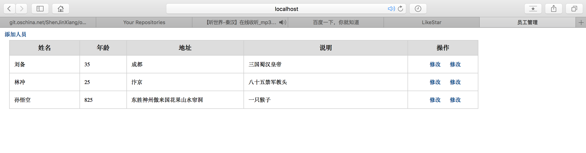

# 实现简单的人员管理模块
上一节用http模块创建了一个最最简单的web服务器，这一节继续用http模块的基本功能，实现一个人员管理模块，由于现在还没介绍nodejs操作数据库，所以数据保存在文件中，这里需要用到nodejs的文件系统fs模块

## 整体思路
1. 数据存储在data.txt文件中，通过fs模块读写数据
2. data.txt文件中保存的数据为JSON格式
3. 按键值对形式保存数据，用户id为键，用户信息为值，用户信息包括id、姓名(name)、年龄(age)、地址(address)、说明(discription)
4. 由于没有介绍模板引擎，所以没有页面，通过js拼成页面
5. 功能包括 显示所有人员列表，添加、修改、删除人员
6. 用户主键采用uuid
7. 只是实现简单功能

## 环境搭建
*创建user_module目录*
```
mkdir user_module
cd user_module
```
*初始化项目，生成package.json*
```
npm init
```
*引入node-uuid模块，用于生成uuid*
```
npm i node-uuid --save
```
*创建lib目录，存放js文件核心代码*
```
mkdir lib
```
## 模块编码
### 创建http服务器
*lib目录中创建server.js文件，内容：*
```javascript
// lib/server.js
const http = require('http');

http.createServer(function (req, res) {
	res.writeHead(200, {'Content-Type': 'text/html'});
	res.write('shenjinxiang');
	res.end();
}).listen(3000);
console.log('Server running at 3000 port.');
```
*运行server.js:*
```
node lib/server.js
Server running at 3000 port.
```
*打开浏览器输入地址：http://localhost:3000 查看结果*

一个基础的http服务器，已经创建了，接下来需要将server.js修改为模块:

*修改server.js内容：*
```javascript
// lib/server.js
const http = require('http');

exports.start = function () {
	function onRequest(req, res) {
		res.writeHead(200, {'Content-Type': 'text/html'});
		res.write('shenjinxiang');
		res.end();
	}
	http.createServer(onRequest).listen(3000);
	console.log('Server running at 3000 port.');
}
```
*user_module下创建index.js，内容:*
```javascript
// index.js
const server = require('./lib/server');

server.start();
```
*运行index.js:*
```
node index.js
Server running at 3000 port.
```
浏览器访问http://localhost:3000，结果与上面是一样的

### 创建路由
上面的服务器只是一个最基本的http服务器，接下来，需要添加路由处理程序，通过解析请求req，获取请求的资源路径和参数，进行不同的处理，展示不同的信息给用户

*lib目录下创建route.js，内容:*
```javascript
// lib/route.js
const util = require('util');
const url = require('url');

function route(req) {
	let urlObj = url.parse(req.url, true);
	let pathname = urlObj.pathname;
	util.log('请求路径：', pathname);
}

exports.route = route;
```
*修改index.js，引入route.js:*
```javascript
// index.js
const server = require('./lib/server');
const router = require('./lib/route');

server.start(router.route);
```
*与此同时，修改server.js:*
```javascript
// lib/server.js
const http = require('http');
const url = require('url');
const util = require('util');

exports.start = function (route) {
	function onRequest(req, res) {
		route(req);
		res.writeHead(200, {'Content-Type': 'text/html'});
		res.write('shenjinxiang');
		res.end();
	}
	http.createServer(onRequest).listen(3000);
	console.log('Server running at 3000 port.');
}
```
*运行index.js:*
```
node index.js
Server running at 3000 port.
```
*浏览器访问http://localhost:3000/ 后台打印信息:*
```
3 Dec 15:19:51 - 请求路径： /
```
*浏览器访问http://localhost:3000/userList 后台打印信息:*
```
3 Dec 15:20:47 - 请求路径： /userList
```

### 添加路由处理程序
可以看到，我们已经获取到请求路径了，但是这远远不够，我们需要针对不同的请求路径，给予用户不同的响应信息

*lib目录下创建requestHandlers.js*
```javascript
// lib/requestHandlers.js
exports.index = function (req, res) {
	res.writeHead(200, {'Content-Type': 'text/html'});
	res.write('<p>index</p>');
	res.end();
};

exports.user = function (req, res) {
	res.writeHead(200, {'Content-Type': 'text/html'});
	res.write('<p>user function</p>');
	res.end();
};

exports.addUser = function (req, res) {
	res.writeHead(200, {'Content-Type': 'text/html'});
	res.write('<p>addUser function</p>');
	res.end();
};

exports.addUserForm = function (req, res) {
	res.writeHead(200, {'Content-Type': 'text/html'});
	res.write('<p>addUserForm function</p>');
	res.end();
};

exports.updUser = function (req, res) {
	res.writeHead(200, {'Content-Type': 'text/html'});
	res.write('<p>updUser function</p>');
	res.end();
};

exports.updUserForm = function (req, res) {
	res.writeHead(200, {'Content-Type': 'text/html'});
	res.write('<p>updUserForm function</p>');
	res.end();
};

exports.delUser = function (req, res) {
	res.writeHead(200, {'Content-Type': 'text/html'});
	res.write('<p>delUser function</p>');
	res.end();
};
```
*修改index.js，引入requestHandlers.js:*
```javascript
// index.js
const server = require('./lib/server');
const router = require('./lib/route');
const requestHandler = require('./lib/requestHandlers');

let handle = {};
handle['/'] = requestHandler.index;
handle['/user'] = requestHandler.user;
handle['/addUser'] = requestHandler.addUser;
handle['/addUserForm'] = requestHandler.addUserForm;
handle['/updUser'] = requestHandler.updUser;
handle['/updUserForm'] = requestHandler.updUserForm;
handle['/delUser'] = requestHandler.delUser;

server.start(router.route, handle);
```
*修改server.js:*
```javascript
// lib/server.js
const http = require('http');

exports.start = function (route, handle) {
	function onRequest(req, res) {
		route(handle, req, res);
	}
	http.createServer(onRequest).listen(3000);
	console.log('Server running at 3000 port.');
}
```
*修改route.js:*
```javascript
// lib/route.js
const util = require('util');
const url = require('url');

function route(handle, req, res) {
	let urlObj = url.parse(req.url, true);
	let pathname = urlObj.pathname;
	util.log('请求路径：', pathname);
	if (typeof handle[pathname] === 'function') {
		handle[pathname](req, res);
	} else {
		res.writeHead(404, {'Content-Type': 'text/html'});
		res.write('<p>404 Not found</p>');
		res.end();
	}
}

exports.route = route;
```
*修改完毕，测试目前的程序，启动index.js:*
```
node index.js
Server running at 3000 port.
```
在浏览器中访问该服务器，按不同的路径，显示了不同的结果。至此，路由分配编写完毕，接下来从数据读取方面着手，最后整合在一起。

### 数据存储方式
数据存储在文件中，按json格式存储格式如下：
```
{
	"id1": {
		"id": "id1",
		"name": "姓名1",
		"age": "年龄1",
		"address": "地址1",
		"discription": "说明1"
	},
	"id2": {
		"id": "id2",
		"name": "姓名2",
		"age": "年龄2",
		"address": "地址2",
		"discription": "说明2"
	},
	"id3": {
		"id": "id3",
		"name": "姓名3",
		"age": "年龄3",
		"address": "地址3",
		"discription": "说明3"
	},
	"id4": {
		"id": "id4",
		"name": "姓名4",
		"age": "年龄4",
		"address": "地址4",
		"discription": "说明4"
	}
}
```

### 编写数据读写模块
*创建data.txt文件，用于保存数据:*
```
touch lib/data.txt
```
*lib目录下创建dbUtil.js，内容:*
```javascript
// lib/dbUtil.js
const fs = require('fs');

/**
 * 存放数据的文件
 */
let dbPath = './lib/data.txt';

/**
 * 获取所有数据
 */
let queryList = exports.queryList = function (callback) {
	fs.readFile(dbPath, 'utf-8', function (err, data) {
		if (err) throw err;
		let obj = {};
		if (data) {
			obj = JSON.parse(data);
		}
		callback(obj);
	});
};

/**
 * 根据id获取一条记录
 */
let queryById = exports.queryById = function (id, callback) {
	queryList(function (obj) {
		let data = obj[id];
		callback(data);
	});
};

/**
 * 保存一条记录，如果id存在则修改，不存在则新增
 */
let save = exports.save = function (obj, callback) {
	queryList(function (data) {
		data[obj.id] = {
			"id": obj.id,
			"name": obj.name,
			"age": obj.age,
			"address": obj.address,
			"discription": obj.discription
		};

		fs.writeFile(dbPath, JSON.stringify(data), function(err) {
			if (err) throw err;
			callback();
		});
	});
};

/**
 * 根据id删除一条记录
 */
let delById = exports.delById = function (id, callback) {
	queryList(function (data) {
		delete data[id];

		fs.writeFile(dbPath, JSON.stringify(data), function(err) {
			if (err) throw err;
			callback();
		});
	});
};
```

### 向用户展示人员信息
我们已经完成了路由分配模块，也完成了数据读取模块。现在，需要准备渲染给用户的页面

*创建模版文件*
```html
<!DOCTYPE html>
<html>
<head>
<meta charset='utf-8'>
<title>员工管理</title>
<style>
*{margin:0px;padding:0px;}
body{font-size:12px;}
table{border-collapse: collapse; width: 80%;margin-left:20px;}
table th {border:1px solid #ccc; line-height: 32px; background-color: #ddd;font-size:14px;}
table td {border:1px solid #ccc; line-height: 28px; padding-left: 10px;}
table tr:hover{background-color: #eee;}
table .cz_td{text-align:center;}

label{width:100px; text-align:right;display:inline-block;}
.text{text-indent: 5px;height:24px;line-height:24px;}
ul li {line-height: 34px; height: 34px; }
.width-text{width: 454px;}
.btn{width: 80px; height: 30px;  font-weight:bold; border-radius:5px;border:none;cursor:pointer;}
.save_btn{background-color:#048; color: #fff;}
.save_btn:hover{background-color:#059;}
.reset_btn{background-color: #ccc; color: #333;}
.reset_btn:hover{background:#ddd;}
a {text-decoration: none; padding: 5px 10px; font-weight:bold; display: inline-block; color: #048; }
a:hover{color:#069;}
</style>
</head>
<body>
####
</body>
</html>
```
其中####的位置是用来替换内容的标记

*创建readLines.js文件，用于读取temp.html的内容:*
```javascript
// lib/readLines.js
const fs = require('fs');
const readline = require('readline');

function readLines(file, callback) {
	let data = [];

	let rl = readline.createInterface({
		input : fs.createReadStream(file)
	});

	rl.on('line', function(line){
		data.push(line);
	});

	rl.on('close', function() {
		callback(data);
	});
}

module.exports = readLines;
```
*lib目录下创建readTemp.js文件，内容:*
```javascript
// lib/readTemp.js
const readLines = require('./readLines');

let tempFile = './lib/temp.html';

module.exports = function(callback) {
	readLines(tempFile, function (data) {
		let index = data.indexOf('####');
		callback(data.slice(0, index), data.slice(index + 1, data.length));
	});
};
```
*lib目录下创建render.js文件，内容:*
```javascript
// lib/render.js
const readTemp = require('./readTemp');

/**
 * 渲染主页面
 */
exports.index = function (res) {
	readTemp(function (before, end) {
		let content = [
			'<p>index 页面</p>',
			'<p><a href="/user">用户列表</a></p>'
		];
		let arr = before.concat(content, end);
		res.writeHead(200, {'Content-Type': 'text/html'});
		arr.forEach(function (item) {
			res.write(item);
		});
		res.end();
	});
};

/**
 * 渲染人员列表页面
 */
exports.user = function (res, data) {
		readTemp(function(before, end) {
			let content = [];
			content.push('<a href="/addUserForm">添加人员</a>');
			content.push('<table>');
			content.push('<tr>');
			content.push('<th width="15%">姓名</th>');
			content.push('<th width="10%">年龄</th>');
			content.push('<th width="25%">地址</th>');
			content.push('<th width="35%">说明</th>');
			content.push('<th width="15%">操作</th>');
			content.push('</tr>');

			let isEmpty = true;
			for (var key in data) {
				isEmpty = false;
				content.push('<tr>');
				content.push('<td>' + data[key].name + '</td>');
				content.push('<td>' + data[key].age + '</td>');
				content.push('<td>' + data[key].address + '</td>');
				content.push('<td>' + data[key].discription + '</td>');
				content.push('<td class="cz_td">');
				content.push('<a href="/updUserForm?id=' + data[key].id + '">修改</a>');
				content.push('<a href="/delUser?id=' + data[key].id + '">修改</a>');
				content.push('</td>');
				content.push('</tr>');
			}
			if (isEmpty) {
				content.push('<tr>');
				content.push('<td colspan="5">暂无人员</td>');
				content.push('</tr>');
			}

			let arr = before.concat(content, end);
			res.writeHead(200, {'Content-Type': 'text/html'});
			arr.forEach(function (item) {
				res.write(item);
			});
			res.end();
		});
};

/**
 * 渲染添加人员信息页面
 */
exports.addUserForm = function (res) {
	readTemp(function (before, end) {
		let content = [];
		content.push('<br>');
		content.push('<div class="content">');
		content.push('<form action="/addUser" method="post">');
		content.push('<ul>');
		content.push('<li>');
		content.push('<input type="hidden" id="id" name="id" />');
		content.push('<label for="name">姓名：</label>');
		content.push('<input type="text" class="text" id="name" name="name" />');
		content.push('<label for="age">年龄：</label>');
		content.push('<input type="text" class="text" id="age" name="age" />');
		content.push('</li>');
		content.push('<li>');
		content.push('<label for="address">地址：</label>');
		content.push('<input type="text" class="width-text text" id="address" name="address" />');
		content.push('</li>');
		content.push('<li>');
		content.push('<label for="discription">说明：</label>');
		content.push('<input type="text" class="width-text text" id="discription" name="discription" />');
		content.push('</li>');
		content.push('<li style="text-indent:105px;">');
		content.push('<input type="submit" class="save_btn btn" value="保存"/>&nbsp;&nbsp;');
		content.push('<input type="reset" class="reset_btn btn" value="重置"/>');
		content.push('</li>');
		content.push('</ul>');
		content.push('</form>');
		content.push('</div>');
		
		let arr = before.concat(content, end);
		res.writeHead(200, {'Content-Type': 'text/html'});
		arr.forEach(function (item) {
			res.write(item);
		});
		res.end();
	});
};

/**
 * 渲染修改页面
 */
exports.updUserForm = function (res, data) {
	readTemp(function (before, end) {
		let content = [];
		content.push('<br>');
		content.push('<div class="content">');
		content.push('<form action="/updUser" method="post">');
		content.push('<ul>');
		content.push('<li>');
		content.push('<input type="hidden" id="id" name="id" value="' + data.id + '" />');
		content.push('<label for="name">姓名：</label>');
		content.push('<input type="text" class="text" id="name" name="name" value="' + data.name + '" />');
		content.push('<label for="age">年龄：</label>');
		content.push('<input type="text" class="text" id="age" name="age" value="' + data.age + '" />');
		content.push('</li>');
		content.push('<li>');
		content.push('<label for="address">地址：</label>');
		content.push('<input type="text" class="width-text text" id="address" name="address" value="' + data.address + '"/>');
		content.push('</li>');
		content.push('<li>');
		content.push('<label for="discription">说明：</label>');
		content.push('<input type="text" class="width-text text" id="discription" name="discription" value="' + data.discription + '" />');
		content.push('</li>');
		content.push('<li style="text-indent:105px;">');
		content.push('<input type="submit" class="save_btn btn" value="保存"/>&nbsp;&nbsp;');
		content.push('<input type="reset" class="reset_btn btn" value="重置"/>');
		content.push('</li>');
		content.push('</ul>');
		content.push('</form>');
		content.push('</div>');
		
		let arr = before.concat(content, end);
		res.writeHead(200, {'Content-Type': 'text/html'});
		arr.forEach(function (item) {
			res.write(item);
		});
		res.end();
	});
};
```
*修改requestHandler.js:*
```javascript
// lib/requestHandlers.js
const querystring = require('querystring');
const url = require('url');
const uuid = require('node-uuid');
const render = require('./render');
const db = require('./dbUtil');

exports.index = function (req, res) {
	render.index(res);
};

exports.user = function (req, res) {
	db.queryList(function (data) {
		render.user(res, data);
	});
};

exports.addUser = function (req, res) {
	getParam(req, function (params) {
		params.id = uuid.v4();
		db.save(params, function () {
			res.writeHead(302, {'location': '/user'});
			res.end();
		});
	});	
};

exports.addUserForm = function (req, res) {
	render.addUserForm(res);
};

exports.updUser = function (req, res) {
	getParam(req, function (params) {
		db.save(params, function () {
			res.writeHead(302, {'location': '/user'});
			res.end();
		});
	});
};

exports.updUserForm = function (req, res) {
	getParam(req, function (param) {
		db.queryById(param.id, function (data) {
			render.updUserForm(res, data);
		});
	});
};

exports.delUser = function (req, res) {
	getParam(req, function(param) {
		db.delById(param.id, function () {
			res.writeHead(302, {'location': '/user'});
			res.end();
		});
	});
};

/**
 * 获取请求参数
 */
function getParam (req, callback) {
	if (req.method === 'POST' || req.method === 'post') {
		let post = '';
		req.on('data', function (chunk) {
			post += chunk;
		});
		req.on('end', function () {
			post = querystring.parse(post);
			callback(post);
		});
	} else {
		let param = url.parse(req.url, true).query;
		callback(param);
	}
}
```

至此完成所有模块的编辑，打开浏览器测试即可




这个例子只是一个最简单的增删改查，代码在demo目录下user_module目录下，没有任何异常处理、没有拦截器、权限控制，页面也是最简单的。。 但是已经很麻烦了。类似与javaWeb开发，有ssh等很多优秀的框架，nodejs中，也有类似的框架模块，以后再介绍
